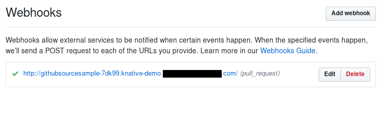

# GitHub source

GitHub Source example shows how to wire GitHub events for consumption
by a Knative Service.

## Before you begin

1. Set up [Knative Serving](../../../serving).
1. Ensure Knative Serving is [configured with a domain
   name](../../../serving/using-a-custom-domain.md)
   that allows GitHub to call into the cluster.
1. Set up [Knative Eventing](../../../eventing) with the GitHub source.

### Create a Knative Service

To verify the GitHub source is working, create a simple Knative
Service that dumps incoming messages to its log. The `service.yaml` file
defines this basic Service.

```yaml
apiVersion: serving.knative.dev/v1
kind: Service
metadata:
  name: github-message-dumper
spec:
  template:
    spec:
      containers:
      - image: gcr.io/knative-releases/knative.dev/eventing/cmd/event_display
```

Enter the following command to create the service from `service.yaml`:

```shell
kubectl --namespace default apply --filename service.yaml
```

### Create GitHub Tokens

Create a [personal access token](https://github.com/settings/tokens)
for GitHub that the GitHub source can use to register webhooks with
the GitHub API. Also decide on a secret token that your code will use
to authenticate the incoming webhooks from GitHub (_secretToken_).

The token can be named anything you find convenient. The Source
requires `repo:public_repo` and `admin:repo_hook`, to let it fire
events from your public repositories and to create webhooks for those
repositories. Copy and save this token; GitHub will force you to
generate it again if misplaced.

Here's an example for a token named "GitHubSource Sample" with the
recommended scopes:


Update `githubsecret.yaml` with those values. If your generated access
token is `'personal_access_token_value'` and you choose your _secretToken_
as `'asdfasfdsaf'`, you'd modify `githubsecret.yaml` like so:

```yaml
apiVersion: v1
kind: Secret
metadata:
  name: githubsecret
type: Opaque
stringData:
  accessToken: personal_access_token_value
  secretToken: asdfasfdsaf
```

Hint: you can makeup a random _secretToken_ with:

```shell
head -c 8 /dev/urandom | base64
```

Then, apply the githubsecret using `kubectl`:

```shell
kubectl --namespace default apply --filename githubsecret.yaml
```

### Create Event Source for GitHub Events

In order to receive GitHub events, you have to create a concrete Event
Source for a specific namespace. Be sure to replace the
`ownerAndRepository` value with a valid GitHub public repository owned
by your GitHub user.

If using GitHub enterprise you will need to add an additional githubAPIURL
field to the spec specifying your GitHub enterprise API endpoint, see
[here](../../README.md#githubsource)

```yaml
apiVersion: sources.knative.dev/v1alpha1
kind: GitHubSource
metadata:
  name: githubsourcesample
spec:
  eventTypes:
    - pull_request
  ownerAndRepository: <YOUR USER>/<YOUR REPO>
  accessToken:
    secretKeyRef:
      name: githubsecret
      key: accessToken
  secretToken:
    secretKeyRef:
      name: githubsecret
      key: secretToken
  sink:
    ref:
      apiVersion: serving.knative.dev/v1
      kind: Service
      name: github-message-dumper
```

Then, apply that yaml using `kubectl`:

```shell
kubectl --namespace default apply --filename github-source.yaml
```

### Verify

Verify the GitHub webhook was created by looking at the list of
webhooks under the Settings tab in your GitHub repository. A hook
should be listed that points to your Knative cluster with a green
check mark to the left of the hook URL, as shown below.



### Create Events

Create a pull request in your GitHub repository. We will verify
that the GitHub events were sent into the Knative eventing system
by looking at our message dumper function logs.

```shell
kubectl --namespace default get pods
kubectl --namespace default logs github-event-display-XXXX user-container
```

You should log lines similar to:

```
2018/11/08 18:25:34 Message Dumper received a message: POST / HTTP/1.1
Host: github-event-display.knative-demo.svc.cluster.local
Accept-Encoding: gzip
Ce-Cloudeventsversion: 0.1
Ce-Eventid: a8d4cf20-e383-11e8-8069-46e3c8ad2b4d
Ce-Eventtime: 2018-11-08T18:25:32.819548012Z
Ce-Eventtype: dev.knative.source.github.pull_request
Ce-Source: https://github.com/someuser/somerepo/pull/1
Content-Length: 21060
Content-Type: application/json
User-Agent: Go-http-client/1.1
X-B3-Parentspanid: b2e514c3dbe94c03
X-B3-Sampled: 1
X-B3-Spanid: c85e346d89c8be4e
X-B3-Traceid: abf6292d458fb8e7
X-Envoy-Expected-Rq-Timeout-Ms: 60000
X-Envoy-Internal: true
X-Forwarded-For: 127.0.0.1, 127.0.0.1
X-Forwarded-Proto: http
X-Request-Id: 8a2201af-5075-9447-b593-ec3a243aff52

{"action":"opened","number":1,"pull_request": ...}
```

### Cleanup

You can remove the Github webhook by deleting the Github source:

```shell
kubectl --namespace default delete --filename github-source.yaml
```

Similarly, you can remove the Service and Secret via:

```shell
kubectl --namespace default delete --filename service.yaml
kubectl --namespace default delete --filename githubsecret.yaml

```
