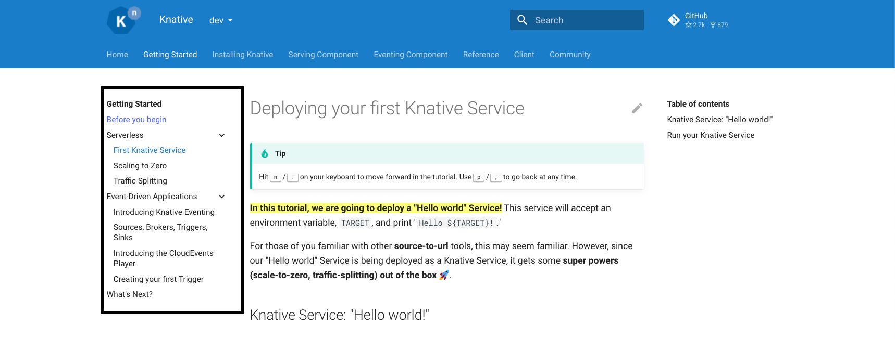
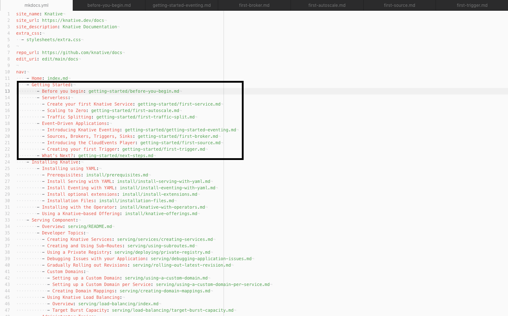

# MkDocs Contributions (Beta)
**This is a temporary home for contribution guidelines for the MkDocs branch. When MkDocs becomes "main" this will be moved to the appropriate place on the website**


## Install Material for MkDocs
Knative.dev uses [Material for MkDocs](https://squidfunk.github.io/mkdocs-material/) to render documentation. Material for MkDocs is Python based and uses pip to install most of it's required packages as well as optional add-ons (which we use).

For some (e.g. folks using RHEL), you may have to use pip3.


=== "pip"
    ```
    pip install mkdocs-material
    ```
    More detailed instructions can be found here: [https://squidfunk.github.io/mkdocs-material/getting-started/#installation](https://squidfunk.github.io/mkdocs-material/getting-started/#installation)

=== "pip3"
    ```
    pip3 install mkdocs-material
    ```
    More detailed instructions can be found here: [https://squidfunk.github.io/mkdocs-material/getting-started/#installation](https://squidfunk.github.io/mkdocs-material/getting-started/#installation)

## Install Knative-Specific Extensions

Knative uses a number of extensions to MkDocs which can also be installed using pip. If you used pip to install, run the following:

=== "pip"
    ```
    pip install mkdocs-material-extensions mkdocs-macros-plugin mkdocs-exclude mkdocs-awesome-pages-plugin
    ```

=== "pip3"
    ```
    pip3 install mkdocs-material-extensions mkdocs-macros-plugin mkdocs-exclude mkdocs-awesome-pages-plugin
    ```

## Use the Docker Container
//TODO DOCKER CONTAINER EXTENSIONS

## Setting Up Local Preview
Once you have installed Material for MkDocs and all of the extensions, head over to
--8<-- "docs/snippets/links/main-docs-branch-link.md"
and clone the repo.

In your terminal, find your way over to the location of the cloned repo. Once you are in the main folder (.../docs) and run:

=== "Local Preview"
    ```
    mkdocs serve
    ```

=== "Local Preview w/ Dirty Reload"
    If you’re only changing a single page in the /docs/ folder (i.e. not the homepage or mkdocs.yml) adding the flag --dirtyreload will make the site rebuild super crazy insta-fast.
    ```
    mkdocs serve --dirtyreload
    ```
=== "Local Preview including Blog and Community Site"
    First, install the necessary extensions:
    ```
    npm install -g postcss postcss-cli autoprefixer http-server
    ```
    Once you have those npm packages installed, run:
    ```
    ./hack/build-with-blog.sh serve
    ```
    !!! note
        Unfortunately, there aren’t live previews for this version of the local preview.


After awhile, your terminal should spit out:

```{ .bash .no-copy }
INFO    -  Documentation built in 13.54 seconds
[I 210519 10:47:10 server:335] Serving on http://127.0.0.1:8000
[I 210519 10:47:10 handlers:62] Start watching changes
[I 210519 10:47:10 handlers:64] Start detecting changes
```

Now access http://127.0.0.1:8000 and you should see the site is built! 🎉

**Anytime you change any file in your /docs/ repo and hit save, the site will automatically rebuild itself to reflect your changes!**

## Setting Up "Public" Preview
If, for whatever reason, you want to share your work before submitting a PR (where Netlify would generate a preview for you), you can deploy your changes as a Github Page easily using the following command:
```
mkdocs gh-deploy --force
```

```{ .bash .no-copy }
INFO    -  Documentation built in 14.29 seconds
WARNING -  Version check skipped: No version specified in previous deployment.
INFO    -  Copying '/Users/omerbensaadon/Documents/GitHub/MergeConflictsResolve/docs/site' to 'gh-pages' branch and pushing to GitHub.
INFO    -  Your documentation should shortly be available at: https://<your-github-handle>.github.io/docs/
```
Where `<your-github-handle>` is your Github handle.

After a few moments, your changes should be available for public preview at the link provided by MkDocs! This means you can rapidly prototype and share your changes before making a PR!

## Navigation
Navigation in MkDocs uses the "mkdocs.yml" file (found in the /docs directory) to organize navigation.

=== "Frontend"
    

=== "Backend"
    

For more in-depth information on Navigation, see:
[https://www.mkdocs.org/user-guide/writing-your-docs/#configure-pages-and-navigation](https://www.mkdocs.org/user-guide/writing-your-docs/#configure-pages-and-navigation)
and
[https://squidfunk.github.io/mkdocs-material/setup/setting-up-navigation/](https://squidfunk.github.io/mkdocs-material/setup/setting-up-navigation/)

### Content Tabs
Content tabs are handy way to organize lots of information in a visually pleasing way. Some documentation from [https://squidfunk.github.io/mkdocs-material/reference/content-tabs/#usage](https://squidfunk.github.io/mkdocs-material/reference/content-tabs/#usage) is reproduced below.
=== "Grouping Code blocks"
    Code blocks are one of the primary targets to be grouped, and can be considered a special case of content tabs, as tabs with a single code block are always rendered without horizontal spacing.
    Example:
    ```
    === "C"

        ``` c
        #include <stdio.h>

        int main(void) {
          printf("Hello world!\n");
          return 0;
        }
        ```

    === "C++"

        ``` c++
        #include <iostream>

        int main(void) {
          std::cout << "Hello world!" << std::endl;
          return 0;
        }
        ```
    ```

    Result:
    === "C"

        ``` c
        #include <stdio.h>

        int main(void) {
          printf("Hello world!\n");
          return 0;
        }
        ```

    === "C++"

        ``` c++
        #include <iostream>

        int main(void) {
          std::cout << "Hello world!" << std::endl;
          return 0;
        }
        ```

=== "Grouping other content"
    When a content tab contains more than one code block, it is rendered with horizontal spacing. Vertical spacing is never added, but can be achieved by nesting tabs in other blocks.

    Example:

    ```
    === "Unordered list"

        * Sed sagittis eleifend rutrum
        * Donec vitae suscipit est
        * Nulla tempor lobortis orci

    === "Ordered list"

        1. Sed sagittis eleifend rutrum
        2. Donec vitae suscipit est
        3. Nulla tempor lobortis orci
    ```

    Result:
    === "Unordered list"

        * Sed sagittis eleifend rutrum
        * Donec vitae suscipit est
        * Nulla tempor lobortis orci

    === "Ordered list"

        1. Sed sagittis eleifend rutrum
        2. Donec vitae suscipit est
        3. Nulla tempor lobortis orci

For more information, see:[https://squidfunk.github.io/mkdocs-material/reference/content-tabs/#usage](https://squidfunk.github.io/mkdocs-material/reference/content-tabs/#usage)
### File Includes (Content Reuse)
Knative strives to reduce duplicative effort by reusing commonly used bits of information, see the docs/snippet directory for some examples.

Snippets does not require a specific extension, and as long as a valid file name is specified, it will attempt to process it.

Snippets can handle recursive file inclusion. And if Snippets encounters the same file in the current stack, it will avoid re-processing it in order to avoid an infinite loop (or crash on hitting max recursion depth).

For more info, see: [https://facelessuser.github.io/pymdown-extensions/extensions/snippets/](https://facelessuser.github.io/pymdown-extensions/extensions/snippets/)

### Admonitions
=== "Admontion"
    !!! tip
        Admonitions (like this one) are a great way to highlight important bits of information for readers.

=== "Formating"
    ```
    !!! tip
        Admonitions (like this one) are a great way to highlight important bits of information for readers.
    ```
For formatting (including more advanced Admonitions), see: [https://squidfunk.github.io/mkdocs-material/reference/admonitions/#usage](https://squidfunk.github.io/mkdocs-material/reference/admonitions/#usage)


### Icons and Emojis
Material for MkDocs supports using Material Icons and Emojis using easy shortcodes.
=== "Emojs"
    :taco:
=== "Formatting"
    `:taco:`

To search a database of Icons and Emojis (all of which can be used on Knative.dev), as well as usage information, see: [https://squidfunk.github.io/mkdocs-material/reference/icons-emojis/#search](https://squidfunk.github.io/mkdocs-material/reference/icons-emojis/#search)

# TODO (Add Requests Here)
URL Re-directs
Navigation using lukasgeiter/mkdocs-awesome-pages-plugin: An MkDocs plugin that simplifies configuring page titles and their order
Index.md vs. README.md
awesome-pages
