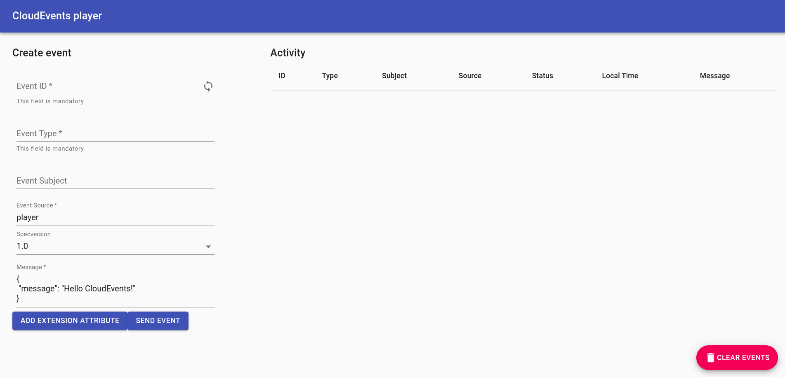

# Using a Knative Service as a source

In this tutorial, you will use the [CloudEvents Player](https://github.com/ruromero/cloudevents-player){target=blank} app to showcase the core concepts of Knative Eventing. By the end of this tutorial, you should have an architecture that looks like this:


The above image is Figure 6.6 from [Knative in Action](https://www.manning.com/books/knative-in-action){target=_blank}.

## Creating your first source

The CloudEvents Player acts as a Source for CloudEvents by intaking the URL of the Broker as an environment variable, `BROKER_URL`. You will send CloudEvents to the Broker through the CloudEvents Player application.

Create the CloudEvents Player Service:
=== "kn"
    Run the command:
    ```bash
    kn service create cloudevents-player \
    --image ruromero/cloudevents-player:latest \
    --env BROKER_URL=http://broker-ingress.knative-eventing.svc.cluster.local/default/example-broker
    ```
    !!! Success "Expected output"
        ```{ .bash .no-copy }
        Service 'cloudevents-player' created to latest revision 'cloudevents-player-vwybw-1' is available at URL:
        http://cloudevents-player.default.${LOADBALANCER_IP}.sslip.io
        ```

    ??? question "Why is my Revision named something different!"
        Because we didn't assign a `revision-name`, Knative Serving automatically created one for us. It's okay if your Revision is named something different.

=== "YAML"
    1. Copy the following YAML into a file named `cloudevents-player.yaml`:
        ```bash
        apiVersion: serving.knative.dev/v1
        kind: Service
        metadata:
          name: cloudevents-player
        spec:
          template:
            metadata:
              annotations:
                autoscaling.knative.dev/min-scale: "1"
            spec:
              containers:
                - image: ruromero/cloudevents-player:latest
                  env:
                    - name: BROKER_URL
                      value: http://broker-ingress.knative-eventing.svc.cluster.local/default/example-broker
        ```

    1. Apply the YAML file by running the command:
        ``` bash
        kubectl apply -f cloudevents-player.yaml
        ```

        !!! Success "Expected output"
            ```{ .bash .no-copy }
            service.serving.knative.dev/cloudevents-player created
            ```

## Examining the CloudEvents Player

**You can use the CloudEvents Player to send and receive CloudEvents.**
If you open the Service URL in your browser, the **Create Event** form appears.

The Service URL is `http://cloudevents-player.default.${LOADBALANCER_IP}.sslip.io`,
for example, [http://cloudevents-player.default.127.0.0.1.sslip.io](http://cloudevents-player.default.127.0.0.1.sslip.io) for `kind`.



??? question "What do these fields mean?"
    | Field          | Description |
    |:----------------:|:-------------|
    | `Event ID`     | A unique ID. Click the loop icon to generate a new one.   |
    | `Event Type`   | An event type.|
    | `Event Source` | An event source.|
    | `Specversion`  | Demarcates which CloudEvents spec you're using (should always be 1.0).|
    | `Message`      | The `data` section of the CloudEvent, a payload which is carrying the data you care to be delivered.|

    For more information on the CloudEvents Specification, check out the [CloudEvents Spec](https://github.com/cloudevents/spec/blob/v1.0.1/spec.md){target=_blank}.

### Sending an event

Try sending an event using the CloudEvents Player interface:

1. Fill in the form with whatever you data you want.
1. Ensure your Event Source does not contain any spaces.
1. Click **SEND EVENT**.


??? tip "Clicking the :fontawesome-solid-envelope: shows you the CloudEvent as the Broker sees it."
    {:width="500px"}

??? question "Want to send events using the command line instead?"
    As an alternative to the Web form, events can also be sent/viewed using the command line.

    To post an event:
    ```bash
    curl -i http://cloudevents-player.default.${LOADBALANCER_IP}.sslip.io \
        -H "Content-Type: application/json" \
        -H "Ce-Id: 123456789" \
        -H "Ce-Specversion: 1.0" \
        -H "Ce-Type: some-type" \
        -H "Ce-Source: command-line" \
        -d '{"msg":"Hello CloudEvents!"}'
    ```

    And to view events:
    ```bash
    curl http://cloudevents-player.default.${LOADBALANCER_IP}.sslip.io/messages
    ```

The :material-send: icon in the "Status" column implies that the event has been sent to our Broker... but where has the event gone? **Well, right now, nowhere!**

A Broker is simply a receptacle for events. In order for your events to be sent anywhere, you must create a Trigger which listens for your events and places them somewhere. And, you're in luck; you'll create your first Trigger on the next page!
