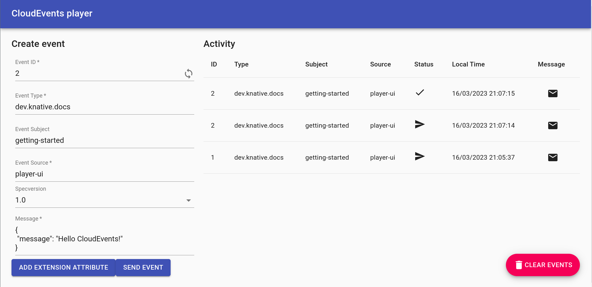

# Using Triggers and sinks

In the last topic we used the CloudEvents Player as an event source to send events to the Broker.
We now want the event to go from the Broker to an event sink.

In this topic, we will use the CloudEvents Player as the sink as well as a source.
This means we will be using the CloudEvents Player to both send and receive events.
We will use a Trigger to listen for events in the Broker to send to the sink.

## Creating your first Trigger

Create a Trigger that listens for CloudEvents from the event source and places them into the sink, which is also the CloudEvents Player app.

=== "kn"

    To create the Trigger, run the command:
    ```bash
    kn trigger create cloudevents-trigger --sink cloudevents-player  --broker example-broker
    ```
    !!! Success "Expected output"
        ```{ .bash .no-copy }
        Trigger 'cloudevents-trigger' successfully created in namespace 'default'.
        ```

=== "YAML"

    1. Copy the following YAML into a file named `ce-trigger.yaml`:
        ```bash
        apiVersion: eventing.knative.dev/v1
        kind: Trigger
        metadata:
          name: cloudevents-trigger
          annotations:
            knative-eventing-injection: enabled
        spec:
          broker: example-broker
          subscriber:
            ref:
              apiVersion: serving.knative.dev/v1
              kind: Service
              name: cloudevents-player
        ```

    1. Create the Trigger by running the command:
        ```bash
        kubectl apply -f ce-trigger.yaml
        ```

        !!! Success "Expected output"
            ```{ .bash .no-copy }
            trigger.eventing.knative.dev/cloudevents-trigger created
            ```

??? question "What CloudEvents is my Trigger listening for?"
    Because we didn't specify a `--filter` in our `kn` command, the Trigger is listening for any CloudEvents coming into the Broker.

    Expand the next note to see how to use Filters.

Now, when we go back to the CloudEvents Player and send an event, we see that CloudEvents are both sent and received by the CloudEvents Player:

{draggable=false}

You may need to refresh the page to see your changes.

??? question "What if I want to filter on CloudEvent attributes?"
    First, delete your existing Trigger:
    ```bash
      kn trigger delete cloudevents-trigger
    ```
    Now let's add a Trigger that listens for a certain CloudEvent Type
    ```bash
      kn trigger create cloudevents-player-filter --sink cloudevents-player  --broker example-broker --filter type=some-type
    ```

    If you send a CloudEvent with type `some-type`, it is reflected in the CloudEvents Player UI.  The Trigger ignores any other types.

    You can filter on any aspect of the CloudEvent you would like to.


Some people call this **"Event-Driven Architecture"** which can be used to create your own **"Functions as a Service"** on Kubernetes :tada: :taco: :fire:
