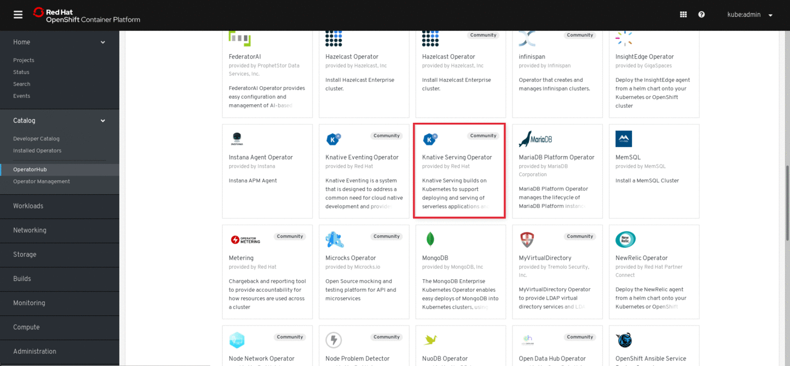
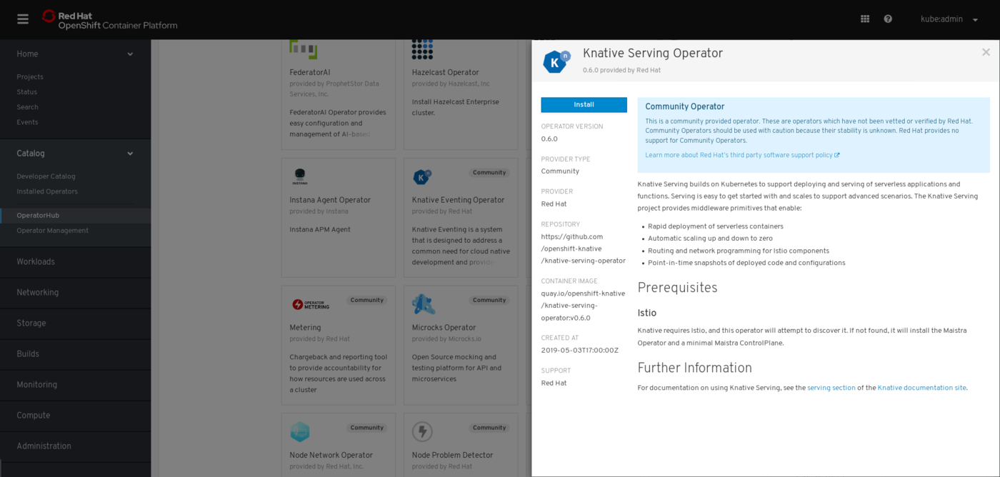
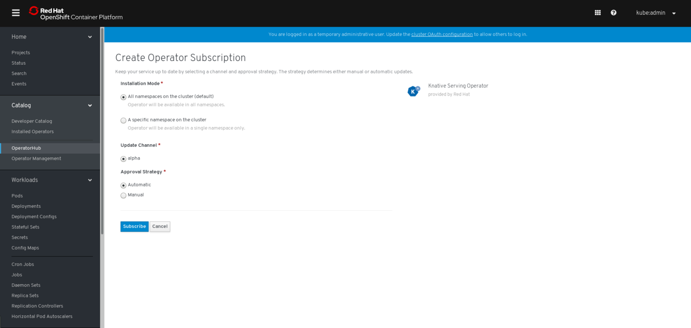
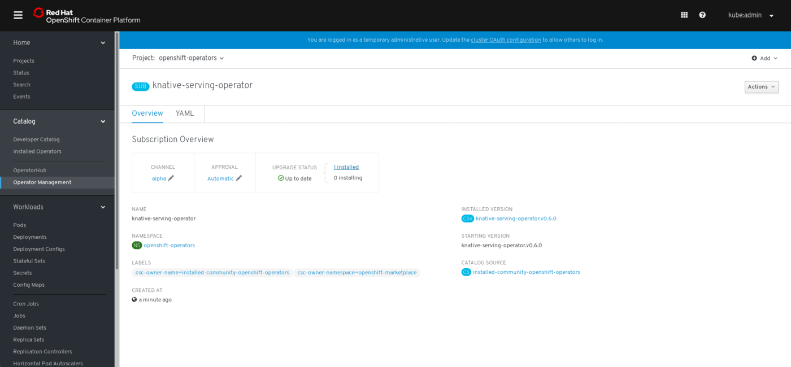
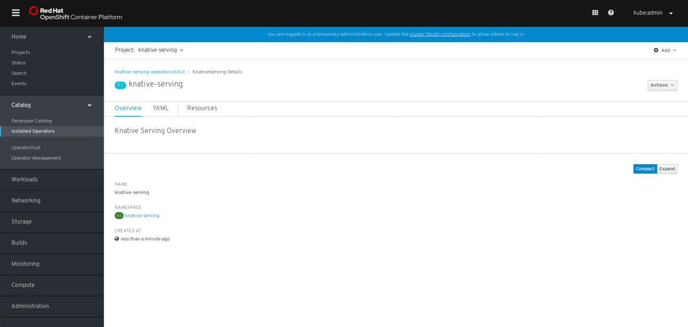
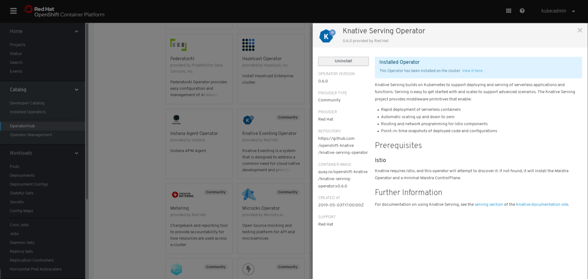

# Knative Install on OpenShift

This guide walks you through the installation of the latest version of [Knative
Serving](https://github.com/knative/serving) on [OpenShift](https://github.com/openshift/origin) by using the Knative Serving Operator. The operator is available on the OpenShift OperatorHub. Create and deploy an image of a sample "hello world" app onto the newly created Knative cluster.
=======

This guide walks you through the installation of the latest version of
[Knative Serving](https://github.com/knative/serving) on an
[OpenShift](https://github.com/openshift/origin) using pre-built images and
demonstrates creating and deploying an image of a sample "hello world" app onto
the newly created Knative cluster.
>>>>>>> upstream/master:docs/install/Knative-with-OpenShift.md

You can find [guides for other platforms here](./README.md).

## Before you begin

* An OpenShift 4 cluster is required for installation. Visit [try.openshift.com](try.openshift.com) for information on setting up a cluster. You will need cluster administrator privileges to install and use Knative on an OpenShift cluster. 
=======
These instructions will run an OpenShift 3.11 (Kubernetes 1.11) cluster on your
local machine using
[`oc cluster up`](https://docs.openshift.org/latest/getting_started/administrators.html#running-in-a-docker-container)
to test-drive knative.
>>>>>>> upstream/master:docs/install/Knative-with-OpenShift.md

> Note: Currently, long-running clusters are not supported on OpenShift 4.

<<<<<<< HEAD:install/Knative-with-OpenShift.md

## Installing the Knative Serving Operator

1. Go to **Catalog > OperatorHub** in the OpenShift Web Console. A list of operators for OpenShift, provided by Red Hat as well as a community of partners and open-source projects is provided. Click on the **Knative Serving Operator** tile.

> **NOTE:** Use the **Filter by Keyword** box to facilitate the search of the Knative Serving operator in the catalog.



2. A **Show Community Operator** dialog box will open. Click **Continue** to proceed.
=======
You can install the latest version of `oc`, the OpenShift CLI, into your local
directory by downloading the right release tarball for your OS from the
[releases page](https://github.com/openshift/origin/releases/tag/v3.11.0).

```shell
wget https://github.com/openshift/origin/releases/download/v3.11.0/openshift-origin-client-tools-v3.11.0-0cbc58b-linux-64bit.tar.gz -o oc.tar.gz
tar xzvf openshift*tar.gz
mv openshift-origin-client-tools-*/oc .
mv openshift-origin-client-tools-*/kubectl .
rm -rf openshift-origin-client-tools-*/
```

You will now have the `oc` (and `kubectl`) binaries in your local directory.

## Scripted cluster setup and installation

For Linux and Mac, you can optionally run a
[script](./scripts/knative-with-openshift.sh) that automates the steps on this
page.

Once you have `oc` present on your machine and in your `PATH`, you can simply
run [this script](./scripts/knative-with-openshift.sh); it will:
>>>>>>> upstream/master:docs/install/Knative-with-OpenShift.md

3. The **Knative Serving Operator** descriptor screen will appear. Click **Install**.



4. On the **Create the Operator Subscription** screen, create a new subscription by clicking on the **Subscribe** button. This will install the Knative Serving Operator in the project `openshift-operators` and Knative Serving in the `knative-serving` project.

<<<<<<< HEAD:install/Knative-with-OpenShift.md

=======
Here are the manual steps which the above script automates for you in case you
prefer doing this yourself:

Create a new OpenShift cluster on your local machine using `oc cluster up`:
>>>>>>> upstream/master:docs/install/Knative-with-OpenShift.md

> **NOTE:** The Operator Lifecycle Manager (OLM) installs the operator, which will automatically install Knative. This installation will create the `knative-serving`, `istio-operator`, and `istio-system` namespaces.

5. Verify the subscription status for the installation operator, by viewing the **Subscription Overview**. The **UPGRADE STATUS** will update from **0 Installing** to **1 Installed**. 

> **NOTE:** The screen will update after a few minutes. Wait for the `knative-serving` namespace to appear in the project drop-down menu. Refresh the page if needed.



<<<<<<< HEAD:install/Knative-with-OpenShift.md
6. Knative Serving is now installed. Navigate to **Catalog > Installed Operators** to confirm the operator is installed. Click on **knative-serving** to view the install status.
=======
# SCCs (Security Context Constraints) are the precursor to the PSP (Pod
# Security Policy) mechanism in Kubernetes.
oc adm policy add-scc-to-user privileged -z default -n default

oc label namespace default istio-injection=enabled
```

## Installing Istio

> Note: [Gloo](https://gloo.solo.io/) is available as an alternative to Istio.
> [Click here](./Knative-with-Gloo.md) to install Knative with Gloo.

Knative depends on Istio. First, run the following to grant the necessary
privileges to the service accounts istio will use:

```shell
oc adm policy add-scc-to-user anyuid -z istio-ingress-service-account -n istio-system
oc adm policy add-scc-to-user anyuid -z default -n istio-system
oc adm policy add-scc-to-user anyuid -z prometheus -n istio-system
oc adm policy add-scc-to-user anyuid -z istio-egressgateway-service-account -n istio-system
oc adm policy add-scc-to-user anyuid -z istio-citadel-service-account -n istio-system
oc adm policy add-scc-to-user anyuid -z istio-ingressgateway-service-account -n istio-system
oc adm policy add-scc-to-user anyuid -z istio-cleanup-old-ca-service-account -n istio-system
oc adm policy add-scc-to-user anyuid -z istio-mixer-post-install-account -n istio-system
oc adm policy add-scc-to-user anyuid -z istio-mixer-service-account -n istio-system
oc adm policy add-scc-to-user anyuid -z istio-pilot-service-account -n istio-system
oc adm policy add-scc-to-user anyuid -z istio-sidecar-injector-service-account -n istio-system
oc adm policy add-cluster-role-to-user cluster-admin -z istio-galley-service-account -n istio-system
oc adm policy add-scc-to-user anyuid -z cluster-local-gateway-service-account -n istio-system
```

Run the following to install Istio:

```shell
curl -L https://storage.googleapis.com/knative-releases/serving/latest/istio.yaml \
  | sed 's/LoadBalancer/NodePort/' \
  | oc apply --filename -
```
>>>>>>> upstream/master:docs/install/Knative-with-OpenShift.md




## Deploying an app

<<<<<<< HEAD:install/Knative-with-OpenShift.md
Now that your cluster has Knative installed, you're ready to deploy an app.
=======
> Note: Instead of rerunning the command, you can add `--watch` to the above
> command to view the component's status updates in real time. Use CTRL+C to
> exit watch mode.

Set `priviledged` to `true` for the `istio-sidecar-injector`:

```shell
oc get cm istio-sidecar-injector -n istio-system -oyaml  \
| sed -e 's/securityContext:/securityContext:\\n      privileged: true/' \
| oc replace -f -
```

Restart the `sidecar-injector` pod if `SELinux` is enabled:

```shell
if getenforce | grep -q Disabled
then
    echo "SELinux is disabled, no need to restart the pod"
else
    echo "SELinux is enabled, restarting sidecar-injector pod"
    oc delete pod -n istio-system -l istio=sidecar-injector
fi
```

<!-- TODO: need instruction about installing Cert-Manager with `oc`-->
>>>>>>> upstream/master:docs/install/Knative-with-OpenShift.md

If you'd like to follow a step-by-step guide for deploying your first app on
Knative, check out the
[Getting Started with Knative App Deployment](./getting-started-knative-app.md)
guide.

If you'd like to view the available sample apps and deploy one of your choosing,
head to the [sample apps](../serving/samples/README.md) repo.

> Note: When looking up the IP address to use for accessing your app, you need
> to look up the NodePort for the `istio-ingressgateway` well as the IP address
> used for OpenShift. You can use the following command to look up the value to
> use for the {IP_ADDRESS} placeholder used in the samples:

```shell
<<<<<<< HEAD:install/Knative-with-OpenShift.md
# In Knative 0.2.x and prior versions, the `knative-ingressgateway` service was used instead of `istio-ingressgateway`.
INGRESSGATEWAY=knative-ingressgateway
=======
oc adm policy add-scc-to-user anyuid -z build-controller -n knative-build
oc adm policy add-scc-to-user anyuid -z controller -n knative-serving
oc adm policy add-scc-to-user anyuid -z autoscaler -n knative-serving
oc adm policy add-scc-to-user anyuid -z kube-state-metrics -n knative-monitoring
oc adm policy add-scc-to-user anyuid -z node-exporter -n knative-monitoring
oc adm policy add-scc-to-user anyuid -z prometheus-system -n knative-monitoring
oc adm policy add-cluster-role-to-user cluster-admin -z build-controller -n knative-build
oc adm policy add-cluster-role-to-user cluster-admin -z controller -n knative-serving
```
>>>>>>> upstream/master:docs/install/Knative-with-OpenShift.md

# The use of `knative-ingressgateway` is deprecated in Knative v0.3.x.
# Use `istio-ingressgateway` instead, since `knative-ingressgateway`
# will be removed in Knative v0.4.
if kubectl get configmap config-istio -n knative-serving &> /dev/null; then
    INGRESSGATEWAY=istio-ingressgateway
fi

<<<<<<< HEAD:install/Knative-with-OpenShift.md
export IP_ADDRESS=$(oc get node  -o 'jsonpath={.items[0].status.addresses[0].address}'):$(oc get svc $INGRESSGATEWAY -n istio-system -o 'jsonpath={.spec.ports[?(@.port==80)].nodePort}')
```

## Uninstalling the Knative Serving Operator
=======
```shell
curl -L https://storage.googleapis.com/knative-releases/serving/latest/serving.yaml \
  | sed 's/LoadBalancer/NodePort/' \
  | oc apply --filename -
```

> **Note**: You can add
> `-l networking.knative.dev/certificate-provider!=cert-manager` to above
> `oc apply` command to exclude [Auto TLS feature](../serving/using-auto-tls.md)
> related components if you don't need this feature.

Monitor the Knative components until all of the components show a `STATUS` of
`Running`:
>>>>>>> upstream/master:docs/install/Knative-with-OpenShift.md

1. Go to **Catalog > OperatorHub** in the OpenShift Web Console.

<<<<<<< HEAD:install/Knative-with-OpenShift.md
2. Click on the **Knative Serving Operator** tile.


=======
Just as with the Istio components, it will take a few seconds for the Knative
components to be up and running; you can rerun the command to see the current
status.

> Note: Instead of rerunning the command, you can add `--watch` to the above
> command to view the component's status updates in real time. Use CTRL+C to
> exit watch mode.
>>>>>>> upstream/master:docs/install/Knative-with-OpenShift.md

> **NOTE:** The operator tile will indicate it is installed.

3. The **Show Community Operator**` dialog box will appear. Click **Continue** to proceed.

4. Once the **Knative Serving Operator** descriptor screen appears, click **Uninstall**.

<<<<<<< HEAD:install/Knative-with-OpenShift.md

=======
If you'd like to follow a step-by-step guide for deploying your first app on
Knative, check out the
[Getting Started with Knative App Deployment](./getting-started-knative-app.md)
guide.
>>>>>>> upstream/master:docs/install/Knative-with-OpenShift.md

5. Select **Also completely remove the Operator from the selected namespace**, in the **Remove Operator Subscription** dialog box.

<<<<<<< HEAD:install/Knative-with-OpenShift.md
6. Click **Remove**.

=======
> Note: When looking up the IP address to use for accessing your app, you need
> to look up the NodePort for the `istio-ingressgateway` well as the IP address
> used for OpenShift. You can use the following command to look up the value to
> use for the {IP_ADDRESS} placeholder used in the samples:

```shell
# In Knative 0.2.x and prior versions, the `knative-ingressgateway` service was used instead of `istio-ingressgateway`.
INGRESSGATEWAY=knative-ingressgateway

# The use of `knative-ingressgateway` is deprecated in Knative v0.3.x.
# Use `istio-ingressgateway` instead, since `knative-ingressgateway`
# will be removed in Knative v0.4.
if kubectl get configmap config-istio -n knative-serving &> /dev/null; then
    INGRESSGATEWAY=istio-ingressgateway
fi

export IP_ADDRESS=$(oc get node  -o 'jsonpath={.items[0].status.addresses[0].address}'):$(oc get svc $INGRESSGATEWAY -n istio-system -o 'jsonpath={.spec.ports[?(@.port==80)].nodePort}')
```
>>>>>>> upstream/master:docs/install/Knative-with-OpenShift.md

## Cleaning up

Delete your test cluster by running:

```shell
oc cluster down
rm -rf openshift.local.clusterup
```

---

Except as otherwise noted, the content of this page is licensed under the
[Creative Commons Attribution 4.0 License](https://creativecommons.org/licenses/by/4.0/),
and code samples are licensed under the
[Apache 2.0 License](https://www.apache.org/licenses/LICENSE-2.0).
