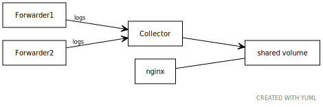

This document describes how to set up [Fluent Bit](https://docs.fluentbit.io/),
a log processor and forwarder, to collect your kubernetes logs in a central
directory. This is not required for running Knative, but can be helpful with
[Knative Serving](../serving), which will automatically delete pods (and their
associated logs) when they are no longer needed. Note that Fluent Bit supports
exporting to a number of other log providers; if you already have an existing
log provider (for example, Splunk, Datadog, ElasticSearch, or Stackdriver), then
you may only need
[the second part of setting up and configuring log forwarders](#setting-up-the-forwarders).

Setting up log collection consists of two pieces: running a log forwarding
DaemonSet on each node, and running a collector somewhere in the cluster (in our
example, we use a StatefulSet which stores logs on a Kubernetes
PersistentVolumeClaim, but you could also use a HostPath).

## Setting up the collector

It's useful to set up the collector before the forwarders, because you'll need
the address of the collector when configuring the forwarders, and the forwarders
may queue logs until the collector is ready.



<!-- yuml.me UML rendering of:
[Forwarder1]logs->[Collector]
[Forwarder2]logs->[Collector]

// Add notes
[Collector]->[shared volume]
[nginx]-[shared volume]
-->

The [`fluent-bit-collector.yaml`](./fluent-bit-collector.yaml) defines a
StatefulSet as well as a Kubernetes Service which allows accessing and reading
the logs from within the cluster. The supplied configuration will create the
monitoring configuration in a namespace called `logging`. You can apply the
configuration with:

```bash
kubectl apply --filename https://github.com/knative/docs/raw/master/docs/install/collecting-logs/fluent-bit-collector.yaml
```

The default configuration will classify logs into Knative, apps (pods with an
`app=` label which aren't Knative), and the default to logging with the pod
name; this can be changed by updating the `log-collector-config` ConfigMap
before or after installation. Once the ConfigMap is updated, you'll need to
restart Fluent Bit (for example, by deleting the pod and letting the StatefulSet
recreate it).

To access the logs through your web browser:

```shell
kubectl port-forward --namespace logging service/log-collector 8080:80
```

And then visit http://localhost:8080/.

You can also open a shell in the `nginx` pod and search the logs using unix
tools:

```
kubectl exec --namespace logging --stdin --tty --container nginx log-collector-0
```

## Local collector

If you are using a local Kubernetes cluster for development (Kind, Docker
Desktop, or Minikube), you can create a `hostPath` PersistentVolume to store the
logs on your desktop OS. This will allow you to use all your normal desktop
tools on the files without needing Kubernetes-specific tools.

The PersistentVolumeClaim will look something like this, but the `hostPath` will
vary based on your Kubernetes software and host operating system. Some example
values are documented below.

```yaml
apiVersion: v1
kind: PersistentVolume
metadata:
  name: shared-logs
  labels:
    app: logs-collector
spec:
  accessModes:
      - "ReadWriteOnce"
  storageClassName: manual
  claimRef:
    apiVersion: v1
    kind: PersistentVolumeClaim
    name: logs-log-collector-0
    namespace: logging
  capacity:
    storage: 5Gi
  hostPath:
    path:  /run/desktop/mnt/host/c/Users/evank/logs/
```

And then you'll need to update the StatefulSet's `volumeClaimTemplates` to
reference the `shared-logs` volume, like this fragment of yaml:

```yaml
  volumeClaimTemplates:
    metadata:
      name: logs
    spec:
      accessModes: [ "ReadWriteOnce" ]
      volumeName: shared-logs
```

Here are some known shared volume combinations to a `logs` directory in the home
directory for `$USER`:

| Host OS  | Kubernetes     | `hostPath` |
| Mac OS   | Kind           | `TODO` |
| Mac OS   | Minikube       | `TODO` |
| Mac OS   | Docker Desktop | `TODO` |
| Windows  | Kind           | `/run/desktop/mnt/host/c/Users/${USER}/` |
| Windows  | Minikube       | `/run/desktop/mnt/host/c/Users/${USER}/` |
| Windows  | Docker Desktop | `/run/desktop/mnt/host/c/Users/${USER}/` |


## Setting up the forwarders

For the most part, you can follow the
[Fluent Bit directions for installing on Kubernetes](https://docs.fluentbit.io/manual/installation/kubernetes).
Those directions will set up a Fluent Bit DaemonSet which forwards logs to
ElasticSearch by default; when the directions call for creating the ConfigMap,
you'll want to either replace the elasticsearch configuration with
[this `fluent-bit-configmap.yaml`](./fluent-bit-configmap.yaml) or add the
following block to the ConfigMap and update the
`@INCLUDE output-elasticsearch.conf` to be `@INCLUDE output-forward.conf`.

```yaml
output-forward.conf: |
  [OUTPUT]
      Name            forward
      Host            log-collector.logging
      Port            24224
      Require_ack_response  True
```

If you are using a different log collection infrastructure (Splunk, for
example),
[follow the directions in the FluentBit documentation](https://docs.fluentbit.io/manual/pipeline/outputs)
on how to configure your forwarders.

