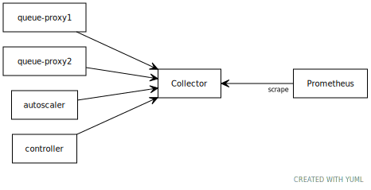

This document describes how to set up the
[OpenTelemetry Collector](https://opentelemetry.io/docs/collector/about/) to
receive metrics from the Knative infrastructure components and distribute them
to Prometheus. [OpenTelemetry](https://opentelemetry.io/) is a CNCF project to
provide consistent interfaces for instrumenting applications and platforms to
provide telemetry information for developers and operators. OpenTelemetry allows
Knative to build provider-agnostic instrumentation into the platform, so that
it's easy to export logs to multiple monitoring services without needing to
rebuild or reconfigure the Knative binaries.

## Setting up the collector

The collector provides a long-lived location where various Knative components
can push metrics (and eventually traces) to be retained and collected by a
monitoring service. For this example, we'll configure a single collector
instance using the
[opentelemetry-operator](https://github.com/open-telemetry/opentelemetry-operator).



<!-- yuml.me UML rendering of:
[queue-proxy1]->[Collector]
[queue-proxy2]->[Collector]
[autoscaler]->[Collector]
[Collector]<-scrape[Prometheus]
-->

1. The OpenTelemetry Operator requires [cert-manager](https://cert-manager.io/).
   Typically, Knative installations will already have cert-manager for auto-TLS,
   but if not,
   [install from these instructions](https://cert-manager.io/docs/installation/kubernetes/).

1. The first step is to install the operator:

   ```shell
   kubectl apply --filename https://github.com/open-telemetry/opentelemetry-operator/releases/latest/download/opentelemetry-operator.yaml
   ```

1. Next, create a namespace for the collector to run in:

   ```shell
   kubectl create namespace metrics
   ```

1. And then create an OpenTelemetryCollector object to store the configuration
   for the collector:

   ```shell
   kubectl apply --filename collector.yaml
   ```

1. Finally, update the `config-observability` ConfigMap in Knative Serving and
   Eventing
   ```shell
   kubectl patch --namespace knative-serving configmap/config-observability \
     --type merge \
     --patch '{"data":{"metrics.backend-destination":"opencensus","metrics.opencensus-address":"otel-collector.metrics:55678"}}'
   kubectl patch --namespace knative-eventing configmap/config-observability \
     --type merge \
     --patch '{"data":{"metrics.backend-destination":"opencensus","metrics.opencensus-address":"otel-collector.metrics:55678"}}'
   ```

You can check that metrics are being forwarded by loading the Prometheus export
port on the collector:

```shell
kubectl port-forward --namespace metrics deployment/otel-collector 8889
```

And then fetch http://localhost:8889/metrics to see the exported metrics.

## Setting up Prometheus

[Prometheus](https://prometheus.io/) is an open-source tool for collecting and
aggregating timeseries metrics. Full configuration of Prometheus can be found at
the website, but this document will provide a simple setup for scraping the
OpenTelemetry Collector we set up in the previous section.

1. Install the
   [Prometheus Operator](https://github.com/prometheus-operator/prometheus-operator).
   Note that the provided manifest installs the operator into the `default`
   namespace. If you want to install into another namespace, you'll need to
   download the YAML manifest and update all the namespace references to your
   target namespace.

   ```shell
   kubectl apply --filename https://raw.githubusercontent.com/prometheus-operator/prometheus-operator/master/bundle.yaml
   ```

1. You'll then need to set up a ServiceMonitor object to track the OpenTelemetry
   Collector, as well as a ServiceAccount with the ability to read Kubernetes
   services and pods (so that Prometheus can track the resource endpoints) and
   finally a Prometheus object to instantiate the actual Prometheus instance.

   ```shell
   kubectl apply --filename prometheus.yaml
   ```

By default, the Prometheus instance will only be exposed on a private service
named `prometheus-operated`; to access the console in your web browser, run:

```shell
kubectl port-forward --namespace metrics service/prometheus-operated 9090
```

And then access the console in your browser via http://localhost:9090.
