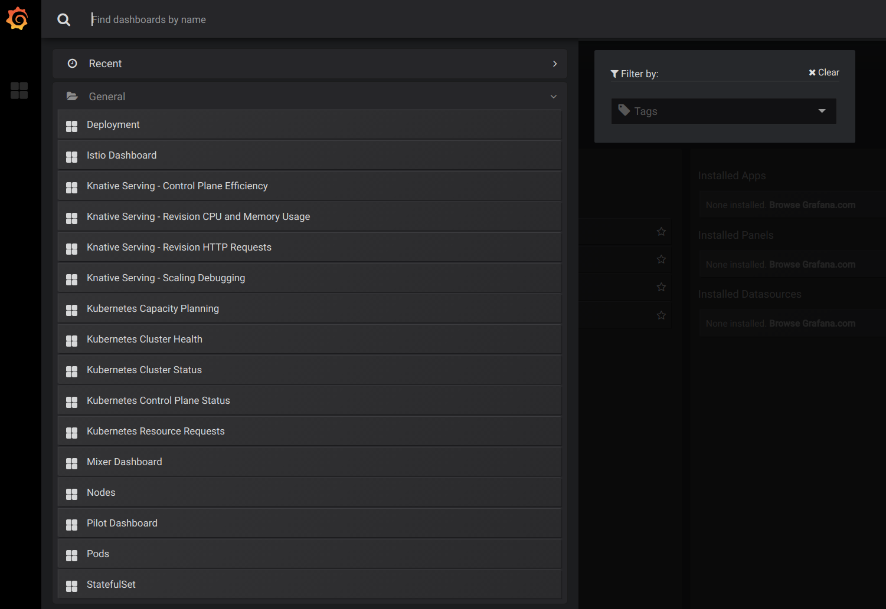

You access metrics through the [Grafana](https://grafana.com/) UI. Grafana is
the visualization tool for [Prometheus](https://prometheus.io/).

## Grafana

1. To open Grafana, enter the following command:

```shell
kubectl port-forward --namespace knative-monitoring \
$(kubectl get pods --namespace knative-monitoring \
--selector=app=grafana --output=jsonpath="{.items..metadata.name}") \
3000
```

- This starts a local proxy of Grafana on port 3000. For security reasons, the
  Grafana UI is exposed only within the cluster.

2. Navigate to the Grafana UI at [http://localhost:3000](http://localhost:3000).

3. Select the **Home** button on the top of the page to see the list of
   pre-installed dashboards (screenshot below):
   

The following dashboards are pre-installed with Knative Serving:

- **Revision HTTP Requests:** HTTP request count, latency, and size metrics per
  revision and per configuration
- **Nodes:** CPU, memory, network, and disk metrics at node level
- **Pods:** CPU, memory, and network metrics at pod level
- **Deployment:** CPU, memory, and network metrics aggregated at deployment
  level
- **Istio, Mixer and Pilot:** Detailed Istio mesh, Mixer, and Pilot metrics
- **Kubernetes:** Dashboards giving insights into cluster health, deployments,
  and capacity usage

4. Set up an administrator account to modify or add dashboards by signing in
   with username: `admin` and password: `admin`.

- Before you expose the Grafana UI outside the cluster, make sure to change the
  password. You will be prompted to set a password on first login, and it can
  later be changed at
  [http://localhost:3000/org/users](http://localhost:3000/org/users).

## Prometheus

Although Grafana provides a richer set of graphing functionality, Prometheus can
still be useful for debugging.

1. To open Prometheus, enter the following command:

```shell
kubectl port-forward -n knative-monitoring \
$(kubectl get pods -n knative-monitoring \
--selector=app=prometheus --output=jsonpath="{.items[0].metadata.name}") \
9090
```

- This starts a local proxy of Prometheus on port 9090. For security reasons,
  the Prometheus UI is exposed only within the cluster.

2. Navigate to the Prometheus UI at
   [http://localhost:9090](http://localhost:9090)

### Metrics Troubleshooting

You can use the Prometheus web UI to troubleshoot publishing and service
discovery issues for metrics.

- To see the targets that are being scraped, go to Status -> Targets
- To see what Prometheus service discovery is picking up vs. dropping, go to
  Status -> Service Discovery
- To see a specific metric you can search for in the in search box on the top of
  the page


