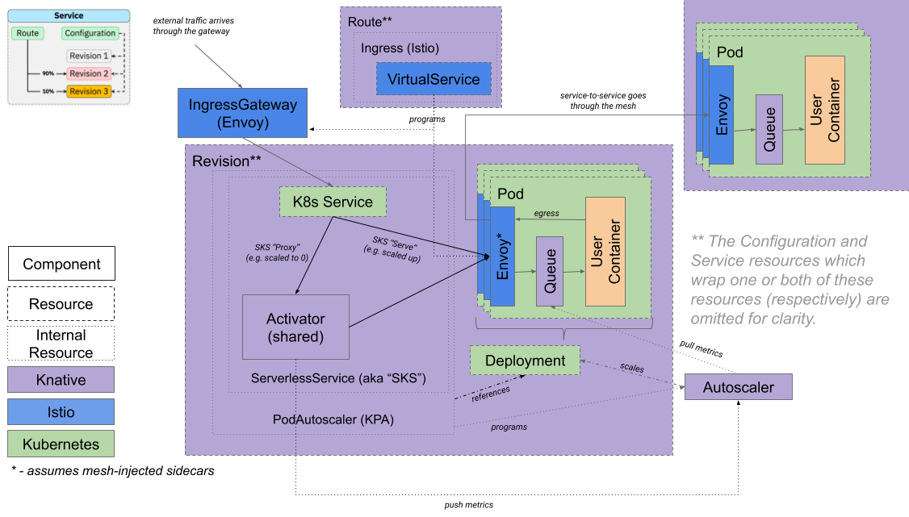

# Enabling requests to Knative services when additional authorization policies are enabled

Knative Serving system pods, such as the activator and autoscaler components, require access to your deployed Knative services.
If you have configured additional security features, such as Istio's authorization policy, you must enable access to your Knative service for these system pods.

## Before you begin

You must meet the following prerequisites to use Istio AuthorizationPolicy:

- Istio must be used for your Knative Ingress.
See [Install a networking layer](../install/yaml-install/serving/install-serving-with-yaml.md#install-a-networking-layer).
- Istio sidecar injection must be enabled.
See the [Istio Documentation](https://istio.io/latest/docs/setup/additional-setup/sidecar-injection/).

## Mutual TLS in Knative

Because Knative requests are frequently routed through activator, some considerations need to be made when using mutual TLS.



Generally, mutual TLS can be configured normally as [in Istio's documentation](https://istio.io/latest/docs/tasks/security/authentication/mtls-migration/). However, since the activator can be in the request path of Knative services, it must have sidecars injected. The simplest way to do this is to label the `knative-serving` namespace:

```bash
kubectl label namespace knative-serving istio-injection=enabled
```

If the activator isn't injected:

- In PERMISSIVE mode, you'll see requests appear without the expected `X-Forwarded-Client-Cert` header when forwarded by the activator.

    ```bash
    $ kubectl exec deployment/httpbin -c httpbin -it -- curl -s http://httpbin.knative.svc.cluster.local/headers
    {
      "headers": {
        "Accept": "*/*",
        "Accept-Encoding": "gzip",
        "Forwarded": "for=10.72.0.30;proto=http",
        "Host": "httpbin.knative.svc.cluster.local",
        "K-Proxy-Request": "activator",
        "User-Agent": "curl/7.58.0",
        "X-B3-Parentspanid": "b240bdb1c29ae638",
        "X-B3-Sampled": "0",
        "X-B3-Spanid": "416960c27be6d484",
        "X-B3-Traceid": "750362ce9d878281b240bdb1c29ae638",
        "X-Envoy-Attempt-Count": "1",
        "X-Envoy-Internal": "true"
      }
    }
    ```

- In STRICT mode, requests will simply be rejected.

To understand when requests are forwarded through the activator, see the [target burst capacity](load-balancing/target-burst-capacity.md) documentation.

This also means that many Istio AuthorizationPolicies won't work as expected. For example, if you set up a rule allowing requests from a particular source into a Knative service, you will see requests being rejected if they are forwarded by the activator.

For example, the following policy allows requests from within pods in the `serving-tests` namespace to other pods in the `serving-tests` namespace.

```yaml
apiVersion: security.istio.io/v1beta1
kind: AuthorizationPolicy
metadata:
 name: allow-serving-tests
 namespace: serving-tests
spec:
 action: ALLOW
 rules:
 - from:
   - source:
      namespaces: ["serving-tests"]
```

Requests here will fail when forwarded by the activator, because the Istio proxy at the destination service will see the source namespace of the requests as `knative-serving`, which is the namespace of the activator.

Currently, the easiest way around this is to explicitly allow requests from the `knative-serving` namespace, for example by adding it to the list in the policy mentioned earlier:

```yaml
apiVersion: security.istio.io/v1beta1
kind: AuthorizationPolicy
metadata:
 name: allow-serving-tests
 namespace: serving-tests
spec:
 action: ALLOW
 rules:
 - from:
   - source:
      namespaces: ["serving-tests", "knative-serving"]
```

## Health checking and metrics collection

In addition to allowing your application path, you'll need to configure Istio AuthorizationPolicy to allow health checking and metrics collection to your applications from system pods. You can allow access from system pods by paths.

### Allowing access from system pods by paths

Knative system pods access your application using the following paths:

- `/metrics`
- `/healthz`

The `/metrics` path allows the autoscaler pod to collect metrics.
The `/healthz` path allows system pods to probe the service.

To add the `/metrics` and `/healthz` paths to the AuthorizationPolicy:

1. Create a YAML file for your AuthorizationPolicy using the following example:

    ```yaml
    apiVersion: security.istio.io/v1beta1
    kind: AuthorizationPolicy
    metadata:
      name: allowlist-by-paths
      namespace: serving-tests
    spec:
      action: ALLOW
      rules:
      - to:
        - operation:
            paths:
            - /metrics   # The path to collect metrics by system pod.
            - /healthz   # The path to probe by system pod.
    ```

1. Apply the YAML file by running the command:

    ```bash
    kubectl apply -f <filename>.yaml
    ```
    Where `<filename>` is the name of the file you created in the previous step.
