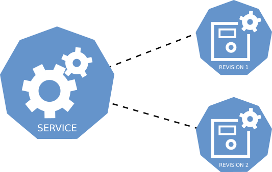

# About Revisions

--8<-- "about-revisions.md"

<!--TODO: Check image formatting and whether we need a set size for diagrams in CSS-->

## Additional resources

- [Revision spec](https://github.com/knative/specs/blob/main/specs/serving/knative-api-specification-1.0.md#revision)
