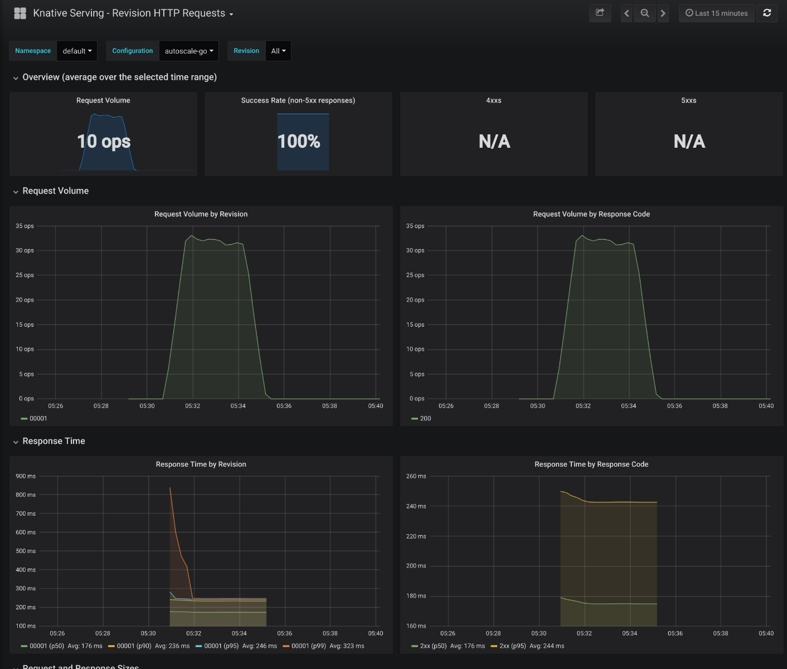

A demonstration of the autoscaling capabilities of a Knative Serving Revision.

## Prerequisites

1. A Kubernetes cluster with
   [Knative Serving](../../../../install/)
   installed.
1. A
   [metrics installation](../../../installing-logging-metrics-traces/)
   for viewing scaling graphs (optional).
1. The `hey` load generator installed (`go get -u github.com/rakyll/hey`).
1. Clone this repository, and move into the sample directory:

    ```
    git clone https://github.com/knative/docs knative-docs
    cd knative-docs
    ```

## Deploy the Service

1. Deploy the [sample](../service.yaml) Knative Service:

    ```
    kubectl apply --filename serving/samples/autoscale-go/service.yaml
    ```

1. Find the ingress hostname and IP and export as an environment variable:

    ```
    # In Knative 0.2.x and prior versions, the `knative-ingressgateway` service was used instead of `istio-ingressgateway`.
    INGRESSGATEWAY=knative-ingressgateway

    # The use of `knative-ingressgateway` is deprecated in Knative v0.3.x.
    # Use `istio-ingressgateway` instead, since `knative-ingressgateway`
    # will be removed in Knative v0.4.
    if kubectl get configmap config-istio -n knative-serving &> /dev/null; then
        INGRESSGATEWAY=istio-ingressgateway
    fi

    export IP_ADDRESS=`kubectl get svc $INGRESSGATEWAY --namespace istio-system --output jsonpath=" .  {.status.loadBalancer.ingress[*].ip}"`
    ```

## Load the Service

1. Make a request to the autoscale app to see it consume some resources.

    ```
    curl --header "Host: autoscale-go.default.example.com" "http://${IP_ADDRESS?}?sleep=100&prime=10000&bloat=5"
    ```

    ```
    Allocated 5 Mb of memory.
    The largest prime less than 10000 is 9973.
    Slept for 100.13 milliseconds.
    ```

1. Send 30 seconds of traffic maintaining 50 in-flight requests.

    ```
    hey -z 30s -c 50 \
      -host "autoscale-go.default.example.com" \
      "http://${IP_ADDRESS?}?sleep=100&prime=10000&bloat=5" \
      && kubectl get pods
    ```

    ```
    Summary:
      Total:        30.3379 secs
      Slowest:      0.7433 secs
      Fastest:      0.1672 secs
      Average:      0.2778 secs
      Requests/sec: 178.7861

      Total data:   542038 bytes
      Size/request: 99 bytes

    Response time histogram:
      0.167 [1]     |
      0.225 [1462]  |■■■■■■■■■■■■■■■■■■■■■■■■■■■■■■■
      0.282 [1303]  |■■■■■■■■■■■■■■■■■■■■■■■■■■■■
      0.340 [1894]  |■■■■■■■■■■■■■■■■■■■■■■■■■■■■■■■■■■■■■■■■
      0.398 [471]   |■■■■■■■■■■
      0.455 [159]   |■■■
      0.513 [68]    |■
      0.570 [18]    |
      0.628 [14]    |
      0.686 [21]    |
      0.743 [13]    |

    Latency distribution:
      10% in 0.1805 secs
      25% in 0.2197 secs
      50% in 0.2801 secs
      75% in 0.3129 secs
      90% in 0.3596 secs
      95% in 0.4020 secs
      99% in 0.5457 secs

    Details (average, fastest, slowest):
      DNS+dialup:   0.0007 secs, 0.1672 secs, 0.7433 secs
      DNS-lookup:   0.0000 secs, 0.0000 secs, 0.0000 secs
      req write:    0.0001 secs, 0.0000 secs, 0.0045 secs
      resp wait:    0.2766 secs, 0.1669 secs, 0.6633 secs
      resp read:    0.0002 secs, 0.0000 secs, 0.0065 secs

    Status code distribution:
      [200] 5424 responses
    ```

    ```
    NAME                                             READY   STATUS    RESTARTS   AGE
    autoscale-go-00001-deployment-78cdc67bf4-2w4sk   3/3     Running   0          26s
    autoscale-go-00001-deployment-78cdc67bf4-dd2zb   3/3     Running   0          24s
    autoscale-go-00001-deployment-78cdc67bf4-pg55p   3/3     Running   0          18s
    autoscale-go-00001-deployment-78cdc67bf4-q8bf9   3/3     Running   0          1m
    autoscale-go-00001-deployment-78cdc67bf4-thjbq   3/3     Running   0          26s
    ```

## Analysis

### Algorithm

Knative Serving autoscaling is based on the average number of in-flight requests
per pod (concurrency). The system has a default
[target concurrency of 100.0](https://github.com/knative/serving/blob/3f00c39e289ed4bfb84019131651c2e4ea660ab5/config/config-autoscaler.yaml#L35)
but [we used 10](service.yaml#L26) for our service. We loaded the service with
50 concurrent requests so the autoscaler created 5 pods
(`50 concurrent requests / target of 10 = 5 pods`)

#### Panic

The autoscaler calculates average concurrency over a 60 second window so it
takes a minute for the system to stablize at the desired level of concurrency.
However the autoscaler also calculates a 6 second "panic" window and will enter
panic mode if that window reached 2x the target concurrency. In panic mode the
autoscaler operates on the shorter, more sensitive panic window. Once the panic
conditions are no longer met for 60 seconds, the autoscaler will return to the
initial 60 second "stable" window.

 ```
                                                        |
                                   Panic Target--->  +--| 20
                                                     |  |
                                                     | <------Panic Window
                                                     |  |
        Stable Target--->  +-------------------------|--| 10   CONCURRENCY
                           |                         |  |
                           |                      <-----------Stable Window
                           |                         |  |
 --------------------------+-------------------------+--+ 0
 120                       60                           0
                      TIME
 ```

#### Customization

The autoscaler supports customization through annotations. There are two
autoscaler classes built into Knative:

1. `kpa.autoscaling.knative.dev` which is the concurrency-based autoscaler
   described above (the default), and
2. `hpa.autoscaling.knative.dev` which delegates to the Kubernetes HPA which
   autoscales on CPU usage.

Example of a Service scaled on CPU:

 ```
 apiVersion: serving.knative.dev/v1alpha1
 kind: Service
 metadata:
   name: autoscale-go
   namespace: default
 spec:
   runLatest:
     configuration:
       revisionTemplate:
         metadata:
           annotations:
             # Standard Kubernetes CPU-based autoscaling.
             autoscaling.knative.dev/class:  hpa.autoscaling.knative.dev
             autoscaling.knative.dev/metric: cpu
         spec:
           container:
             image: gcr.io/knative-samples/autoscale-go:0.1
 ```

Additionally the autoscaler targets and scaling bounds can be specified in
annotations. Example of a Service with custom targets and scale bounds:

 ```
 apiVersion: serving.knative.dev/v1alpha1
 kind: Service
 metadata:
   name: autoscale-go
   namespace: default
 spec:
   runLatest:
     configuration:
       revisionTemplate:
         metadata:
           annotations:
             # Knative concurrency-based autoscaling (default).
             autoscaling.knative.dev/class:  kpa.autoscaling.knative.dev
             autoscaling.knative.dev/metric: concurrency
             # Target 10 requests in-flight per pod.
             autoscaling.knative.dev/target: "10"
             # Disable scale to zero with a minScale of 1.
             autoscaling.knative.dev/minScale: "1"
             # Limit scaling to 100 pods.
             autoscaling.knative.dev/maxScale: "100"
         spec:
           container:
             image: gcr.io/knative-samples/autoscale-go:0.1
 ```

Note: for an `hpa.autoscaling.knative.dev` class service, the
`autoscaling.knative.dev/target` specifies the CPU percentage target (default
`"80"`).

#### Demo

View the [Kubecon Demo](https://youtu.be/OPSIPr-Cybs) of Knative autoscaler
customization (32 minutes).

### Dashboards

View the Knative Serving Scaling and Request dashboards (if configured).

 ```
 kubectl port-forward --namespace knative-monitoring $(kubectl get pods --namespace knative-monitoring --selector=app=grafana  --output=jsonpath="{.items..metadata.name}") 3000
 ```




### Other Experiments

1. Send 60 seconds of traffic maintaining 100 concurrent requests.

    ```
    hey -z 60s -c 100 \
      -host "autoscale-go.default.example.com" \
      "http://${IP_ADDRESS?}?sleep=100&prime=10000&bloat=5"
    ```

1. Send 60 seconds of traffic maintaining 100 qps with short requests (10 ms).

    ```
    hey -z 60s -q 100 \
      -host "autoscale-go.default.example.com" \
      "http://${IP_ADDRESS?}?sleep=10"
    ```

1. Send 60 seconds of traffic maintaining 100 qps with long requests (1 sec).

    ```
    hey -z 60s -q 100 \
      -host "autoscale-go.default.example.com" \
      "http://${IP_ADDRESS?}?sleep=1000"
    ```

1. Send 60 seconds of traffic with heavy CPU usage (~1 cpu/sec/request, total
   100 cpus).

    ```
    hey -z 60s -q 100 \
      -host "autoscale-go.default.example.com" \
      "http://${IP_ADDRESS?}?prime=40000000"
    ```

1. Send 60 seconds of traffic with heavy memory usage (1 gb/request, total 5
   gb).

    ```
    hey -z 60s -c 5 \
      -host "autoscale-go.default.example.com" \
      "http://${IP_ADDRESS?}?bloat=1000"
    ```

## Cleanup

 ```
 kubectl delete --filename serving/samples/autoscale-go/service.yaml
 ```

## Further reading

[Autoscaling Developer Documentation](https://github.com/knative/serving/blob/master/docs/scaling/DEVELOPMENT/)
