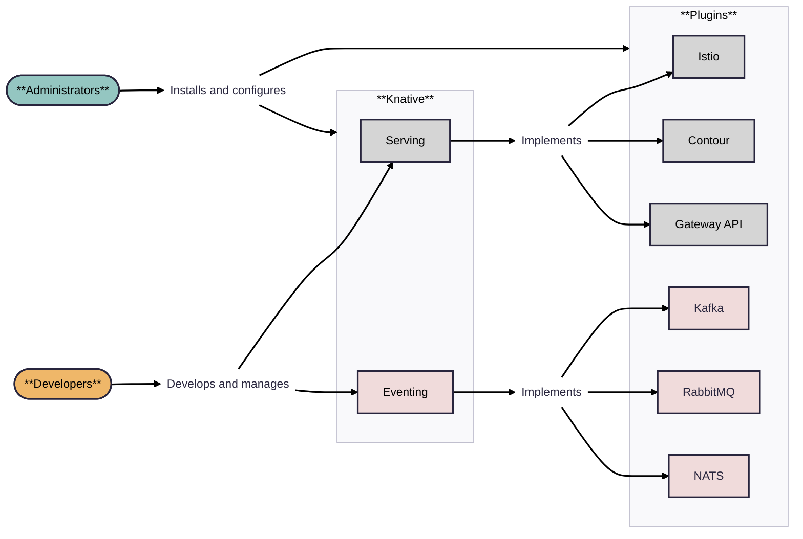

# Overview

This page provides guidance for administrators on how to manage Knative on an existing Kubernetes cluster. Knative administrators install and configure both or either of the Serving and Eventing components along with default or preferred plugins.

Administrators can use Knative to provide developers with a simple experience for interacting with clusters and deploying applications. In this model, developers primarily interact with Knative resources like Services, Brokers, and Triggers. Because Knative can interoperate with core Kubernetes objects, developers can also use existing Kubernetes tools such as pods, services, networking, identity, and storage where needed. Developers looking to further simplify the deployment experience can define functions with the Knative Functions programming model. The following illustration shows the roles of administrators and developers in this model:

As a cluster administrator, your responsibilities include managing the Kubernetes environment, installing cluster-wide components, and enabling developers to deploy applications on the cluster. Knative aims to simplify developer tasks, while aligning with existing management tools and processes.

Knative includes a plugin system to integrate with existing infrastructure in the cluster, enabling Knative resources such as Routes and Brokers to be implemented using one of multiple underlying suppliers. For example, a Knative Eventing app can deliver events to a Broker that triggers a function based on the received event. In a testing cluster, the delivery might use an in-memory option, while a staging or production environment might use a cloud-provided Kafka service.

Of particular interest to cluster administrators is that Knative supports customizable _default values_ on the parameters defined in resource YAML files. These configurations reduce the amount of environment configuration tasks developers needs to consider.

## Installation decisions

See the [Installation roadmap](../install/README.md#installation-roadmap) for prerequisites and installation steps. Your first installation decision is whether to use a YAML-based installation or use the Knative Operator. The Knative Operator is a custom controller that extends the Kubernetes API to install Knative components. If you just need to get acquainted with Knative at this time, you can install the [quickstart](../getting-started/quickstart-install.md).

The method you use to install Knative is not permanent and you can install clusters differently depending on the situation. Although transitioning between installation methods on one cluster is possible, new installations on separate clusters is the better-tested and officially supported approach.

### Upgrades

Administrators are generally responsible for performing upgrades to cluster infrastructure, apps, and services. Knative is designed and tested for continuous operation during upgrades and rollbacks, allowing you to:

- Upgrade or revert the Knative components while it is serving traffic, rather than needing a maintenance window.
- Downgrade by one Knative version. Downgrades work provided that no applications have used new features since the last upgrade.

## Securing Knative

You can grant developers access to additional resources related to their namespace in other services, such as observability, logs, metrics, tracing, and dashboards.

Knative resources are namespaced. Knative adheres to the Kubernetes model of namespace-based isolation that lets you manage development teams and resources by assigning them to namespaces.

Namespaces can also isolate boundaries for tooling such as logs, metrics, tracing, CI/CD integrations, and dashboards. The extent of this isolation depends on both the enforcement strategy and how consistently teams adhere to namespace boundaries.

You can optimize and enforce isolation involving namespaces using standard Kubernetes mechanisms, including:

- [Role-Based Access Control (RBAC)](https://kubernetes.io/docs/reference/access-authn-authz/rbac/)
- [Resource Quotas](https://kubernetes.io/docs/concepts/policy/resource-quotas/)
- [Network Policies](https://kubernetes.io/docs/concepts/services-networking/network-policies/)
- [Pod Security Standards](https://kubernetes.io/docs/concepts/security/pod-security-standards/)

## Configurations

Knative configurations are performed by the following methods:

- Editing YAML manifests and applying with the `kubectl` tool

    Modify resource definitions directly, including labels, annotations, and field values. You can use Kubernetes features such as [OPA](https://kubernetes.io/blog/2019/08/06/opa-gatekeeper-policy-and-governance-for-kubernetes/) and [Kyverno](https://kyverno.io) to enforce specific values on a resource type, or use ConfigMaps in plugin installations to set values at the cluster level.

- Using ConfigMaps

    Store and manage configuration data as key-value pairs. ConfigMaps are frequently used to tune platform-wide behavior. Most of the Knative ConfigMaps are in the `knative-serving` and `knative-eventing` namespaces. Their settings apply to all the relevant Knative components in all namespaces.

- Using the Knative Operator

    Some platform-wide settings can be managed declaratively using the Knative Operator, installed with the `kn` Knative CLI plugin. You can manage the operator without using the `kn` CLI. The `kn` CLI manages only operator installations.

For more information, see [Installing CLI tools](../client/README.md)

Knative uses Kubernetes YAML manifests to define and configure system components. These manifests include core resources, custom resource definitions (CRDs), and extensibility features. As with Kubernetes, these configuration resources are declarative and can be managed using the `kubectl` CLI tool or with continuous delivery tools.

The following sections provide an overview of the current configurations procedures of interest to Administrators. You make these configurations using `kubectl`, with some procedures applying YAML files.

### Serving configurations

| Configuration | ConfigMap | Description |
| -- | --- | --- |
| [Default configurations](../serving/configuration/config-defaults.md) | `config-defaults` | Default resource values such as performance, hardware, and storage settings. |
| [Deployment resources](../serving/configuration/deployment.md) | `config-deployment` | Kubernetes deployment resources that back Knative services. |
| [Domain names](../serving/using-a-custom-domain.md) | `config-domain` | Configure and publish domains. |
| [High-availability](../serving/config-ha.md) | NA | Configure ensure that APIs stay operational if a disruption occurs. |
| [Garbage collection](../serving/revisions/revision-admin-config-options.md) | `config-gc` | Disable and enable collection and set retention time values. |
| [Ingress gateway](../serving/setting-up-custom-ingress-gateway.md)| `config-istio` | For new clusters, you can configure your own gateway and underlying service. |
| [Istio authorization](../serving/istio-authorization.md) | NA | Grant authorization to your deployed Knative services. |
| [Namespace exclusion from webhook](../serving/webhook-customizations.md) | NA | For performance concerns during an upgrade. |
| [Rollout duration for revisions](../serving/configuration/rolling-out-latest-revision-configmap.md) | `config-network` | Adjust rollout durations to accommodate longer request queues. |
| [Security - Certificates](../serving/encryption/configure-certmanager-integration.md) | NA | Describes how to manage automatic certificate provisioning. |
| [Security - Encryptions](../serving/encryption/encryption-overview.md) | `config-network` | Provides links to procedures for encrypting external domains, the local cluster, and system internal. |

### Eventing configurations

| Configuration | ConfigMap | Description |
| -- | --- | --- |
| [Broker defaults](../eventing/configuration/broker-configuration.md) | `config-br-defaults` | Specify your own broker class and channel, or use the default `MTChannelBasedBroker` Broker class and  the ConfigMap of channel defaults. |
| [Broker features (Kafka)](../eventing/brokers/broker-types/kafka-broker/configuring-kafka-features.md) | `config-kafka-features` | Configure options for Broker interactions with Apache Kafka clusters. |
| [Channel defaults](../eventing/configuration/channel-configuration.md) | `default-ch-webhook` | Default configurations and labels to use for the channel. |
| [Channel defaults (Kafka)](../eventing/configuration/kafka-channel-configuration.md) | `kafka-channel` | Defines how KafkaChannel instances are created. Requires that KafkaChannel custom resource definitions (CRD) are installed.|
| [Event source defaults](../eventing/configuration/sources-configuration.md) |`config-ping-defaults` | Configure the PingSource default resources and the maximum data size for CloudEvents it produces. |
| [KEDA Autoscaling of Kafka Resources](../eventing/configuration/keda-configuration.md) |`config-kafka-features` | Configure how KEDA scales a KafkaSource, trigger, or subscription. Note: This feature is is Alpha pre-release. |
| [Sugar Controller](../eventing/sugar/README.md) |`config-sugar` | Configure the Sugar controller, which reacts to label configurations to produce or control eventing resources. See also [Knative Eventing Sugar Controller](../eventing/sugar/README.md). |

