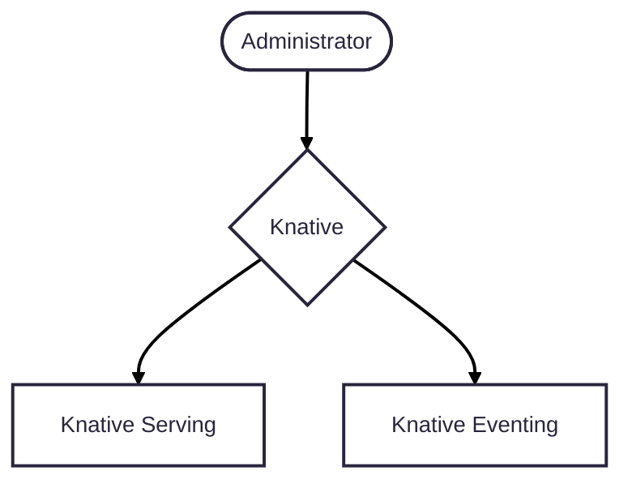

# Overview

This page provides guidance for administrators on how to manage Knative on an existing Kubernetes cluster.

As a cluster administrator, your responsibilities include managing the Kubernetes environment, installing cluster-wide components, and enabling developers to deploy applications on the cluster. Knative aims to simplify developer tasks, while aligning with existing management tools and processes.

Knative includes a plugin system to integrate with existing infrastructure in the cluster, enabling Knative resources such as Routes and Brokers to be implemented using one of multiple underlying suppliers. For example, a Knative Eventing app can deliver events to a Broker that triggers a function based on the received event. In a testing cluster, the delivery might use an in-memory option, while a staging or production environment might use a cloud-provided Kafka service.

Of particular interest to cluster administrators is that Knative supports customizable _default values_ on the parameters defined in resource YAML files. These configurations reduce the amount of environment configuration tasks developers needs to consider.

## Knative installations

See the [Installation roadmap](../install/README.md#installation-roadmap) for prerequisites and installation steps. Your first installation decision is whether to use a YAML-based installation or use the Knative Operator. The Knative Operator is a custom controller that extends the Kubernetes API to install Knative components. If you just need to get acquainted with Knative at this time, you can install the [quickstart](../getting-started/quickstart-install.md).

## Configuring Knative

Knative uses Kubernetes YAML manifests to define and configure system components. These manifests include core resources, custom resource definitions (CRDs), and extensibility features. As with Kubernetes, these configuration resources are declarative and can be managed using the `kubectl` CLI tool or with continuous delivery tools.

This section provides an overview of the current configurations procedures in the Knative documentation of interest to Administrators.

### Network options

| Configuration | Frequency | Tool | ConfigMap |
| --- | --- | --- | --- |
| [Configure the ingress gateway](../serving/setting-up-custom-ingress-gateway.md) | Infrequent | kubectl | config-istio |
| [Configure Domain names](../serving/using-a-custom-domain.md) | Infrequent | kubectl | config-domain |
| [Istio Authorization](../serving/istio-authorization.md) | Infrequent | kubectl | |

### Serving configuration

TBW

#### Encryption

TBW

### Eventing configurations

TBW

## Resource scoping and namespaces

Knative resources are namespaced. Knative adheres to the Kubernetes model of namespace-based isolation that lets you manage development teams and resources by assigning them to namespaces.

Namespaces can also isolate boundaries for tooling such as logs, metrics, tracing, CI/CD integrations, and dashboards. The extent of this isolation depends on both the enforcement strategy and how consistently teams adhere to namespace boundaries.

You can optimize and enforce isolation involving namespaces using standard Kubernetes mechanisms, including:

- [Role-Based Access Control (RBAC)](https://kubernetes.io/docs/reference/access-authn-authz/rbac/)
- [Resource Quotas](https://kubernetes.io/docs/concepts/policy/resource-quotas/)
- [Network Policies](https://kubernetes.io/docs/concepts/services-networking/network-policies/)
- [Pod Security Standards](https://kubernetes.io/docs/concepts/security/pod-security-standards/)

## Configuring Knative components

Knative configurations are performed by the following methods:

- Editing YAML manifests

    Modify resource definitions directly, including labels, annotations, and field values. You can use Kubernetes features such as [OPA](https://kubernetes.io/blog/2019/08/06/opa-gatekeeper-policy-and-governance-for-kubernetes/) and [Kyverno](https://kyverno.io) to enforce specific values on a resource type, or use ConfigMaps in plugin installations to set values at the cluster level.

- Using ConfigMaps

    Store and manage configuration data as key-value pairs. ConfigMaps are frequently used to tune platform-wide behavior. Most of the Knative ConfigMaps are in the `knative-serving` and `knative-eventing` namespaces. Their settings apply to all the relevant Knative components in all namespaces.

- Using the Knative Operator

    Some platform-wide settings can be managed declaratively using the Knative Operator.

## Authorizations

You can grant developers access to additional resources related to their namespace in other services, such as observability, logs, metrics, tracing, and dashboards.

## Upgrades

Administrators are generally responsible for performing upgrades cluster infrastructure and apps and services. Knative is designed and tested for continuous operation during upgrades and rollbacks, allowing you to:

- Upgrade or revert the Knative components while it is serving traffic, rather than needing a maintenance window.
- Downgrade one Knative version. Downgrades work provided that no applications have used new features since the last upgrade.
