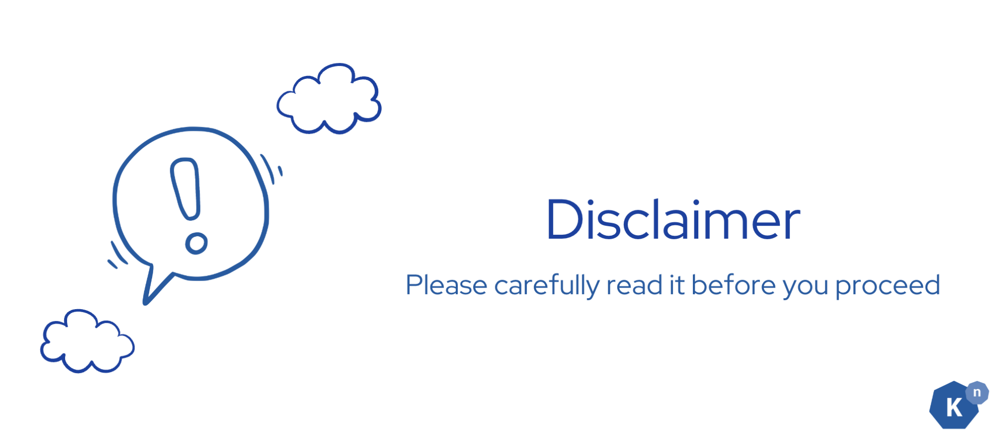
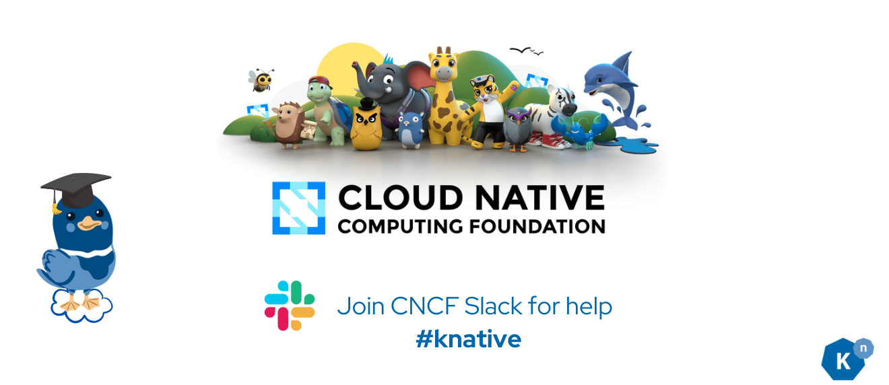

# **Disclaimer**

Hello dear Knative Learners,

Before you begin this tutorial, **please take note of the following disclaimer**. In the spirit of open source, we strive for transparency. This tutorial incorporates many other open source projects, and we are grateful to all the incredible contributors. Your amazing work has made this tutorial possible.

If you're interested in getting started with open source, check out our guide: Get Started with Open Source at Knative.

Thank you, and happy learning!

### **Open Source Libraries Used**

This tutorial makes use of several open source libraries to build the bookstore application. Below are the libraries used along with their respective documentation and project links:

- [Profanity Check](https://pypi.org/project/profanity-check/)
- [Flask](https://flask.palletsprojects.com/en/3.0.x/)
- [CloudEvents](https://cloudevents.io/)
- [TextBlob](https://textblob.readthedocs.io/en/dev/)
- [Node.js](https://nodejs.org/en)
- [Next.js](https://nextjs.org/)
- [PostgreSQL](https://www.postgresql.org/)
- [Apache Camel](https://camel.apache.org/)

### **Music Used in the Demo Video**

The music used in the demo video is sourced from Uppbeat, which provides free music for creators:

- Music: [Trendsetter](https://uppbeat.io/t/mood-maze/trendsetter) by Mood Maze
- License Code: JHDMCOJT3ZC4EVUB

### **Graphic Creation License**

Graphics used in this tutorial were created using Canva:

- Canva License: [Content License Agreement](https://www.canva.com/policies/content-license-agreement)

### **Results of ML Services in This Tutorial**

The results of the sentiment analysis and inappropriate language filter (a.k.a bad word filter) are generated using the open source libraries mentioned above. Knative **is not responsible** for the accuracy or reliability of the output generated by these libraries.

### **General Disclaimer**

This tutorial is provided for educational purposes only. While every effort has been made to ensure the accuracy and reliability of the information provided, the authors and contributors of this tutorial make no guarantees, representations, or warranties of any kind, express or implied, about the completeness, accuracy, reliability, suitability, or availability of the information contained within the tutorial for any purpose.

By using this tutorial, you acknowledge that:

- You are responsible for verifying the information and results obtained from the tutorial.
- The tutorial may contain links to external websites and resources; the authors and contributors of this tutorial are not responsible for the content, privacy policies, or practices of these external websites and resources.
- The open source libraries used in this tutorial are third-party products; the authors and contributors of this tutorial are not responsible for the performance, accuracy, or reliability of these libraries.

### **Contact**

If you have any questions or concerns regarding this disclaimer or the tutorial, please feel free to reach out to the Knative community via the Cloud Native Computing Foundation (CNCF) Slack, particularly the [#knative](https://cloud-native.slack.com/archives/C04LGHDR9K7){:target="_blank"} channel.