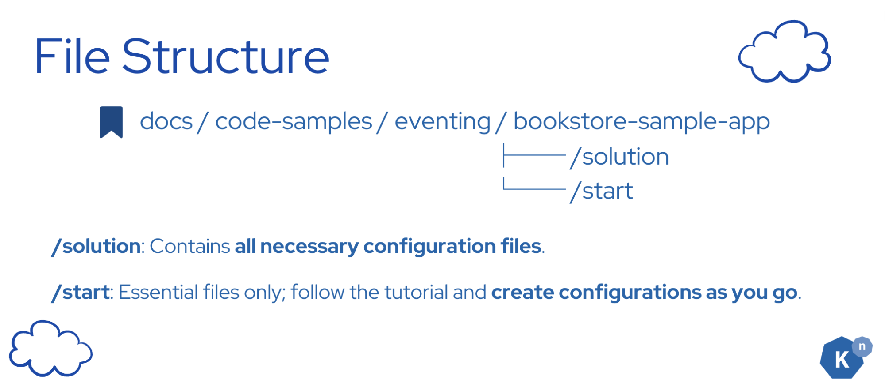
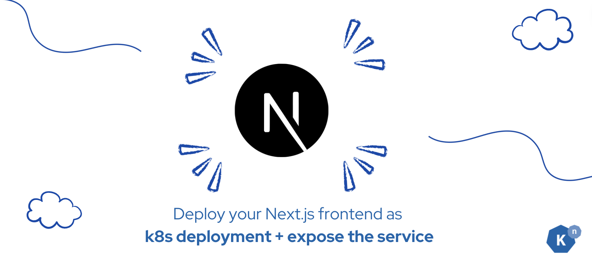

# Environment Setup


In this page, we will be discussing how to set up your environment, and make sure to run up the UI front end and the Book Review Service’s node server.

## **What does the final deliverable for this section look like?**

- You have a running Kubernetes (k8s) cluster on your local machine, with Knative installed.
- You have your front end application deployed as Kubernetes deployment
- You have your Node.js application deployed as Kubernetes deployment

We will be fulfilling each requirement with the order above.

## **Clone the Repository**


```bash
git clone https://github.com/knative/docs.git
```
???+ bug "Troubleshooting"
    Having issue with cloning your repo? Check [here](https://docs.github.com/en/repositories/creating-and-managing-repositories/troubleshooting-cloning-errors){:target="_blank"} for help.

!!! warning

    **IMPORTANT**: Please take some time to read the [Disclaimer](../disclaimer/README.md){:target="_blank"} before moving to the next page.


## **File Structure**



The code for the sample app is in `docs/code-samples/eventing/bookstore-sample-app`

Under `bookstore-sample-app` folder, there are 2 folders:

* **/solution**: this folder contains all the yaml files, and the code you needed. Check it when you got stuck.

* **/start**: this folder contains the necessary files for you to get started. Save there all the configuration files yourself following the tutorial!


!!! tip
    Kuack suggests you to start from **/start**, write all the configuration files as you go over the tutorial, and check solutions when you got stuck.


Always `cd` back to the root directory, which is `/start`, before running any commands.

All the commands in the tutorial are written **assuming you are in the `/start` directory**.


## **Shortcut**


Running `docs/code-samples/eventing/bookstore-sample-app/start/setup.sh` will automatically complete all tasks in this section.

!!! warning

    However, if you are not familiar with the process, we recommend reviewing the steps below.

## **Instructions**

### **Task 1: Set Up a Running Kubernetes Cluster with Knative Installed**


We recommend using [KinD (Kubernetes in Docker)](https://kind.sigs.k8s.io/docs/user/quick-start/) to run a Kubernetes cluster locally.

In order to access Kubernetes services KinD provides a standalone binary in your host and connects to your cluster and provisions new Load Balancer containers for your Services. It requires privileges to open ports on the system and to connect to the container runtime.

See instructions here: https://kind.sigs.k8s.io/docs/user/loadbalancer/

!!! tip

    We recommend you using `kn quickstart` plugin to install Knative.

Please follow the instructions [here](https://knative.dev/docs/install/){:target="_blank"} to spin up your cluster with Knative installed!

???+ success "Verify"

    You should see the pods in the `knative-eventing` and `knative-serving` namespaces running before proceeding.

    ```
    NAMESPACE            NAME                                         READY   STATUS    RESTARTS   AGE
    knative-eventing     eventing-controller-645c4bcd55-fln6l         1/1     Running   0          17m
    knative-eventing     eventing-webhook-7fd9cb958f-ft9vj            1/1     Running   0          17m
    knative-eventing     imc-controller-6b9fbb6487-kwvbz              1/1     Running   0          17m
    knative-eventing     imc-dispatcher-6c4b5856d-hh7wq               1/1     Running   0          17m
    knative-eventing     job-sink-5cc89b5d95-fhlt5                    1/1     Running   0          17m
    knative-eventing     mt-broker-controller-568d6b9c59-qk8dj        1/1     Running   0          17m
    knative-eventing     mt-broker-filter-db66554c4-sxxzr             1/1     Running   0          17m
    knative-eventing     mt-broker-ingress-774547844d-bbbdw           1/1     Running   0          17m
    knative-serving      activator-7bcd47489b-ljmt6                   1/1     Running   0          17m
    knative-serving      autoscaler-65cf6767c4-v7rfn                  1/1     Running   0          17m
    knative-serving      controller-964dcf97b-9qwsv                   1/1     Running   0          17m
    knative-serving      net-kourier-controller-854b568d4f-6xhl5      1/1     Running   0          17m
    knative-serving      webhook-658b566b8-sxbdz                      1/1     Running   0          17m
    kourier-system       3scale-kourier-gateway-54fb555bd7-v2l8q      1/1     Running   0          17m
    kube-system          coredns-66bc5c9577-fhnxr                     1/1     Running   0          18m
    kube-system          coredns-66bc5c9577-x299f                     1/1     Running   0          18m
    kube-system          etcd-kind-control-plane                      1/1     Running   0          18m
    kube-system          kindnet-gpq75                                1/1     Running   0          18m
    kube-system          kube-apiserver-kind-control-plane            1/1     Running   0          18m
    kube-system          kube-controller-manager-kind-control-plane   1/1     Running   0          18m
    kube-system          kube-proxy-v2kdx                             1/1     Running   0          18m
    kube-system          kube-scheduler-kind-control-plane            1/1     Running   0          18m
    local-path-storage   local-path-provisioner-7b8c8ddbd6-m5n2m      1/1     Running   0          18m
    ```

### **Task 2: Running the Bookstore Web App**



The Next.js frontend app is located in the `docs/code-samples/eventing/bookstore-sample-app/start/frontend` folder.

#### **Deploy the Frontend App**

You can either [build the image locally](https://docs.docker.com/get-started/02_our_app/){:target="_blank"} or use our pre-built image. If you are using the pre-built image, you can proceed to the next step.

When ready, run the following command to deploy the frontend app:

```bash
kubectl apply -f frontend/config/100-front-end-deployment.yaml
```

This will create the Deployment and expose it with a Service of type LoadBalancer to receive external traffic:

```
deployment.apps/bookstore-frontend created
service/bookstore-frontend-svc created
```

???+ success "Verify"
    Run the following command to check if the pod is running:
    
    ```bash
    kubectl get pods
    ```

    You will see that your front end pod is running.

    ```
    NAME                                  READY   STATUS    RESTARTS   AGE
    bookstore-frontend-7b879ffb78-9bln6   1/1     Running   0          4m37s
    ```

#### Access the frontend workload

Follow the respective `minikube` or `kind` instructions to access Kubernetes Services locally from your machine.

Check the running Kubernetes Services:

```bash
kubectl get services
```

And you will see the following console output:
```
NAME                     TYPE           CLUSTER-IP      EXTERNAL-IP   PORT(S)          AGE
bookstore-frontend-svc   LoadBalancer   10.99.187.173   172.18.0.6    80:31600/TCP   27m
kubernetes               ClusterIP      10.96.0.1       <none>        443/TCP          39m
```

!!! note
    If the `EXTERNAL-IP` for your frontend service is `<pending>`, then there you'll need to check that
    your `minikube tunnel` or KinD `cloud-provider-kind` is working properly.

???+ success "Verify"
    Access the UI page using the `bookstore-frontend-svc` `EXTERNAL-IP` address. The UI page should appear!

    

### **Task 3: Running the Book Review Service**


The Node.js server is located in the `node-server` folder.

#### **Deploy the Book Review Service: Node.js Server**

You can either [build the image locally](https://docs.docker.com/get-started/02_our_app/){:target="_blank"} or use our pre-built image. If you are using the pre-built image, you can proceed to the next step.

When ready, run the following command to deploy the Node.js server:

```bash
kubectl apply -f node-server/config/100-deployment.yaml
```

This command will pull the image and deploy it to your cluster as a Deployment. It will also expose it as a LoadBalancer to receive external traffic.

```
deployment.apps/node-server created
service/node-server-svc created
```

???+ success "Verify"

    Run the following command to check if the pod is running:

    ```bash
    kubectl get pods
    ```

    You will see that your Node.js server (node-server) pod is running.
    ```
    NAME                                  READY   STATUS    RESTARTS   AGE
    bookstore-frontend-7b879ffb78-9bln6   1/1     Running   0          39m
    node-server-68bf98cdf4-skjmh          1/1     Running   0          38m
    ```


#### Access the node server backend

Follow the respective `minikube` or `kind` instructions to access Kubernetes Services locally from your machine.

Check the running Kubernetes Services:

```bash
kubectl get services
```
And you will see the following console output:
```
NAME                     TYPE           CLUSTER-IP      EXTERNAL-IP   PORT(S)          AGE
bookstore-frontend-svc   LoadBalancer   10.99.187.173   172.18.0.6    80:31600/TCP   73m
kubernetes               ClusterIP      10.96.0.1       <none>        443/TCP          85m
node-server-svc          LoadBalancer   10.101.90.35    172.18.0.8    80:31792/TCP     73m
```

!!! note
    If the `EXTERNAL-IP` for your frontend service is `<pending>`, then there you'll need to check that
    your `minikube tunnel` or KinD `cloud-provider-kind` is working properly.

???+ success "Verify"
    Access the node server page using the `node-server-svc` `EXTERNAL-IP` address. The UI page should appear!

    And in your front end page, you should see the status turns green and say "Connected to node server".

    

## **Troubleshooting**
If you encounter any issues during the setup process, refer to the troubleshooting section in the documentation or check the logs of your Kubernetes pods for more details.
???+ bug "Troubleshooting"

    To check the logs, use the following command:

    ```bash
    kubectl logs <pod-name>
    ```

    Replace `<pod-name>` with the name of the pod you want to check.

Secondly, ensure your KinD & minikube tunnels are running in order to access the websites.

## **Next Step**


You have successfully set up the cluster with Knative installed, and running your front end app and node server. You are all set to start learning. Your journey begins from here.

[Go to Lesson 1 - Send Review Comment to Broker :fontawesome-solid-paper-plane:](../page-1/send-review-comment-to-broker.md){ .md-button .md-button--primary }
