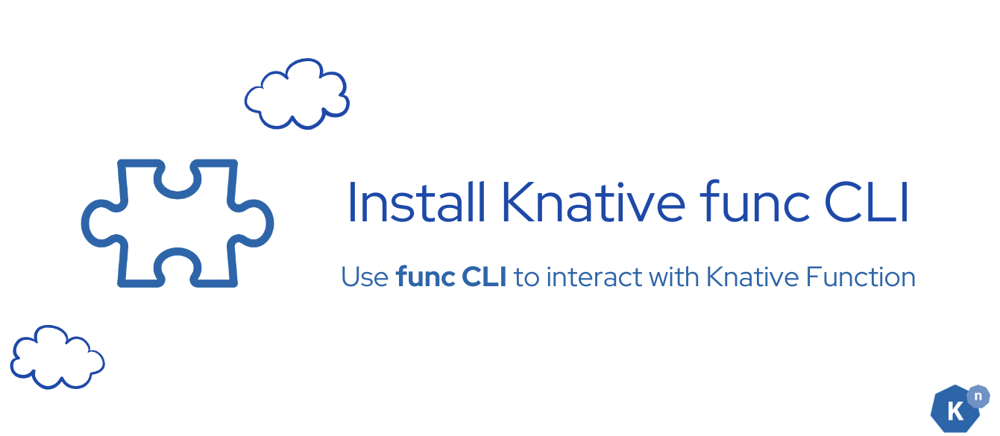

# Sentiment Analysis Service for Bookstore Reviews


As a bookstore owner, you aim to receive instant notifications in a Slack channel whenever a customer submits a new negative review comment. By leveraging Knative Function, you can set up a serverless function that contains a simple sentiment analysis service to categorize review comments by sentiment.

## **Which Knative features will we learn about?**

The ease to use **Knative Function** to deploy your service, and make it be managed by Knative Serving, which gives you the ability to **auto-scale your service to zero**, and scale up to handle the demand.

## **What does the final deliverable look like?**


A running serverless Knative Function that contains a python application that receives the new review comments as CloudEvent and returns the sentiment classification of the input text as CloudEvent.

The function's output will be only from:

- Positive

- Neutral

- Negative

## **Install Prerequisites**

### **Prerequisite 1: Install Knative func CLI**



Knative Function enables you to easily create, build, and deploy stateless, event-driven functions as [Knative Services](https://knative.dev/docs/serving/services/#:~:text=Knative%20Services%20are%20used%20to,the%20Service%20to%20be%20configured){:target="_blank"} by using the func CLI.

In order to do so, you need to install the func CLI. You can follow the [official documentation](https://knative.dev/docs/getting-started/install-func/){:target="_blank"} to install the func CLI.

???+ success "Verify"
    Running `func version` in your terminal to verify the installation, and you should see the version of the func CLI you installed.

???+ bug "Troubleshooting"
    If you see `command not found`, you may need to add the func CLI to your PATH.

## **Implementation**


The process is straightforward:

1. Begin by utilizing the `func create` command to generate your code template.

2. Next, incorporate your unique code into this template.

3. Finally, execute `func deploy` to deploy your application seamlessly to the Kubernetes cluster.

This workflow ensures a smooth transition from development to deployment within the Knative Functions ecosystem.

### **Step 1: Create a Knative Function template**


Create a new function using the func CLI:

```sh
func create -l <language> <function-name>
```

In this case, we are creating a Python function, so the command will be:

```sh
func create -l python sentiment-analysis-app
```

This command will create a new directory with the name `sentiment-analysis-app` and a bunch of files in it. The func CLI will generate a basic function template for you to start with.

You can find all the supported language templates [here](https://knative.dev/docs/functions/){:target="_blank"}.

???+ success "Verify"

    The file tree will look like this:

    ```txt
    start/sentiment-analysis-app
    ├── .funcignore
    ├── function
    │   ├── func.py
    │   └── __init__.py
    ├── func.yaml
    ├── .gitignore
    ├── pyproject.toml
    ├── README.md
    └── tests
        └── test_func.py
    ```

### **Step 2: Replace the generated code with the sentiment analysis logic**


`sentiment-analysis-app/function/func.py` is the file that contains the code for the function. 

You can replace the generated code with the sentiment analysis logic. You can use the following code as a starting point:

???+ abstract "_sentiment-analysis-app/function/func.py_"

    ```python
    import logging
    from cloudevents.http import CloudEvent
    from textblob import TextBlob
    import textblob

    def new():
        return Function()

    class Function:
        async def handle(self, scope, receive, send):
            """ Handle all HTTP requests to this Function. The incoming CloudEvent is in scope["event"]. """
            logging.info("Request Received")

            # 1. Get the incoming CloudEvent
            request_event = scope["event"]

            # 2. Extract the data payload from the event, analyze and create CloudEvent
            response_event = self.analyze_sentiment(request_event.data)

            # 3. Send the response
            logging.info(f"Sending response: {response_event.data}")
            await send(response_event)

        def create_cloud_event(self, inputText, badWordResult, data):
            attributes = {
                "type": "moderated-comment",
                "source": "sentiment-analysis",
                "datacontenttype": "application/json",
                "sentimentResult": data,
                "badwordfilter": badWordResult,
            }

            data = {
                "reviewText": inputText,
                "badWordResult": badWordResult,
                "sentimentResult": data,
            }

            return CloudEvent(attributes, data)

        def analyze_sentiment(self, text):
            review_text = text.get("reviewText", "")
            analysis = TextBlob(review_text)
            sentiment = "neutral"

            if analysis.sentiment.polarity > 0:
                sentiment = "positive"
            elif analysis.sentiment.polarity < 0:
                sentiment = "negative"

            badWordResult = ""
            try:
                badWordResult = text["badWordResult"]
            except KeyError:
                pass

            return self.create_cloud_event(review_text, badWordResult, sentiment)
    ```

### **Step 3: Configure the dependencies**


The `sentiment-analysis-app/pyproject.toml` file contains the project configuration with the dependencies for the function. Add the `textblob` dependency to the dependencies array :
???+ abstract "_sentiment-analysis-app/pyproject.toml_"

    ```toml
    [project]
    name = "function"
    description = ""
    version = "0.1.0"
    requires-python = ">=3.9"
    readme = "README.md"
    license = "MIT"
    dependencies = [
        "httpx",
        "cloudevents",
        "pytest",
        "pytest-asyncio",
        "textblob", # <-- add this dependency
    ]
    authors = [
        { name="Your Name", email="you@example.com"},
    ]

    [build-system]
    requires = ["hatchling"]
    build-backend = "hatchling.build"

    [tool.pytest.ini_options]
    asyncio_mode = "strict"
    asyncio_default_fixture_loop_scope = "function"
    ```

Knative Function will automatically install the dependencies listed here when you build the function.

### **Step 4: Build and run your Knative Function locally (Optional)**
??? info "Click here to expand"
    
    
    
    
    In Knative Function, there are two ways to build: using the [pack build](https://github.com/knative/func/blob/8f3f718a5a036aa6b6eaa9f70c03aeea740015b9/docs/reference/func_build.md?plain=1#L46){:target="_blank"} or using the [source-to-image (s2i) build](https://github.com/knative/func/blob/4f48549c8ad4dad34bf750db243d81d503f0090f/docs/reference/func_build.md?plain=1#L43){:target="_blank"}.
    
    Before we get started, configure the container registry to push the image to the container registry. You can use the following command to configure the container registry:
    
    ```sh
    export FUNC_REGISTRY=<your-container-registry>
    ```
    
    In this case, we will use the s2i build by adding the flag `-b=s2i`, and `-v` to see the verbose output.
    
    ```sh
    func build -b=s2i -v
    ```
    
    When the build is complete, you will see the following output:
    
    ```
    🙌 Function built: <Your container registry>/sentiment-analysis-app:latest
    ```
    
    This command will build the function and push the image to the container registry. After the build is complete, you can run the function using the following command:
    
    
    ```sh
    func run -b=s2i -v
    ```

    ---
    
    **Troubleshooting**
    
    `❗Error: '/home/Kuack/Documents/knative/docs/code-samples' does not contain an initialized function`
    
    **Solution: You may want to check whether you are in the correct directory. You can use the following command to check the current directory.**
    
    ```sh
    pwd
    ```
    
    **If you are in the right directory, and the error still occurs, try to check your `func.yaml`, as it has to contain the field `created` and the right timestamp to be treated as a valid Knative Function.**
    
    ---
    
    In the future, you can skip the step of `func build`, because `func run` will automatically build the function for you.
    
    You will see the following output if the function is running successfully:
    
    ```sh
    ❗function up-to-date. Force rebuild with --build
    Running
    
     on host port 8080
    ---> Running application from script (app.sh) ...
    ```
    
    Knative Function has an easy way to simulate the CloudEvent, you can use the following command to simulate the CloudEvent and test your function out:
    
    ```sh
    func invoke -f=cloudevent --data='{"reviewText": "I love Knative so much"}' --content-type=application/json --type="new-review-comment" -v
    ```
    
    where the `-f` flag indicates the type of the data, is either `HTTP` or `cloudevent`, and the `--data` flag is the input text. You can read more about `func invoke` [here](https://github.com/knative/func/blob/main/docs/reference/func_invoke.md){:target="_blank"}.
    
    In this case, you will get the full CloudEvent response:
    
    ```
    Context Attributes,
      specversion: 1.0
      type: new-review-comment
      source: book-review-broker
      id: ebbcd761-3a78-4c44-92e3-de575d1f2d38
      time: 2024-05-27T04:44:07.549303Z
      datacontenttype: application/json
    Extensions,
      badwordfilter: good
    Data,
      {
        "reviewText": "I love Knative so much",
        "badWordResult": "",
         "sentimentResult": "positive"
      }
    ```
    
### **Step 5: Deploy the function to the cluster**


!!! note
    Please enter `/sentiment-analysis-app` when you are executing the following commands.

In Knative Function, there are two ways to build: using the [pack build](https://github.com/knative/func/blob/8f3f718a5a036aa6b6eaa9f70c03aeea740015b9/docs/reference/func_build.md?plain=1#L46){:target="_blank"} or using the [source-to-image (s2i) build](https://github.com/knative/func/blob/4f48549c8ad4dad34bf750db243d81d503f0090f/docs/reference/func_build.md?plain=1#L43){:target="_blank"}.

After you have finished the code, you can deploy the function to the cluster using the following command:
!!! note
    Using `-b=s2i` to specify how the function should be built.

```sh
func deploy -b=s2i -v
```

???+ success "Verify"

    When the deployment is complete, you will see the following output:
    
    ```sh
    Function deployed in namespace "default" and exposed at URL:
    http://sentiment-analysis-app.default.svc.cluster.local
    ```
 
!!! tip  
    You can find the URL of the Knative Function (Knative Service) by running the following command:
    
    ```sh
    kubectl get kservice
    ```
    
    You will see the URL in the output:
    
    ```sh
    NAME                     URL                                                       LATESTCREATED                  LATESTREADY                    READY   REASON
    sentiment-analysis-app   http://sentiment-analysis-app.default.svc.cluster.local   sentiment-analysis-app-00001   sentiment-analysis-app-00001   True    
    ```


## **Knative Serving: scale down to zero**


If you use the following command to query all the pods in the cluster, you will see that the pod is running:

```sh
kubectl get pods
```

where `-A` is the flag to query all the pods in all namespaces.

And you will find that your sentiment analysis app is running:

```sh
NAMESPACE   NAME                                      READY   STATUS    RESTARTS   AGE
default     sentiment-analysis-app-00002-deployment   2/2     Running   0          2m
```

But if you wait for a while without sending any CloudEvent to your function, and query the pods again, you will find that the pod that has your sentiment analysis app **disappeared**!

This is because Knative Serving's autoscaler will **automatically scale down to zero** if there is no request to the function! Learn more at [Knative Autoscaling](https://knative.dev/docs/serving/autoscaling/){:target="_blank"}.

---

## **Verify**


After deployment, the `func` CLI provides a URL to access your function. You can verify the function's operation by sending a request with a sample review comment.

Simply use Knative Function's command `func invoke` to directly send a CloudEvent to the function on your cluster:

```bash
func invoke -f=cloudevent --data='{"reviewText":"I love Knative so much"}' -v
```

- `-f` flag indicates the type of the data, is either `HTTP` or `cloudevent`
- `--data` flag is the input text
- `-t` flag is the URI to the Knative Function.

???+ success "Verify"

    If you see the response, it means that the function is running successfully.

    ```
    Context Attributes,
      specversion: 1.0
      type: moderated-comment
      source: sentiment-analysis
      id: 0c2d0659-a30e-4efd-bcce-803f15ff5cc5
      time: 2024-06-11T15:12:43.795405Z
      datacontenttype: application/json
    Extensions,
      badwordfilter: 
      sentimentresult: positive
    Data,
      {
        "reviewText": "I love Knative so much",
        "badWordResult": "",
        "sentimentResult": "positive"
      }
    ```


In this tutorial, you learned how to create a serverless function for a simple sentiment analysis service with Knative.

## **Next Step**


Next, we'll deploy another ML service following the same procedure. We encourage you to try it yourself!

!!! tip
    Don't forget to `cd` into the root directory `/start` before proceeding.

If you feel comfortable deploying the other ML service yourself, follow this **simplified guide**:

[Go to Deploy ML workflow: Bad word filter :fontawesome-solid-paper-plane:](../page-3/create-bad-word-filter-service.md){ .md-button .md-button--primary }

If you encounter any issues, don't worry—we have a detailed tutorial ready for you.

[Solution - Go to Deploy ML workflow: Bad word filter :fontawesome-solid-paper-plane:](../page-3/solution-create-bad-word-filter-service.md){ .md-button .md-button--primary }
