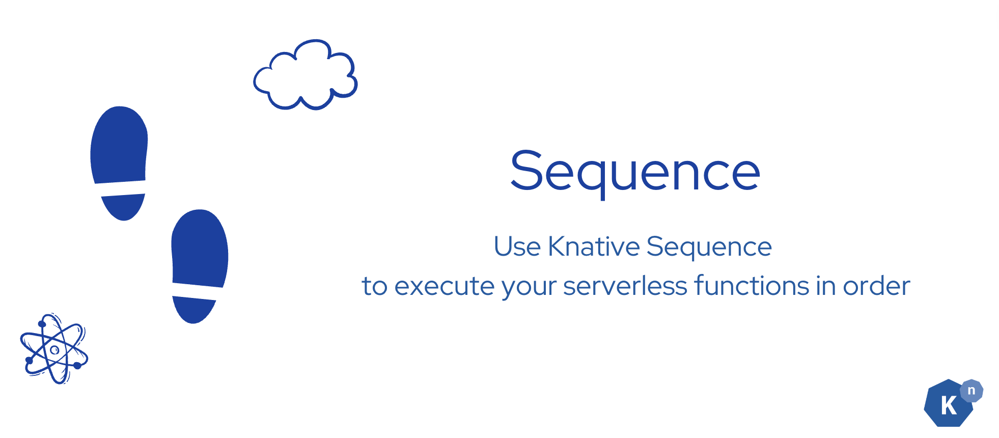
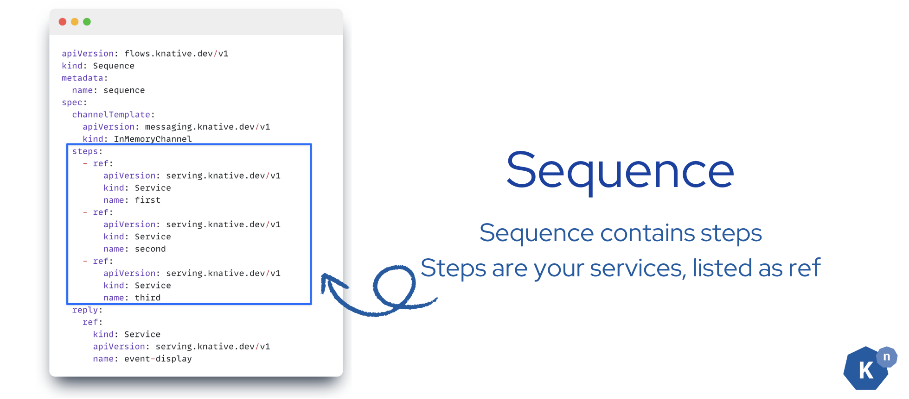
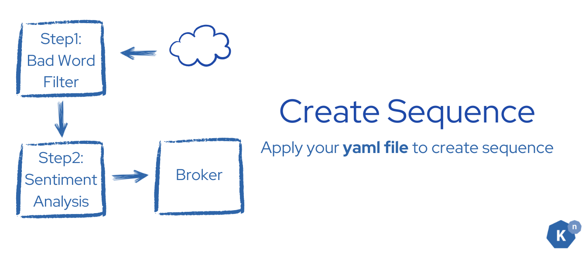
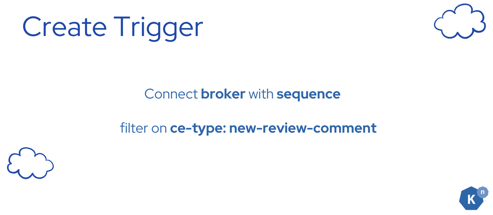
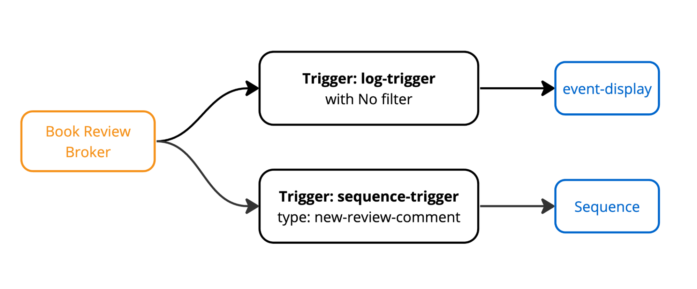

# **Create Knative Sequence to Streamline ML Workflows**



## **What Knative features will we learn about?**

- Knative Sequence

## **What does the final deliverable look like?**


- Create a Knative Sequence with bad word filter service as step 1 and sentiment analysis service as step 2
- The final result is sent back to Broker as reply of the Sequence

## **Implementation**

### **Step 0: Learn Sequence**

Sequence provides a way to define an in-order list of functions that will be invoked. Each step can modify, filter or create a new kind of an event.

If you hope your event to pass through different services **in an order you like**, Knative Sequence is your choice.




```yaml
apiVersion: flows.knative.dev/v1
kind: Sequence
metadata:
  name: sequence
spec:
  channelTemplate:
    apiVersion: messaging.knative.dev/v1
    kind: InMemoryChannel
  steps:
    - ref:
        apiVersion: serving.knative.dev/v1
        kind: Service
        name: first
    - ref:
        apiVersion: serving.knative.dev/v1
        kind: Service
        name: second
  reply:
    ref:
      kind: Service
      apiVersion: serving.knative.dev/v1
      name: event-display
```

### **Step 1: Create the Sequence**


Create a new yaml file named `sequence/config/100-create-sequence.yaml` to create Sequence resource in your cluster:

???+ abstract "sequence/config/100-create-sequence.yaml"
    ```yaml 
    apiVersion: flows.knative.dev/v1
    kind: Sequence
    metadata:
      name: sequence
    spec:
      channelTemplate: # Under the hood, the Sequence will create a Channel for each step in the Sequence
        apiVersion: messaging.knative.dev/v1
        kind: InMemoryChannel
      steps:
        - ref: # This is the first step of the Sequence, it will send the event to the bad-word-filter service
            apiVersion: serving.knative.dev/v1
            kind: Service
            name: bad-word-filter
        - ref: # This is the second step of the Sequence, it will send the event to the sentiment-analysis-app service
            apiVersion: serving.knative.dev/v1
            kind: Service
            name: sentiment-analysis-app
      reply: # This is the last step of the Sequence, it will send the event back to the Broker as reply
        ref:
          kind: Broker
          apiVersion: eventing.knative.dev/v1
          name: bookstore-broker
    ```

Create the Sequence yaml file and apply it to your cluster. 

```
kubectl apply -f sequence/config/100-create-sequence.yaml
```

After applying the configuration, you should see the following output:

```
sequence.flows.knative.dev/sequence created
```


???+ success "Verify"

    You can verify the status of the Sequence very easily

    ```bash
    kubectl get sequences
    ```

    You should expect the Ready state for `sequence` to be True.
    ```
    NAME       URL                                                                  AGE    READY   REASON
    sequence   http://sequence-kn-sequence-0-kn-channel.default.svc.cluster.local   159m   True    
    ```

### **Step 2: Create the Trigger that pass the event to Sequence**



As the Sequence is ready to accept the request now, we need to tell the Broker to forward the events to the Sequence, so that new comments will go through our ML workflows.

Create the Trigger yaml file named `sequence/config/200-create-trigger.yaml`
???+ abstract "sequence/config/200-create-trigger.yaml"

    ```yaml
    apiVersion: eventing.knative.dev/v1
    kind: Trigger
    metadata:
      name: sequence-trigger
    spec:
      broker: bookstore-broker
      filter:
        attributes:
          type: new-review-comment # This is the filter that will be applied to the event, only events with the ce-type new-review-comment will be processed
      subscriber:
        ref:
          apiVersion: flows.knative.dev/v1
          kind: Sequence
          name: sequence
    ```

Apply it to your cluster.

```
kubectl apply -f sequence/config/200-create-trigger.yaml
```

And you should see the following output:

```
trigger.eventing.knative.dev/sequence-trigger created
```


???+ success "Verify"
    You can verify the status of the Trigger very easily

    ```bash
    kubectl get triggers
    ```

    You should see the Trigger in ready state.

    ```
    NAME                BROKER             SUBSCRIBER_URI                                                       AGE    READY   REASON
    sequence-trigger    bookstore-broker   http://sequence-kn-sequence-0-kn-channel.default.svc.cluster.local   162m   True
    log-trigger         bookstore-broker   http://event-display.default.svc.cluster.local                       164m   True
    ```

    And until this point, **your cluster should have the following Triggers** that are created by you.
    


### **Verification**


Open the log for event-display with the following command:

```bash
kubectl logs -l app=event-display -f
```

Type something in the comment box in the UI and click the submit button. All the events that the bookstore-broker received will be displayed in the event-display.

???+ success "Verify"

    The comment should appear in the event-display service with the following output:

    ```yaml
    ☁️cloudevents.Event
    Validation: valid
    Context Attributes,
    specversion: 1.0
    type: moderated-comment
    source: sentiment-analysis
    id: 2f703218-15d4-4ff8-b2bc-11200e209315
    time: 2024-04-21T01:26:27.608365Z
    datacontenttype: application/json
    Extensions,
    badwordfilter: bad
    knativearrivaltime: 2024-04-21T01:26:27.617405597Z
    sentimentresult: negative
    Data,
    {
        "reviewText": "XXXXXXXXXXXX",
        "badWordResult": "bad",
        "sentimentResult": "negative"
    }
    ```

## **Next Step**


In this tutorial, you learned how to create a Sequence to build a ML pipeline.

Next, we'll be learning how to spin up book store's database services, while learning what will be the best case to use Knative Serving.

[Go to Deploy Database Service :fontawesome-solid-paper-plane:](../page-5/deploy-database-service.md){ .md-button .md-button--primary }
