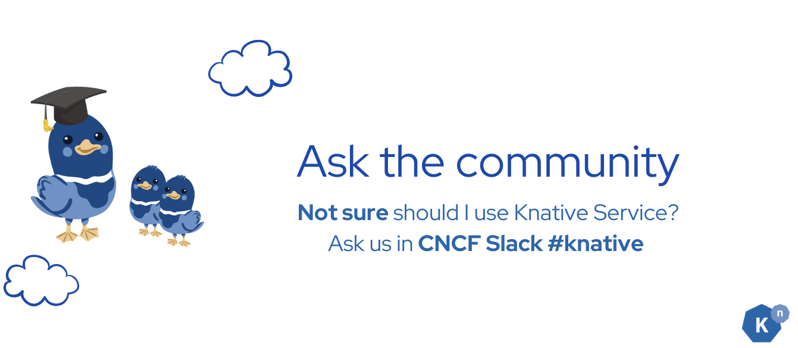
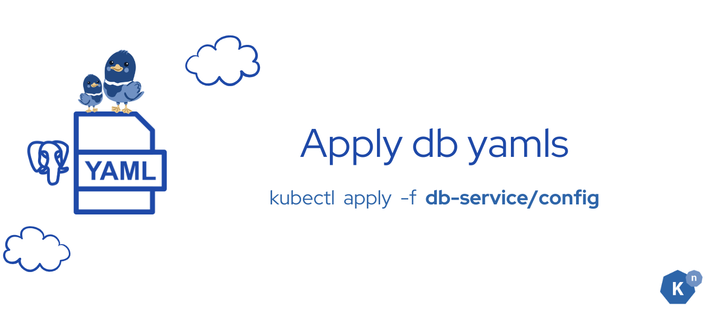
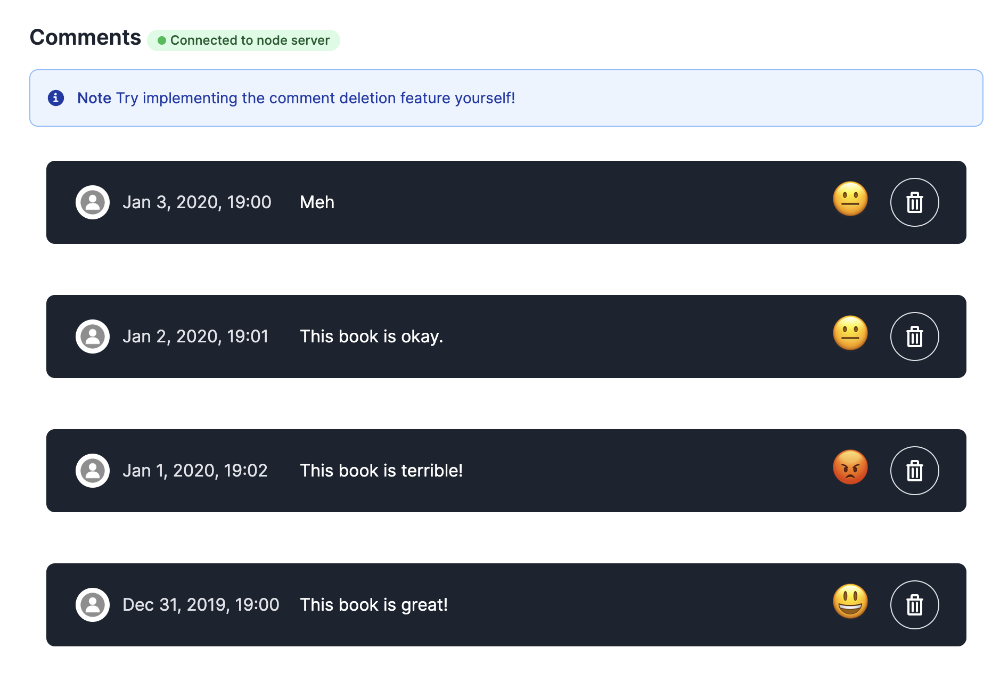

# **Deploy the Database Service**


## **What Knative features will we learn about?**

- What is a good usecase to use Knative Service

## **What does the final deliverable look like?**

- Running a PostgreSQL StatefulSet that contains the table and some sample data

## **Concept Learning**


**Knative Services** are a powerful feature within the Knative ecosystem, designed to handle a wide range of use cases, especially in modern cloud-native applications, it can be controlled by Knative Serving, and achieve scale to 0. Here's an expanded explanation of when and why you should consider using Knative Services:

???+ danger "Stateless Workloads"
    - **Definition:** Stateless applications do not store any data locally between requests. Each request is independent and does not rely on any previous interaction.
    - **Use Case:** Examples include web servers, APIs, and microservices where the state is managed externally, such as in a database or a cache.
    - **Benefits:** Simplifies scaling and failover because any instance can handle any request without requiring session persistence.

???+ example "Event-Driven Workloads"
    - **Definition:** Event-driven architectures respond to events or Triggers, such as HTTP requests, messages in a queue, or changes in a database.
    - **Use Case:** Use Knative Services to deploy functions that react to events, such as processing incoming data, triggering workflows, or integrating with third-party APIs.
    - **Benefits:** Efficient resource utilization, as services can scale down to zero when not handling events, reducing costs and improving performance.



Try to ask in the Knative Slack community [#knative](https://cloud-native.slack.com/archives/C04LGHDR9K7){:target="_blank"} whether it is the best use case or not.

## **Implementation**

### **Step 1: apply all the config yaml files**



In this section, we will just be simply running a PostgreSQL service. We have all config files ready. Simply run the following command to apply all yamls at once.

```sh
kubectl apply -f db-service
```

!!! warning
    Please wait few minutes until everything become ready.  If you see some job pods are failing and having errors, that's okay. Just continue waiting.

???+ success "Verify"

    You should see the following output:
    ```
    configmap/sql-configmap created
    secret/postgresql-secret created
    persistentvolumeclaim/postgresql-pvc created
    statefulset.apps/postgresql created
    service/postgresql created
    job.batch/postgresql-job created
    ```

    Wait a moment until all the pods become available and the database migration job is completed. If you see some job pods are failing and **having errors, don't worry**, please wait until at least one job becomes "**Completed**".

    ```
    NAME                                  READY   STATUS    RESTARTS   AGE
    bookstore-frontend-7b879ffb78-9bln6   1/1     Running   0          6h53m
    camel-k-operator-7989475884-7wk6z     1/1     Running   0          5h26m
    event-display-55967c745d-bxrgh        1/1     Running   0          5h26m
    node-server-644795d698-r9zlr          1/1     Running   0          5h26m
    postgresql-0                          1/1     Running   0          5h23m
    postgresql-job-55dlv                  0/1     Completed 0          10s
    postgresql-job-fnv8m                  0/1     Error     0          73s
    ```

## **Verification**


Get the IP address of the front end service as follows: `kubectl get svc -o=jsonpath='{.status.loadBalancer.ingress[0].ip}' bookstore-frontend-svc`

Open the UI page at `http://${IP}`, you should see some new comments popping up at the bottom of the page.

???+ bug "Troubleshoot"
    If you see "No comments available", that means your database is not initialized yet. Check the health of the database service pods and figure out what happened.




## **Next Step**


You have successfully set up the database services, and it is ready to receive requests and store user comments.

Next, we'll complete our event-driven architecture by connecting all the components you created. This is where the magic happens.

[Go to Implement Advanced Event Filtering :fontawesome-solid-paper-plane:](../page-6/advanced-event-filtering.md){ .md-button .md-button--primary }
