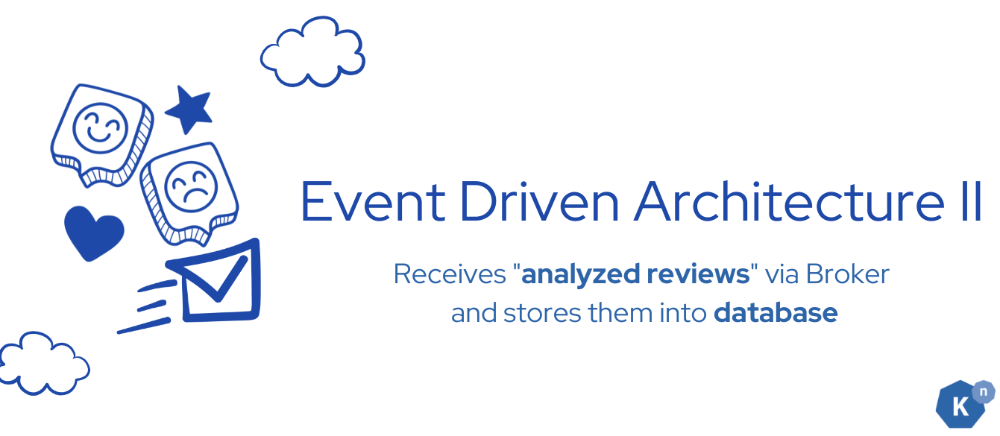
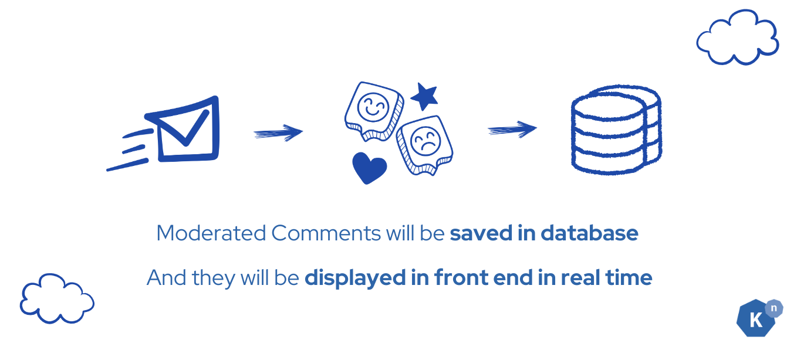
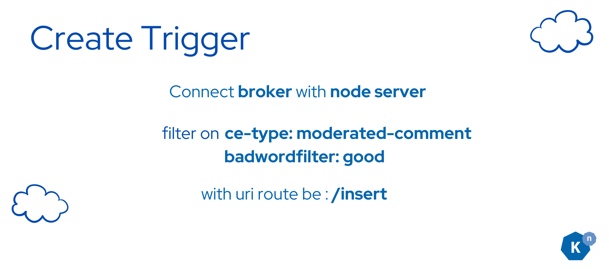

# **Advanced Event Filtering**



## **What Knative features will we learn about?**

- Trigger and Broker
- How Knative magically connects everything together

## **What does the final deliverable look like?**



- The "analyzed reviews" will be sent back to Broker (using a Trigger) and they will be stored into a database.
- The comments that don't contain bad words will show up in the UI, and the sentiment will be displayed as emoji.

## **Implementation**

### **Step 1: Create the Trigger for database insertion**



Append the following Trigger configuration to the existing `node-server/config/200-broker.yaml` file and then apply:

???+ abstract "**Append** to _node-server/config/200-broker.yaml_"
    ```yaml 
    ---
    apiVersion: eventing.knative.dev/v1
    kind: Trigger
    metadata:
      name: db-insert-trigger
    spec:
      broker: bookstore-broker
      filter:
        attributes: # Trigger will filter events based on BOTH the type and badwordfilter attribute
          type: moderated-comment # This is the filter that will be applied to the event, only events with the ce-type moderated-comment will be processed
          badwordfilter: good # This is the filter that will be applied to the event, only events with the ce-extension badwordfilter: good will be processed
      subscriber:
        ref:
          apiVersion: v1
          kind: Service
          name: node-server-svc
        uri: /insert # This is the path where the event will be sent to the subscriber, see /insert in node-server code: index.js
    ```

```shell
kubectl apply -f node-server/config/200-broker.yaml
```

After applying the configuration, you should see

```
broker.eventing.knative.dev/bookstore-broker unchanged
trigger.eventing.knative.dev/db-insert-trigger created
```

So far, the Triggers you created in your cluster should look like the following:


???+ success "Verify"
    Run the following command to check if the Trigger is created successfully:

    ```shell
    kubectl get triggers
    ```

    You should see the Trigger in ready state:
    ```
    NAME                BROKER             SUBSCRIBER_URI                                                       AGE     READY   REASON
    db-insert-trigger   bookstore-broker   http://node-server-svc.default.svc.cluster.local/insert              5h32m   True
    sequence-trigger    bookstore-broker   http://sequence-kn-sequence-0-kn-channel.default.svc.cluster.local   5h30m   True
    log-trigger         bookstore-broker   http://event-display.default.svc.cluster.local                       5h32m   True
    ```


## **Verification**


Now, it's magic time. Everything is connected automatically. Try interacting with the UI!

- **Normal Comments**: When you send a normal comment without any "bad word", it will be displayed properly in the comment area.
- **"Bad Word" Comments**: Comments containing offensive or hateful speech will be filtered out and eventually it will be redirected to Slack (we will cover in the next section).

Simple, isn't it? That's why Knative Eventing is so helpful! You only need to focus on developing each component, while Knative Eventing handles the connections and communication between services. Each service can focus on its responsibilities without worrying about message delivery.

## **Next Step**


You've built your event-driven architecture. Now it's time to connect it to external services to further enhance your bookstore application. In the next section, we will enable the bookstore to send notifications to your Slack workspace!

[Go to Connect Slack with Camel K :fontawesome-solid-paper-plane:](../page-7/slack-sink-learning-knative-eventing-and-apache-camel-K-integration.md){ .md-button .md-button--primary }
