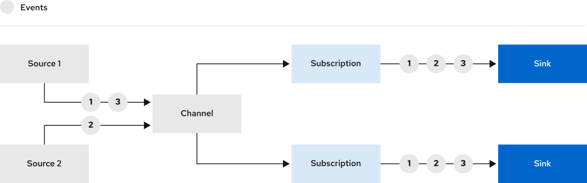

# Channels

Channels are Kubernetes [custom resources](https://kubernetes.io/docs/concepts/extend-kubernetes/api-extension/custom-resources/) that define a single event forwarding and persistence layer.

A channel provides an event delivery mechanism that can fan-out received events, through subscriptions, to multiple destinations, or sinks. Examples of sinks include brokers and Knative services.

## Next steps

- Learn about [default available channel types](channel-types-defaults.md)
- Create a [channel](create-default-channel.md)
- Create a [subscription](subscriptions.md)
