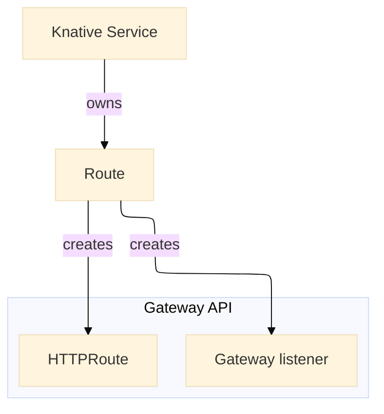

# Configure network adapters

This page describes and provides installation and configuration guidance for the following network adapters for Knative.

- Kourier

    Designed for Knative Serving with efficient serverless function deployment is the goal. Has a simple setup. The default choice for most users when a service mesh is not required. Has a simple setup.

- Contour

    General-purpose Envoy-based ingress controller with full Kubernetes Ingress support. A Knative ingress controller that integrates with Project Contour, translating Knative Ingress into Contour’s HTTPProxy resources.

    A good choice for clusters that already run non-Knative apps and want to reuse a single Ingress controller as well as teams who are already using Contour/Envoy and wanting Knative integration with advanced routing but not full service mesh.

- Istio

    A full-feature service mesh integrated with Knative that can also function as a Knative ingress. Best for enterprises already running Istio or needing advanced service mesh features alongside Knative.

- Gateway API

    Emerging Kubernetes-native networking API (replacing Ingress)extensible than traditional Ingress APIs. It is a specification, not an implementation itself.

    Best for forward-looking teams adopting Gateway API to unify ingress across Kubernetes, with Knative leveraging the same standard.

## Setup and configuration

### Kourier

--8<-- "netadapter-kourier.md"

