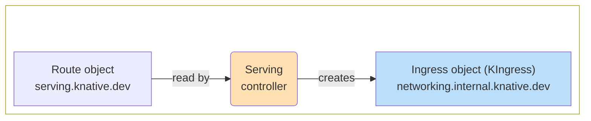
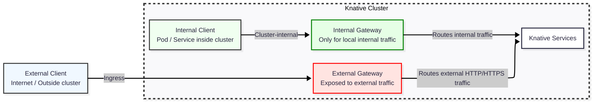

# Configure Knative networking

This page provides configuration guidance for Knative Serving's integration with Kubernetes ingress controllers. Knative leverages existing ingress controls in your Kubernetes cluster, allowing you to use the same monitoring features and capabilities.

For installation instructions, see the network layer install instructions in [Install serving with YAML](../install/yaml-install/serving/install-serving-with-yaml.md#install-a-networking-layer).

The Knative `networking.internal.knative.dev` Ingress type is generally referred to as KIngress objects. KIngress is a common abstraction used to support all the different ingress implementations. It is a custom resource with the name ingresses and apiGroup `networking.internal.knative.dev`. This architecture is shown in following diagram.



Although Knative uses the same interface for different ingress providers, they behave differently according to their native configurations and additional Knative options specific to the ingress provider.

## Ingress providers

Review the tabbed content in this section to determine the optimal networking layer for your cluster. If you already have one of the ingress controllers installed in your cluster, we recommend using your existing installation. For most users without a supported ingress, the Kourier ingress controller is sufficient. You can expand your capabilities with the Contour ingress, a full-feature service mesh with Istio, and the Kubernetes Gateway API.

=== "Kourier"

    ```mermaid
    ---
    config:
      layout: elk
      theme: default
    ---
    flowchart LR
     subgraph bottom[" "]
        direction LR
            envoy("Envoy deployment<br>kourier-system namespace")
            kourier("net-kourier<br>controller")
            kingress2["KIngress class:<br>kourier.ingress.networking.knative.dev"]
      end
        kingress2 -- read by --> kourier
        kourier -- programs --> envoy
    
        style envoy fill:#BBDEFB
        style kourier fill:#FFE0B2
        style bottom fill:transparent
    ```

    [Kourier](https://github.com/knative-extensions/net-kourier/blob/main/README.md#deployment), a Knative extension, is a lightweight implementation of the KIngress resource and is suitable for clusters that don't need other ingress features. Kourier is optimal for learning and prototyping, and is installed by the Knative [Quickstart](../getting-started/README.md).

    Kourier is is the only supported option for IBM-Z and IBM-P platforms. These IBM platforms require additional steps as documented in [Install Serving with YAML on IBM-Z and IBM-P](../install/yaml-install/serving/install-serving-with-yaml-on-IBM-Z-and-IBM-P.md).

    Kourier provides the following additional configuration options:

    - Access logging.
    - Deep Envoy tuning including proxy-protocol, cipher suites, trusted hops, and remote address.
    - External authorization, `extauthz`.
    - Experimental features: CryptoMB, internal TLS.

=== "Contour"

    ```mermaid
    ---
    config:
      layout: elk
      theme: default
    ---
    flowchart LR
         subgraph bottom[" "]
            direction LR
            C1["KIngress objects"]
            C2("Knative<br>net-contour")
            C3["HTTPProxy<br>projectcontour.io"]
            C4("Contour")
          end
            C1 -- "read by" --> C2
            C2 -- "creates" --> C3
            C3 -- "read by" --> C4
        
            style C2 fill:#FFE0B2
            style C3 fill:#BBDEFB
            style C4 fill:#BBDEFB
            style bottom fill:transparent
    ```

    The Contour ingress controller, `net-contour`, bridges Knative's KIngress resources to Contour's HTTPProxy resources. Contour is a good choice for clusters that already run non-Knative apps, are already using a Contour envoy, or don't need a full-feature service mesh.

    You can include the full native Contour configuration as described in the [Contour Configuration Reference](https://projectcontour.io/docs/1.33/configuration/). Capabilities include CORS policy configuration, direct visibility classes for external and internal traffic, and several cluster-wide configuration options.

=== "Istio"

    ```mermaid
    ---
    config:
      layout: elk
      theme: default
    ---
    flowchart LR
    subgraph bottom[" "]
      direction LR
          VirtualService["Istio<br>VirtualService"]
          istiod("Istio")
          net-istio("net-istio<br>controller")
          kingress["KIngress class:<br>istio.ingress.networking.knative.dev"]
    end
      kingress -- read by --> net-istio
      net-istio -- creates --> VirtualService
      VirtualService -- read by --> istiod
  
      style VirtualService fill:#BBDEFB
      style istiod fill:#BBDEFB
      style net-istio fill:#FFE0B2
      style bottom fill:transparent
    ```

    The Knative `net-istio` is a KIngress controller for Istio. Istio is a full-feature service mesh that also functions as a Knative ingress. `net-istio` is well suited for enterprises already running Istio or who need advanced service mesh features.

    Knative has a default Istio integration without the full-feature service mesh. The `knative-ingress-gateway` in the `knative-serving` namespace is a shared Istio gateway resource that handles all incoming (north-south) traffic to Knative services. This gateway points to the underlying `istio-ingressgateway` service in the `istio-system` namespace. You can replace this gateway with one of your own. See [Configure Istio's ingress gateway](setting-up-custom-ingress-gateway.md).

    Istio provides the following additional configuration options:

    - Advanced gateway selection with label selectors for fine-grained routing.
    - Support for mesh-aware and cluster-local access.
    
    In addition to [Istio's configuration options](https://istio.io/latest/docs/reference/config/), `net-istio` provides the following additional configuration options for mapping Knative Routes to Istio VirtualServices:

    - Advanced gateway selection with label selectors for fine-grained routing.
    - Support for mesh-aware and cluster-local access.

=== "Gateway API"

    ```mermaid
    ---
    config:
      layout: elk
      theme: default
    ---
    flowchart LR
     net-gateway("net-gateway-api<br>controller")
     GW["Gateway"]
     KIngress["KIngress objects"]
     HR["HTTPRoute"]
     subgraph underlying["Gateway-API Implementation<br>(Contour, Istio, Envoy Gateway, …)"]
        Controller("GatewayClass&nbsp;Controller")
      end
        KIngress -- read by --> net-gateway
        net-gateway -- updates --> GW
        net-gateway -- creates --> HR
        GW -- read by --> Controller
        HR -- read by --> Controller
    style net-gateway fill:#FFE0B2
    style GW fill:#BBDEFB
    style HR fill:#BBDEFB
    style Controller fill:#BBDEFB
    style underlying fill:#fff3e0,stroke:#ef6c00
    ```

    The Knative `net-gateway-api` is a KIngress implementation for Knative integration with the [Kubernetes Gateway API](https://gateway-api.sigs.k8s.io/). A recommended choice for many teams adopting the Gateway API to unify ingress across Kubernetes. Clusters with large numbers of Knative Services however, may experience limitations.

    The Kubernetes Gateway API supports a number of implementations. Istio, Contour, and Envoy-Gateway implementations are tested. For more information see [Tested Gateway API version and Ingress](https://github.com/knative-extensions/net-gateway-api/blob/main/docs/test-version.md).

    Knative is designed to support attaching Gateway API policies to both Knative-created HTTPRoutes and the existing Gateway resources which manage with those routes.

## Ingress configurations

The Knative tested ingress controllers (Contour, Istio, and Kourier) have the following common configurations:

- Certificate management: Configurable secrets for TLS encrypted traffic. See [Using a custom TLS certificate for DomainMapping](./services/custom-tls-certificate-domain-mapping.md).
- Timeout policies: Controls for idle, and response stream timeouts. To review timeout settings, see [Configuring the Defaults ConfigMap](./configuration/config-defaults.md).
- Traffic visibility: Mechanisms to expose services externally or cluster-locally. See [Traffic management](./traffic-management.md).
- The mapping of Route objects to `networking.internal.knative.dev` objects is common to these controllers.

Use the following command to determine which ingress controllers are installed and their status.

``` bash
kubectl get pods -n knative-serving
```

The ingress controllers have the following names:

- Kourier: `kourier-control-*`, and `kourier-gateway-*`. Kourier is included in the Knative Serving installation should appear in the results when your cluster is first created.
- Contour: `contour-*`.
- Istio: `istio-webhook-*`. The main Istio control plane pods such as `istiod-*` are in the `istio-system` namespace. Knative adds the `istio-webhook-*` pod in the `knative-serving` namespace when Istio is the chosen networking layer.
- Gateway API: `net-gateway-api-*`. Created whenever Gateway API KIngress class is available.

Each ingress controller manages only those ingress objects that are annotated with its key. Knative Serving selects the controller based on the rules in the `network-config` ConfigMap.

You can determine the controller in use by examining the `config-network.yaml`:

```bash
kubectl describe configmaps config-network -n knative-serving
```

Look for the `ingress-class` key. It could also be the `ingress.class` key with a dot. The dash usage is more current and supersedes any key with the dot. In the following example, the `ingress.class` key was initially set for the Kourier controller, but is now set to Contour because the ingress key with a dash takes precedence.

```yml
ingress-class: contour.ingress.networking.knative.dev
ingress.class: kourier.ingress.networking.knative.dev
```

If you want to switch to a controller that is already installed, patch the `config-network` ConfigMap with the new controller as shown in the following example using Kourier.

```bash
kubectl patch cm config-network -n knative-serving \
  --type merge -p '{"data":{"ingress-class":"kourier.ingress.networking.knative.dev"}}'
```

You can remove an unused key with a dot with the following command:

```bash
kubectl patch configmap config-network -n knative-serving \                                                    
--type=json -p='[{"op": "remove", "path": "/data/ingress.class"}]'
```

If you want to install a new controller, see [Install serving with YAML](../install/yaml-install/serving/install-serving-with-yaml.md). Be aware that changing the Ingress class of an existing Route may result in undefined behavior.

In scenarios where there are multiple networking implementations, you can create a custom ingress class to specify different ingress class annotations for each service. For more information, see [Configuring Services custom ingress class](./services/ingress-class.md).

There are also third-party Knative networking options and Knative products available but are not tested or managed by the Knative community. For more information, see [Knative offerings](../install/knative-offerings.md).

## Gateway configurations

The configurations in this section apply only to an Gateway API implementation.

Knative assumes two gateways in the cluster:

- Externally exposed - defines the gateway for external traffic.
- Internally exposed - defines the gateway for local traffic.

Both gateways route traffic to the Knative services inside the cluster.



To install the Gateway API and configure the gateways, see the Gateway API tab in [Install a networking layer](../install/yaml-install/serving/install-serving-with-yaml.md#install-a-networking-layer).

When gateways are installed, the `config-gateway` ConfigMap is updated to track the `class`, `gateway`, and `service`. The service is the Kubernetes Service name that points to the pods in the Gateway implementation.

Use the following command to determine the current configuration:

```bash
kubectl describe configmaps config-gateway -n knative-serving
```

The following `config-gateway` example shows an Istio implementation:

```bash
# external-gateways defines the Gateway to be used for external traffic
external-gateways: |
- class: istio
  gateway: istio-system/knative-gateway
  service: istio-system/istio-ingressgateway
  supported-features:
  - HTTPRouteRequestTimeout

# local-gateways defines the Gateway to be used for cluster local traffic
local-gateways: |
  - class: istio
    gateway: istio-system/knative-local-gateway
    service: istio-system/knative-local-gateway
    supported-features:
    - HTTPRouteRequestTimeout
```
