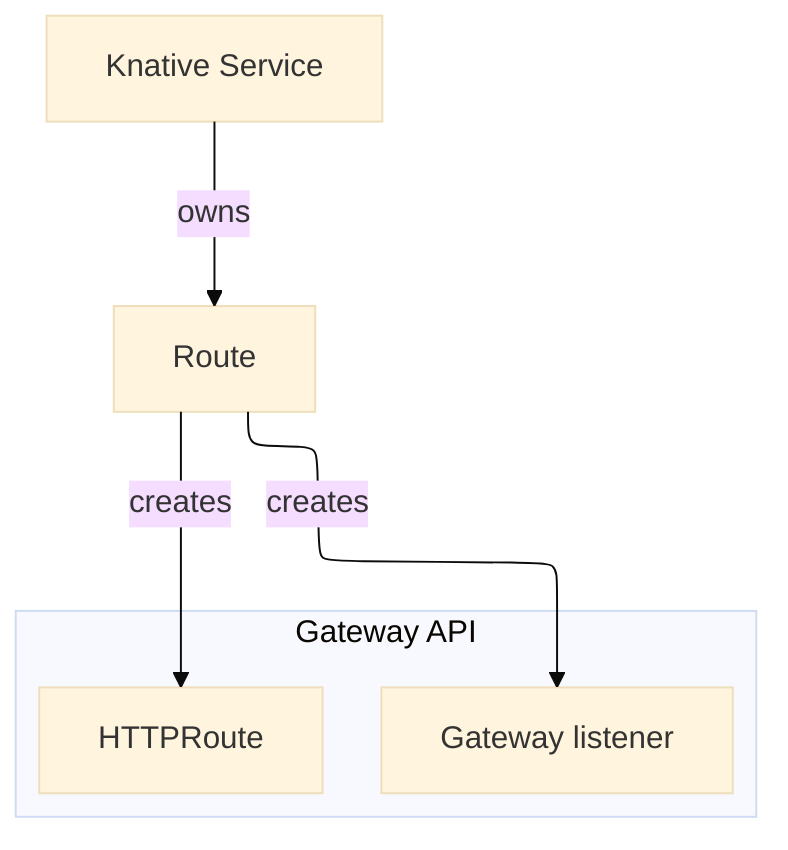

# Configure network layers

This page describes and provides installation and configuration guidance for the following networking plugins.

- Kourier

    Designed for Knative Serving with efficient serverless function deployment is the goal. Has a simple setup. Kourier is the default choice for most users, when a service mesh is not required, as it has a simple setup.

- Contour

    General-purpose Envoy-based ingress controller with full Kubernetes Ingress support. A Knative ingress controller that integrates with Project Contour, translating Knative Ingress into Contour’s HTTPProxy resources.

    A good choice for clusters that already run non-Knative apps and want to reuse a single Ingress controller as well as teams who are already using Contour/Envoy and wanting Knative integration with advanced routing but not full service mesh.

- Istio

    A full-feature service mesh integrated with Knative that can also function as a Knative ingress. Best for enterprises already running Istio or needing advanced service mesh features alongside Knative.

- Gateway API

    Emerging Kubernetes-native networking API (replacing Ingress)extensible than traditional Ingress APIs. It is a specification, not an implementation itself.

    The Kubernetes Gateway API requires a controller or service mesh. Istio and Contour implementations are tested though other Gateway API implementations should work. For more information see [Tested Gateway API version and Ingress](https://github.com/knative-extensions/net-gateway-api/blob/main/docs/test-version.md).

    Best for forward-looking teams adopting Gateway API to unify ingress across Kubernetes, with Knative leveraging the same standard.

## Architectures

## Network Layer setup

This section provides installation and configuration steps.

=== "Kourier controller (default choice)"

    --8<-- "netadapter-kourier.md"

=== "Contour controller"

    --8<-- "netadapter-contour.md"

=== "Istio service mesh"

    For detailed instructions, see [Install Istio for Knative](../install/installing-istio.md).

    --8<-- "netadapter-istio.md"

=== "Gateway API"

    --8<-- "netadapter-gatewayapi.md"

## Configure DNS

--8<-- "dns.md"
--8<-- "real-dns-yaml.md"
--8<-- "no-dns.md"
