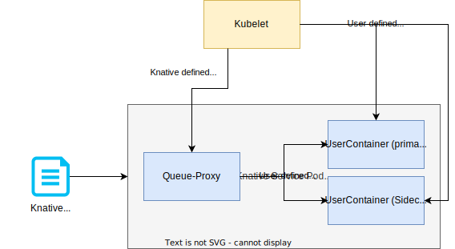

# Configuring Probing

## General understanding of Knative Probing

It is important to note that Knative probing is different from Kubernetes probing. 
One reason for this is that Knative tries to minimize cold-start time and thus is probing
in a vastly higher interval than Kubernetes does. 

The general probing architecture looks like this:



* Users can optionally define Readiness/Liveness and/or Startup probes in the `KnativeService` CR.
* The Liveness and Startup probes are directly executed by the Kubelet against the according container.
* Readiness probes, on the other hand, are rewritten by Knative to be executed by the Queue-Proxy container.
* Knative does probing from in places (e.g. Activator, net-* controller, and from Queue-Proxy), to make sure the whole network stack is configured and ready. Compared to vanilla Kubernetes, Knative uses faster (called aggressive probing) probing interval to shorten the cold-start times when a Pod is already up and running while Kubernetes itself has not yet reflected that readiness.
* Knative will define a default Readiness probe for the primary user container when no probe is defined by the user. It will check for a TCP socket on the traffic port of the Knative Service.
* Knative will also define a Readiness probe for the Queue-Proxy container itself. Queue-Proxy's health endpoint aggregates all results from it's rewritten Readiness probes for all user containers (primary + sidecars). For the aggregated status, Queue-Proxy will call each container's Readiness probe in parallel, wait for their response (or timeout) and report an aggregated result back to Kubernetes. 

Knative will see a Pod as healthy and ready to serve traffic once the Queue-Proxy probe returns a success response and once the Knative networking layer reconfiguration has finished.

!!! note
    Keep in mind, that Knative could see your Pod as healthy and ready while Kubernetes still thinks it is not or vice versa.
    The `Deployment` and `Pod` statuses do not reflect the status in `Knative`. To fully check the status that Knative sees, you have to check 
    all the conditions on the object hierarchy of Knative (e.g. `Service`, `Configuration`, `Revision`, `PodAutoscaler`, `ServerlessService`, `Route`, `Ingress`).


## Configuring custom probes

!!! note
    If you are using multiple containers in your Knative Service, make sure to enable [multi-container probing](../configuration/feature-flags.md#multiple-container-probing).

You can define Readiness and Liveness probes in your Knative Service the same way you would in Kubernetes:

```yaml
apiVersion: serving.knative.dev/v1
kind: Service
metadata:
  name: runtime
  namespace: default
spec:
  template:
    spec:
      containers:
        
      - name: first-container
        image: <your-image>
        ports:
          - containerPort: 8080
        readinessProbe:
          httpGet:
            port: 8080 # you can also check on a different port than the containerPort (traffic-port)
            path: "/health"
        livenessProbe:
          tcpSocket:
            port: 8080
        startupProbe:
          httpGet:
            port: 8080
            path: "/"
            
      - name: second-container
        image: <your-image>
        readinessProbe:
          httpGet:
            port: 8089
            path: "/health"
        livenessProbe:
          tcpSocket:
            port: 8089
        startupProbe:
          httpGet:
            port: 8080
            path: "/"
```

Supported probe types are:

* httpGet
* tcpSocket
* exec
* grpc


!!! note
    Be aware that Knative also does some defaulting (checking readiness on the traffic port using an HTTP check) and additional validation to make aggressive probing work.

!!! warning
    As the Queue-Proxy container does not rewrite or check defined Liveness probes, it is important to know that Kubernetes can and will restart specific containers once a Liveness probe fails. Make sure to also include the same check that you define as a Liveness probe as a Readiness probe to make sure Knative is aware of the failing container in the Pod. Otherwise, you may see, it is possible that you see connection errors during the restart of a container caused by the Liveness probe failure.

## Progress Deadline and Startup Probes

It is important to know that Knative has a deadline until a Knative Service should initially start up (or rollout). This is called [progress deadline](../configuration/deployment.md#configuring-progress-deadlines). When using Startup probes, the user has to ensure that the progress deadline is set to a value that is higher than the maximum time the Startup probe can take. Consider your configuration of `initialDelaySeconds`, `success/failureThreshold`,  `periodSeconds` and `timeoutSeconds` for this. Otherwise, the Startup probe might never pass before the progress deadline is reached, and the Service will never successfully start up. The Knative Service will then mark this in the status of the Service object:

```json
[
  {
    "lastTransitionTime": "2024-06-06T09:28:01Z",
    "message": "Revision \"runtime-00001\" failed with message: Initial scale was never achieved.",
    "reason": "RevisionFailed",
    "status": "False",
    "type": "ConfigurationsReady"
  }
]
```

