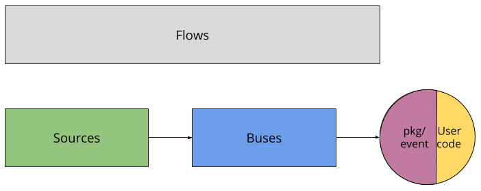

# Knative Events

Knative Events is a system which is designed to address a common need for cloud
native development:

1.  Services are loosely coupled during development and deployed independently
    on a variety of platforms (Kubernetes, VMs, SaaS or FaaS).
1.  A producer can generate events before a consumer is listening, and a
    consumer can express an interest in an event or class of events that is not
    yet being produced.
1.  Services can be connected to create new applications
    - without modifying producer or consumer.
    - with the ability to select a specific subset of events from a particular
      producer

The above concerns are consistent with the
[design goals of CloudEvents](https://github.com/cloudevents/spec/blob/master/spec.md#design-goals),
a common specification for cross-service interoperability being developed by the
CNCF Serverless WG.

> **Note**: The Eventing repo is very much a work-in-progress. See the
> [list of Known Issues](https://github.com/knative/eventing/issues?q=is%3Aissue+is%3Aopen+label%3A%22Known+Issue%22)
> with the current state, but feel free to report additional issues. Expect to
> see changes in all of the following areas in the next months:
>
> 1.  The API model and terminology is still evolving.
> 1.  The controller model for Buses and Sources are still being refined.
> 1.  Test coverage is not up to snuff.
> 1.  The release packaging is still being determined.

Once these concerns are resolved, we expect to work on creating a wider array of
EventSources.

## Installation

You can install Knative Eventing with the following command:

```bash
kubectl apply --filename https://storage.googleapis.com/knative-releases/eventing/latest/release.yaml
```

In addition to the core definitions, you'll need to install at least one
EventSource and one Bus to have a useful cluster. See below for more information
on how to install different versions of these components.

> A note on naming: We track the
> [CloudEvents nomenclature](https://github.com/cloudevents/spec/blob/master/spec.md)
> where possible. Much of the naming in this area is in flux, however and many
> of the needed terms are outside of the current scope of the specification.

## Architecture

In order to subdivide the problem, we have split the server-side components into
three abstractions:



### Buses

Buses provide a k8s-native abstraction over message buses like
[NATS](https://nats.io) or [Kafka](https://kafka.apache.org/). At this level,
the abstraction is basically publish-subscribe; events are published to a
Channel, and Subscriptions route that Channel to interested parties.

- **Channel** is a network endpoint which receives (and optionally persists)
  events using a Bus-specific implementation.
- **Subscription** connects events received on a Channel to an interested
  `target`, represented as a DNS name. There may be multiple Subscriptions on a
  single channel.
- **Bus** defines the adaptation layers needed to implement channels and
  subscriptions using a specific persistence strategy (such as delivery of
  events to a Kafka topic).

We currently have 3 buses implemented:

- [Stub](https://github.com/knative/eventing/tree/master/pkg/buses/stub)
  provides a zero-dependency in-memory transport.
  ```bash
  kubectl apply --filename https://storage.googleapis.com/knative-releases/eventing/latest/release-bus-stub.yaml
  kubectl apply --filename https://storage.googleapis.com/knative-releases/eventing/latest/release-clusterbus-stub.yaml
  ```
- [Kafka](https://github.com/knative/eventing/tree/master/pkg/buses/kafka) uses
  an existing (user-provided) Kafka cluster for persistence.
  ```bash
  kubectl apply --filename https://storage.googleapis.com/knative-releases/eventing/latest/release-bus-kafka.yaml
  kubectl apply --filename https://storage.googleapis.com/knative-releases/eventing/latest/release-clusterbus-kafka.yaml
  ```
- [GCP PubSub](https://github.com/knative/eventing/tree/master/pkg/buses/gcppubsub)
  uses Google Cloud PubSub for message persistence.
  ```bash
  kubectl apply --filename https://storage.googleapis.com/knative-releases/eventing/latest/release-bus-gcppubsub.yaml
  kubectl apply --filename https://storage.googleapis.com/knative-releases/eventing/latest/release-clusterbus-gcppubsub.yaml
  ```

### Sources

Sources provide a similar abstraction layer for provisioning data sources from
outside Kubernetes and routing them to the cluster, expressed as a Feed
(typically, to a Channel on a Bus, but could also be directly to another
endpoint). Right now, we only have a few generic Sources, but we plan to add
more interesting and specific Sources over time.

- **Feed** is a primitive object defining a connection between an EventType and
  the action (as an
  [CloudEvents compatible HTTP endpoint](https://github.com/cloudevents/spec/blob/master/http-transport-binding.md)).
- **EventType** and **ClusterEventType** describe a specific set of events with a
  common schema which are emitted by an EventSource. EventType is
  namespace-scoped, while ClusterEventTypes are installed by an administrator
  and available in all namespaces in your cluster.
- **EventSource** and **ClusterEventSource** describe an external system which
  may produce one or more EventTypes.

We currently have 3 sources implemented:

- [K8sevents](https://github.com/knative/eventing-sources/tree/master/cmd/kuberneteseventsource)
  collects
  [Kubernetes Events](https://kubernetes.io/docs/reference/generated/kubernetes-api/v1.10/#event-v1-core)
  and presents them as CloudEvents.
  ```bash
  kubectl apply --filename https://storage.googleapis.com/knative-releases/eventing-sources/latest/release.yaml 
  ```
- [GCP PubSub](https://github.com/knative/eventing-sources/tree/master/cmd/gcppubsub_receive_adapter)
  collects events published to a GCP PubSub topic and presents them as
  CloudEvents.
  ```bash
  kubectl apply --filename https://storage.googleapis.com/knative-releases/eventing-sources/latest/release-with-gcppubsub.yaml
  ```

### Flows

Lastly, we have a higher-level abstraction called a Flow which bundles up the
specification from the Source to the endpoint, optionally allowing you to choose
the Channel and Bus which the event is routed over. (Otherwise, there is a
default Bus used to provision a Channel.)

- **Flow** is the top-level user-facing concept in Eventing; it describes the
  desired path from an external Source of events to a destination that will
  react to the events. There is only a single type of Flow, which is installed
  by the core Knative Eventing install.

## Supporting Libraries

In addition to the above, there is a golang library at
[`pkg/event`](https://github.com/knative/eventing/tree/master/pkg/event) for
handling CloudEvents and easily creating a container which processes CloudEvents
delivered over HTTP. You can look at several of the samples for usage examples.

## Getting Started

- [Setup Knative Serving](../install/README.md)
- [Install Eventing components](#installation)
- [Run samples](samples)

---

Except as otherwise noted, the content of this page is licensed under the
[Creative Commons Attribution 4.0 License](https://creativecommons.org/licenses/by/4.0/),
and code samples are licensed under the
[Apache 2.0 License](https://www.apache.org/licenses/LICENSE-2.0).
