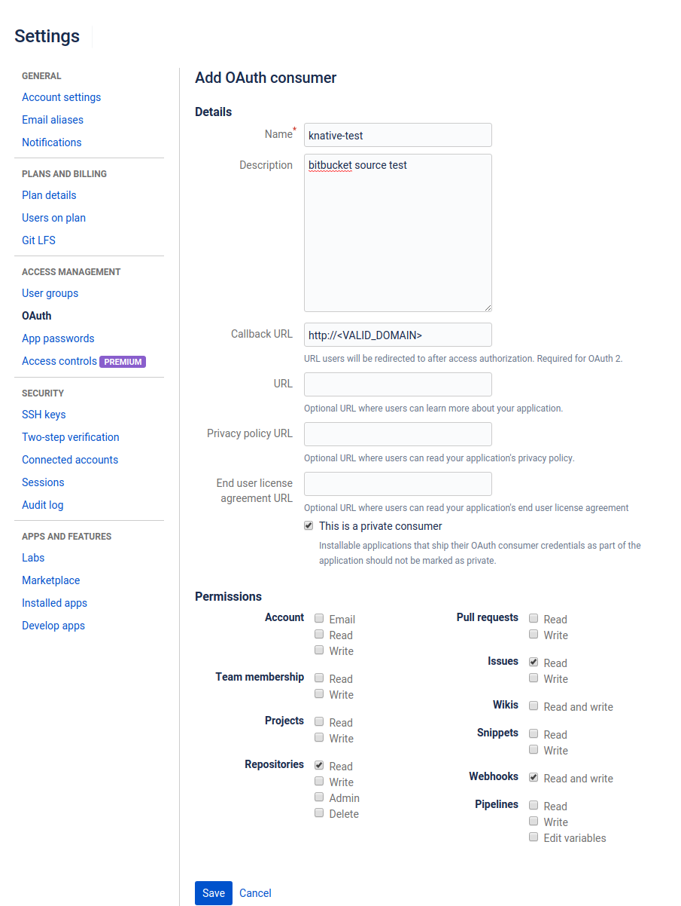

# BitBucket Source example

BitBucket Source example shows how to wire BitBucket events for consumption
by a Knative Service.

## Deployment Steps

### Prerequisites

You will need:

1. An internet-accessible Kubernetes cluster with Knative Serving
   installed. Follow the [installation
   instructions](https://github.com/knative/docs/blob/master/install/README.md)
   if you need to create one.
1. Ensure Knative Serving is [configured with a domain
   name](https://github.com/knative/docs/blob/master/serving/using-a-custom-domain.md)
   that allows BitBucket to call into the cluster.
1. If you're using GKE, you'll also want to [assign a static IP address](https://github.com/knative/docs/blob/master/serving/gke-assigning-static-ip-address.md).
1. Install [Knative
   Eventing](https://github.com/knative/docs/tree/master/eventing). Those
   instructions also install the default eventing sources, including
   the `BitBucketSource` we'll use.

### Create a Knative Service

To verify the `BitBucketSource` is working, we will create a simple Knative
`Service` that dumps incoming messages to its log. The `service.yaml` file
defines this basic service.

```yaml
apiVersion: serving.knative.dev/v1alpha1
kind: Service
metadata:
  name: bitbucket-message-dumper
spec:
  runLatest:
    configuration:
      revisionTemplate:
        spec:
          container:
            image: gcr.io/knative-releases/github.com/knative/eventing-sources/cmd/message_dumper
```

Enter the following command to create the service from `service.yaml`:

```shell
kubectl --namespace default apply --filename service.yaml
```

### Create a BitBucket OAuth Consumer

Create an [OAuth Consumer](https://confluence.atlassian.com/bitbucket/oauth-on-bitbucket-cloud-238027431.html#OAuthonBitbucketCloud-Createaconsumer)
in BitBucket that the BitBucket Source can use to register webhooks with
the BitBucket API.
  
The OAuth Consumer can be named anything you find convenient. The BitBucket Source
requires `Webhooks Read and Write`, `Repositories Read`, and `Issues Read` to let it fire
events from your public repositories and to create webhooks for those
repositories.

Here's an example for an OAuth Consumer named "knative-test" with the
recommended scopes:



Update `bitbucket-secret.yaml` with those values. If the generated OAuth
consumer key is `'oauth_consumer_key_value'` and the generated secret is `'oauth_consumer_secret_value'`, 
you'd modify `bitbucket-secret.yaml` as follows:

```yaml
apiVersion: v1
kind: Secret
metadata:
  name: bitbucket-secret
type: Opaque
stringData:
  consumerKey: oauth_consumer_key_value
  consumerSecret: oauth_consumer_secret_value
```

Then, apply the secret using `kubectl`:

```shell
kubectl --namespace default apply --filename bitbucket-secret.yaml
```

### Create Event Source for BitBucket Events

In order to receive BitBucket events, you have to create a concrete Event
Source for a specific namespace. Be sure to replace the
`ownerAndRepository` value with a valid BitBucket public repository owned
by your BitBucket user.

```yaml
apiVersion: sources.eventing.knative.dev/v1alpha1
kind: BitBucketSource
metadata:
  name: bitbucket-source-sample
spec:
  eventTypes:
    - repo:push
  ownerAndRepository: <YOUR USER>/<YOUR REPO>
  consumerKey:
    secretKeyRef:
      name: bitbucket-secret
      key: consumerKey
  consumerSecret:
    secretKeyRef:
      name: bitbucket-secret
      key: consumerSecret
  sink:
    apiVersion: serving.knative.dev/v1alpha1
    kind: Service
    name: bitbucket-message-dumper
```

Then, apply that yaml using `kubectl`:

```shell
kubectl --namespace default apply --filename bitbucket-source.yaml
```

### Verify

Verify that the BitBucket webhook was created by looking at the list of
webhooks under the Settings tab in your BitBucket repository. A hook
should be listed that points to your Knative cluster, as shown below.


### Create Events

Create a push in your BitBucket repository. We will verify
that the BitBucket event was sent to the Knative eventing system
by looking at our message dumper function logs.

```shell
kubectl --namespace default get pods
kubectl --namespace default logs bitbucket-message-dumper-XXXX user-container
```

You should log lines similar to:

```
2019/03/06 13:16:40 Message Dumper received a message: POST / HTTP/1.1
Host: bitbucket-message-dumper.default.svc.cluster.local
Accept-Encoding: gzip
Ce-Event-Key: "repo:push"
Ce-Id: d65b2f88-11b6-4588-b1ba-d5095a160235
Ce-Request-Uuid: "d65b2f88-11b6-4588-b1ba-d5095a160235"
Ce-Source: https://api.bitbucket.org/2.0/repositories/someuser/somerepo/commits?include=somecommit&exclude=somecommit
Ce-Specversion: 0.2
Ce-Time: 2019-03-06T13:16:40.667029098Z
Ce-Type: dev.knative.source.bitbucket.repo:push
Content-Length: 4437
Content-Type: application/json
User-Agent: Go-http-client/1.1
X-B3-Parentspanid: 36c826a98b911016
X-B3-Sampled: 1
X-B3-Spanid: 1fe8b6975b2b6c2d
X-B3-Traceid: 0573724c260219df
X-Envoy-Expected-Rq-Timeout-Ms: 600000
X-Envoy-Internal: true
X-Forwarded-For: 127.0.0.1, 127.0.0.1
X-Forwarded-Proto: http
X-Request-Id: 81b4603c-3f2b-9e0b-ace4-fe3a7aeb2047

{...}
```

### Cleanup

You can remove the BitBucket webhook by deleting the BitBucket Source:

```shell
kubectl --namespace default delete --filename bitbucket-source.yaml
```

Similarly, you can remove the Service and Secret via:

```shell
kubectl --namespace default delete --filename service.yaml
kubectl --namespace default delete --filename bitbucket-secret.yaml

```
