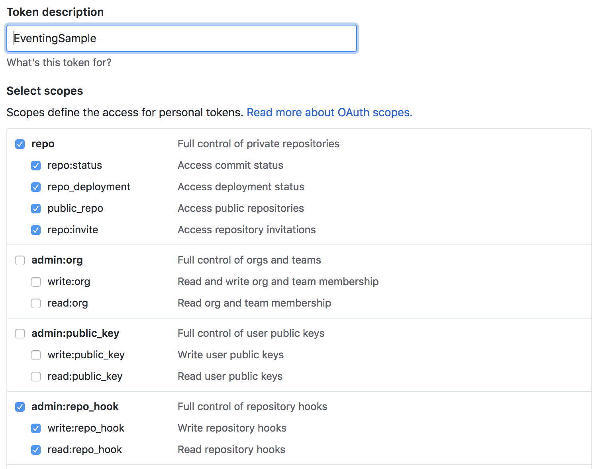

# Reacting to GitHub Events

In response to a pull request event, the sample app _legit_ Service will add 
`(looks pretty legit)` to the PR title.

A GitHub webhook will be created on a repository and a Knative `Service` will be 
deployed to receive the webhook's event deliveries and forward them into a 
`Channel`, through a `Bus`, and out to the consumer via a `Subscription`. The 
`Flow` resource takes care of provisioning the webhook, the `Service`, the 
`Channel`, and the `Subscription`.

## Prerequisites

You will need:

- A Kubernetes cluster with Knative serving installed. Follow the
  [installation instructions](https://github.com/knative/docs/blob/master/install/README.md)
  if you need to create one.
- [Docker](https://www.docker.com/) installed and running on your local machine,
  and a Docker Hub account configured (you'll use it for a container registry).
- Knative eventing core installed on your Kubernetes cluster. You can install
  with:
  ```shell
  kubectl apply -f https://storage.googleapis.com/knative-releases/eventing/latest/release.yaml
  ```
- A domain name that allows GitHub to call into the cluster: Follow the
  [assign a static IP address](https://github.com/knative/docs/blob/master/serving/gke-assigning-static-ip-address.md)
  and
  [configure a custom domain](https://github.com/knative/docs/blob/master/serving/using-a-custom-domain.md)
  instructions.

## Configuring Knative

To use this sample, you'll need to install the `stub` ClusterBus and the 
`github` EventSource:

```shell
# Installs ClusterBus
kubectl apply -f https://storage.googleapis.com/knative-releases/eventing/latest/release-clusterbus-stub.yaml
# Installs EventSource
kubectl apply -f https://storage.googleapis.com/knative-releases/eventing/latest/release-source-github.yaml
```

## Granting permissions

Because the `github` EventSource needs to create a Knative Service, you'll need
to provision a special ServiceAccount with the necessary permissions.

The `eventing/samples/github-events/auth.yaml` file provisions a service
account, and creates a role which can create a Knative Service in the `default`
namespace. In a production environment, you might want to limit the access of
this service account to only specific namespaces.

```shell
kubectl apply -f eventing/samples/github-events/auth.yaml
```

## Building and deploying the sample

1.  Use Docker to build the sample code into a container. To build and push with
    Docker Hub, run the following commands, replacing `{username}` with your
    Docker Hub username. Run these commands, r following from the _root_ of the
    `knative/docs` repo:

    ```shell
    # Build the container on your local machine
    docker build -t {username}/github-events --file=eventing/samples/github-events/Dockerfile .

    # Push the container to docker registry
    docker push {username}/github-events
    ```

1.  After the build has completed and the container is pushed to Docker Hub, you
    can deploy the function into your cluster. **Ensure that the container image
    value in `function.yaml` matches the container you built in the previous
    step.** Apply the configuration using `kubectl`:

    ```shell
    kubectl apply -f eventing/samples/github-events/function.yaml
    ```

1.  Check that your service is running using:

    ```shell
    kubectl get services.serving.knative.dev -o "custom-columns=NAME:.metadata.name,READY:.status.conditions[2].status,REASON:.status.conditions[2].message"
    NAME              READY     REASON
    legit             True      <none>
    ```

1.  Create a [personal access token](https://github.com/settings/tokens) to 
    GitHub repo that the GitHub source can use to register webhooks with the 
    GitHub API. Also decide on a token that your code will use to authenticate
    the incoming webhooks from GitHub (*accessToken*).
    
    The token can be named anything you find convenient. This sample requires
    full `repo` control to be able update the title of the _Pull Request_.
    The Source requires `admin:repo_hook`, this allows it to create webhooks
    into repos that your account is allowed to do so. Copy and save this token;
    GitHub will force you to generate it again if misplaced.

    Here I named my token "EventingSample" and have selected the recommended
    scopes: 

    

    Update `eventing/samples/github-events/githubsecret.yaml` with those
    values. If  your generated access token is `'asdfasfdsaf'` and you choose
    your *secretToken* as `'personal_access_token_value'`, you'd modify
    `eventing/samples/github-events/githubsecret.yaml` like so:

    ```yaml
    apiVersion: v1
    kind: Secret
    metadata:
      name: githubsecret
    type: Opaque
    stringData:
      githubCredentials: >
        {
          "accessToken": "asdfasfdsaf",
          "secretToken": "personal_access_token_value"
        }
    ```

    Hint: you can makeup a random *accessToken* with:
    
    ```shell
    head -c 8 /dev/urandom | base64
    ```

    Then, apply the githubsecret using `kubectl`:
    
    ```shell
    kubectl apply -f eventing/samples/github-events/githubsecret.yaml
    ```

1.  Update the resource inside `eventing/samples/github-events/flow.yaml` to the
    org/repo of your choosing. Note that the personal access token must be valid
    for the chosen org/repo. 

    Then create the flow sending GitHub Events to the service:

    ```shell
    kubectl apply -f eventing/samples/github-events/flow.yaml
    ```

1.  Create a PR for the repo you configured the webhook for, and you'll see that
    the Title will be modified with the suffix `(looks pretty legit)`


## Understanding what happened

`TODO: similar to k8s-events.`

<!--TODO:
explain the resources and communication channels, as well as where the secret
is used. In particular include a note to look at
https://github.com/<owner>/<repo>/settings/hooks to see the webhook registered
and then deleted.
 -->

## Cleaning up

To clean up the function, `Flow`, auth, and secret:

```shell
kubectl delete -f eventing/samples/github-events/function.yaml
kubectl delete -f eventing/samples/github-events/flow.yaml
kubectl delete -f eventing/samples/github-events/auth.yaml
kubectl delete -f eventing/samples/github-events/githubsecret.yaml
```

And then delete the [personal access token](https://github.com/settings/tokens)
created from GitHub.
