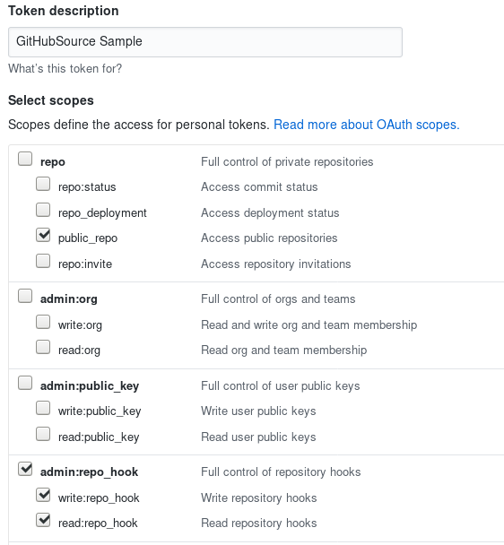

# GitHub Source example

GitHub Source example shows how to wire GitHub events for consumption
by a Knative Service.

## Deployment Steps

### Prerequisites

You will need:

1. An internet-accessible Kubernetes cluster with Knative Serving
  installed. Follow the [installation
  instructions](https://github.com/knative/docs/blob/master/install/README.md)
  if you need to create one.
  - Ensure Knative Serving is [configured with a domain
    name](https://github.com/knative/docs/blob/master/serving/using-a-custom-domain.md)
    that allows GitHub to call into the cluster.
  - If you're using GKE, you'll also want to [assign a static IP address](https://github.com/knative/docs/blob/master/serving/gke-assigning-static-ip-address.md).
1. Install [Knative
  Eventing](https://github.com/knative/docs/tree/master/eventing).
1. Create a `Channel`. You can use your own `Channel` or use the
   provided sample, which creates a channel called `githubchannel`. If
   you use your own `Channel` with a different name, then you will
   need to alter other commands later.

```shell
kubectl -n default apply -f eventing/samples/github-source/channel.yaml
```

### Deploy Event Sources

1. Deploy the `GitHubSource` controller as part of eventing-source's
   controller. This makes GitHub events available for subscriptions.

```shell
kubectl apply -f https://knative-releases.storage.googleapis.com/eventing-sources/latest/release.yaml
```

### Create GitHub Tokens

1.  Create a [personal access
    token](https://github.com/settings/tokens) for GitHub that the
    GitHub source can use to register webhooks with the GitHub
    API. Also decide on a secret token that your code will use to
    authenticate the incoming webhooks from GitHub (*secretToken*).
    
    The token can be named anything you find convenient. The Source
    requires `repo:public_repo` and `admin:repo_hook`, to let it fire
    events from your public repositories and to create webhooks for
    those repositories. Copy and save this token; GitHub will force
    you to generate it again if misplaced.

    Here's an example for a token named "GitHubSource Sample" with the
    the recommended scopes:

    

    Update `githubsecret.yaml` with those
    values. If  your generated access token is `'asdfasfdsaf'` and you choose
    your *secretToken* as `'personal_access_token_value'`, you'd modify
    `githubsecret.yaml` like so:

```yaml
apiVersion: v1
kind: Secret
metadata:
  name: githubsecret
type: Opaque
stringData:
  accessToken: asdfasfdsaf
  secretToken: personal_access_token_value
```

    Hint: you can makeup a random *accessToken* with:
    
    ```shell
    head -c 8 /dev/urandom | base64
    ```

    Then, apply the githubsecret using `kubectl`:
    
    ```shell
    kubectl -n default apply -f eventing/samples/github-source/githubsecret.yaml
    ```

### Create Event Source for GitHub Events

1. In order to receive GitHub events, you have to create a concrete
   Event Source for a specific namespace. Be sure to replace the
   `ownerAndRepository` value with a valid GitHub public repository
   owned by your GitHub user. If you are using a different `Secret`
   name, `Channel`, or `Service Account`, modify the yaml accordingly.

```shell
kubectl -n default apply -f eventing/samples/github-source/github-source.yaml
```

### Subscriber

To verify the `GitHubSource` is fully working, create a simple Knative
Service that dumps incoming messages to its log and create a
`Subscription` from the `Channel` to that Knative Service.

1. If the deployed `GitHubEventSource` is pointing at a `Channel`
   other than `githubchannel`, modify `subscriber.yaml` by replacing
   `githubchannel` with that `Channel`'s name.
1. Deploy `subscriber.yaml`.

```shell
ko apply -f eventing/samples/github-source/subscription.yaml
```

### Create Events

Create a Pull Request in your GitHub repository.

### Verify

Verify the GitHub webhook was created by looking at the list of
webhooks under the Settings tab in your GitHub repository. A hook
should be listed that points to your Knative cluster with a green
check mark to the left of the hook URL.

We will verify that the GitHub events were sent into the Knative
eventing system by looking at our message dumper function logs. If you
deployed the [Subscriber](#subscriber), then continue using this
section. If not, then you will need to look downstream yourself.

```shell
kubectl -n default get pods
kubectl -n default logs github-message-dumper-XXXX user-container
```

You should log lines similar to:

```
2018/11/08 18:25:34 Message Dumper received a message: POST / HTTP/1.1
Host: github-message-dumper.knative-demo.svc.cluster.local
Accept-Encoding: gzip
Ce-Cloudeventsversion: 0.1
Ce-Eventid: a8d4cf20-e383-11e8-8069-46e3c8ad2b4d
Ce-Eventtime: 2018-11-08T18:25:32.819548012Z
Ce-Eventtype: dev.knative.source.github.pull_request
Ce-Source: https://github.com/someuser/somerepo/pull/1
Content-Length: 21060
Content-Type: application/json
User-Agent: Go-http-client/1.1
X-B3-Parentspanid: b2e514c3dbe94c03
X-B3-Sampled: 1
X-B3-Spanid: c85e346d89c8be4e
X-B3-Traceid: abf6292d458fb8e7
X-Envoy-Expected-Rq-Timeout-Ms: 60000
X-Envoy-Internal: true
X-Forwarded-For: 127.0.0.1, 127.0.0.1
X-Forwarded-Proto: http
X-Request-Id: 8a2201af-5075-9447-b593-ec3a243aff52

{"action":"opened","number":1,"pull_request": ...}
```
