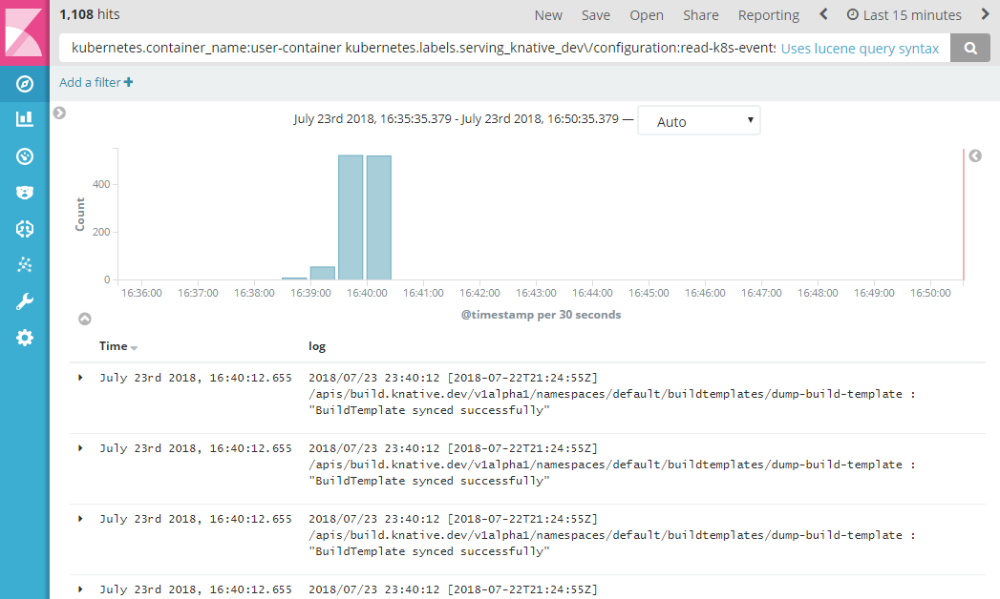

# Flow Example

A simple function which receives and logs Kubernetes Events. This examples uses
all the different components of the Knative Eventing stack with a `stub`
ClusterBus and the `k8sevents` EventSource. The function is deployed using a
Knative serving service, so it scales automatically as event traffic increases.

## Prerequisites

- A Kubernetes cluster with Knative installed. Follow the
  [installation instructions](https://github.com/knative/docs/blob/master/install/README.md)
  if you need to create one.
- [Docker](https://www.docker.com/) installed and running on your local machine,
  and a Docker Hub account configured (you'll use it for a container registry).
- The core Knative eventing tools installed. You can install them with:
  ```shell
  kubectl apply -f https://storage.googleapis.com/knative-releases/latest/release-eventing.yaml
  ```

## Configuring Knative

To use this sample, you'll need to install the `stub` ClusterBus and the
`k8sevents` EventSource.

```shell
kubectl apply -f https://storage.googleapis.com/knative-releases/latest/release-eventing-clusterbus-stub.yaml
kubectl apply -f https://storage.googleapis.com/knative-releases/latest/release-eventing-source-k8sevents.yaml
```

## Granting permissions

Because the `k8sevent` EventSource needs to create a Deployment and call the
Kubernetes watch API on events, you'll need to provision a special
ServiceAccount with the necessary permissions.

The `serviceaccount.yaml` file provisions a service account, creates a role
which can create Deployments in the `default` namespace and can view all
Kubernetes resources. In a production environment, you might want to limit the
access of this service account to only specific namespaces.

```shell
kubectl apply -f serviceaccount.yaml
```

## Build and deploy the sample

1.  Use Docker to build the sample code into a container. To build and push with
    Docker Hub, run these commands replacing {username} with your Docker Hub
    username. Run the following from the _root_ of the `knative/docs` repo:

    ```shell
    # Build the container on your local machine
    docker build -t {username}/k8s-events --file=eventing/samples/k8s-events/Dockerfile .

    # Push the container to docker registry
    docker push {username}/k8s-events
    ```

1.  After the build has completed and the container is pushed to Docker Hub, you
    can deploy the function into your cluster. **Ensure that the container image
    value in function.yaml matches the container you built in the previous step.**
    Apply the configuration using `kubectl`:

    ```shell
    kubectl apply -f eventing/samples/k8s-events/function.yaml
    ```

1.  Check that your service is running using:

    ```shell
    kubectl get services.serving.knative.dev -o "custom-columns=NAME:.metadata.name,READY:.status.conditions[2].status,REASON:.status.conditions[2].message"
    NAME              READY     REASON
    read-k8s-events   True      <none>
    ```

1.  Create the flow sending Kubernetes Events to the service:

    ```shell
    kubectl apply -f eventing/samples/k8s-events/flow.yaml
    ```

1.  You can read the function logs using Kibana. To access Kibana, you need to
    run `kubectl proxy` to start a local proxy to access the logging stack:

    ```
    kubectl proxy
    Starting to serve on 127.0.0.1:8001
    ```

    Then visit the
    [Kibana interface](http://localhost:8001/api/v1/namespaces/monitoring/services/kibana-logging/proxy/app/kibana#/discover%3F_g%3D%28%29%26_a%3D%28columns%3A%21%28log%29%2Cindex%3AAWSnR1TW-6k0tY2-zd9_%2Cinterval%3Aauto%2Cquery%3A%28query_string%3A%28query%3A%27kubernetes.container_name%3Auser-container+kubernetes.labels.serving_knative_dev%255C%252Fconfiguration%3Aread-k8s-events%27%29%29%2Csort%3A%21%28%27@timestamp%27%2Cdesc%29%29)
    and search for the following string (or use the link above):
    ```
    kubernetes.container_name:user-container kubernetes.labels.serving_knative_dev\/configuration:read-k8s-events
    ```

    

## Understanding what happened

When the flow is created, it provisions the following resources:

1.  A Feed resource to connect the specified EventSource to a Channel on the
    bus:

    ```shell
    kubectl get -o yaml feed k8s-event-flow
    ```

    ```yaml
    apiVersion: feeds.knative.dev/v1alpha1
    kind: Feed
    metadata:
      name: k8s-event-flow
      namespace: default
    spec:
      action:
        channelName: k8s-event-flow-channel.default.svc.cluster.local
      serviceAccountName: feed-sa
      trigger:
        eventType: dev.knative.k8s.event
        parameters:
          namespace: default
        resource: k8sevents/dev.knative.k8s.event
        service: k8sevents
    ```

1.  The `trigger` parameter on the Feed references an `eventType`, and provides
    some parameters to that EventType:

    ```shell
    kubectl get -o yaml eventtype dev.knative.k8s.event
    ```

    ```yaml
    apiVersion: feeds.knative.dev/v1alpha1
    kind: EventType
    metadata:
      name: dev.knative.k8s.event
      namespace: default
    spec:
      description: subscription for receiving k8s cluster events
      eventSource: k8sevents
    ```

1.  In turn, the EventType references an `eventSource`. A single EventSource may
    expose several different EventTypes, each of which provides different types
    of events from the same source. At the moment, the k8sevents adapter only
    knows how to listen for `corev1.Event` changes, but it's likely that other
    sorts of object watches will be supported in the future.

    ```shell
    kubectl get -o yaml eventsource k8sevents
    ```

    ```yaml
    apiVersion: feeds.knative.dev/v1alpha1
    kind: EventSource
    metadata:
      name: k8sevents
      namespace: default
    spec:
      image: gcr.io/knative-releases/github.com/knative/eventing/pkg/sources/k8sevents@...
      parameters:
        image: gcr.io/knative-releases/github.com/knative/eventing/pkg/sources/k8sevents/receive_adapter@...
      source: k8sevents
      type: k8sevents
    ```

1.  In addition to the `eventType` parameter, the Flow also referenced a Channel
    by kubernetes service name (as `action.channelName`. You can find the
    channel object by examining the `ownerReferences` on the Service:

    ```shell
    kubectl get -o yaml svc k8s-event-flow-channel
    ```

    ```yaml
    apiVersion: v1
    kind: Service
    metadata:
      labels:
        channel: k8s-event-flow
      name: k8s-event-flow-channel
      namespace: default
      ownerReferences:
      - apiVersion: channels.knative.dev/v1alpha1
        blockOwnerDeletion: true
        controller: true
        kind: Channel
        name: k8s-event-flow
        uid: 234b1269-8e5d-11e8-aae1-42010a8a001e
    spec:
      ...
    ```

1.  A Channel is the network address of a message dispatch queue on a Bus. The
    Channel and Bus provide a one-to-many messaging layer with optional
    persistence. Each Channel is associated with either a Bus or a ClusterBus:

    ```shell
    kubectl get -o yaml channel k8s-event-flow
    ```

    ```yaml
    apiVersion: channels.knative.dev/v1alpha1
    kind: Channel
    metadata:
      name: k8s-event-flow
      namespace: default
    spec:
      clusterBus: stub
    ```

1.  In this case, you can see that the `k8s-event-flow` Channel references the
    `stub` ClusterBus. Knative eventing supports both ClusterBuses, provisioned
    by a cluster administrator, and namespace-local Buses, which are useful for
    development or resource isolation. Typically, many users may share a
    persistent ClusterBus backed by a broker such as Kafka or Google PubSub. In
    these cases, the cluster administrator would create and manage both the
    underlying Kafka cluster and the ClusterBus definition. The `stub` bus is a
    simple in-memory forwarder with no dependencies, which is great for demos
    but will not durably store messages if the connected endpoints are down.

    ```shell
    kubectl get -o yaml clusterbus stub
    ```

    ```yaml
    apiVersion: channels.knative.dev/v1alpha1
    kind: ClusterBus
    metadata:
      name: stub
    spec:
      dispatcher:
        args:
        - -logtostderr
        - -stderrthreshold
        - INFO
        image: gcr.io/knative-releases/github.com/knative/eventing/pkg/buses/stub@...
        name: dispatcher
        resources: {}
    ```

1.  So far, you've explored how the events are collected from Kubernetes by the
    Feed and forwarded to the Bus. The last piece of the puzzle is how the
    events are forwarded from the Bus to your function. This is handled by a
    Subscription:

    ```shell
    kubectl get -o yaml subscription k8s-event-flow
    ```

    ```yaml
    - apiVersion: channels.knative.dev/v1alpha1
    kind: Subscription
    metadata:
      name: k8s-event-flow
      namespace: default
    spec:
      channel: k8s-event-flow
      subscriber: read-k8s-events.default.svc.cluster.local
    ```

    A Subscription links a channel to an interested recipient of the events; in
    this case, the `k8s-event-flow` Channel with our `read-k8s-events` Knative
    Service.
