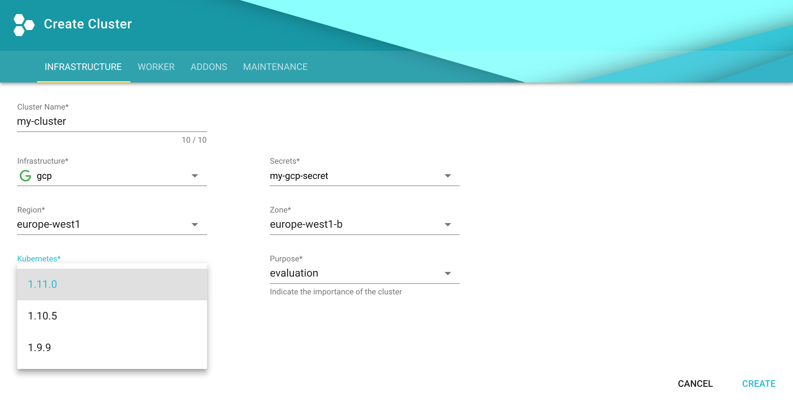
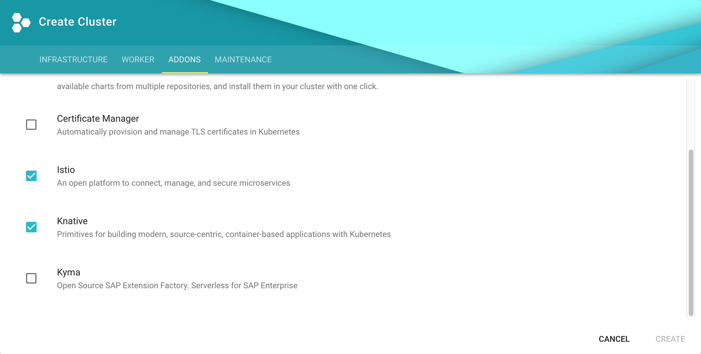

# Knative Install on [Gardener](https://github.com/gardener)

This guide walks you through the installation of the latest version of Knative
using pre-built images on a [Gardener](https://gardener.cloud) created cluster
environment. To set up your own Gardener, see the
[documentation](https://github.com/gardener/gardener/blob/master/docs/README.md)
or have a look at the
[landscape-setup-template](https://github.com/gardener/landscape-setup-template)
project. To learn more about this open source project, read the
[blog on kubernetes.io](https://kubernetes.io/blog/2018/05/17/gardener/).

You can find [guides for other platforms here](README.md).

## Before you begin

Knative requires a Kubernetes cluster v1.10 or newer.

### Install and configure kubectl

1.  If you already have `kubectl` CLI, run `kubectl version --short` to check
    the version. You need v1.10 or newer. If your `kubectl` is older, follow the
    next step to install a newer version.

2.  [Install the kubectl CLI](https://kubernetes.io/docs/tasks/tools/install-kubectl/#install-kubectl).

### Access Gardener

1.  Create a project in the Gardener dashboard. This will essentially create a
    Kubernetes namespace with the name `garden-<my-project>`.

2.  [Configure access to your Gardener project](https://kubernetes.io/docs/tasks/tools/install-kubectl/#configure-kubectl)
    using a kubeconfig. If you are not the Gardener Administrator already, you
    can create a technical user in the Gardener dashboard: go to the "Members"
    section and add a service account. You can then download the kubeconfig for
    your project. You can skip this step if you create your cluster using the
    user interface; it is only needed for programmatic access, make sure you set
    `export KUBECONFIG=garden-my-project.yaml` in your shell.
    

### Creating a Kubernetes cluster

You can create your cluster using `kubectl` cli by providing a cluster
specification yaml file. You can find an example for GCP
[here](https://github.com/gardener/gardener/blob/master/example/90-shoot-gcp.yaml).
Make sure the namespace matches that of your project. Then just apply the
prepared so-called "shoot" cluster crd with kubectl:

```
kubectl apply -f my-cluster.yaml
```

The easier alternative is to create the cluster following the cluster creation
wizard in the Gardener dashboard:


### Configure kubectl for your cluster

You can now download the kubeconfig for your freshly created cluster in the
Gardener dashboard or via cli as follows:

```
kubectl --namespace shoot--my-project--my-cluster get secret kubecfg -o jsonpath={.data.kubeconfig} | base64 --decode > my-cluster.yaml
```

This kubeconfig file has full administrators access to you cluster. For the rest
of this guide be sure you have `export KUBECONFIG=my-cluster.yaml` set.

## Installing Istio

Knative depends on Istio.

1.  Install Istio:
    ```bash
    kubectl apply -f https://storage.googleapis.com/knative-releases/serving/latest/istio.yaml
    ```
2.  Label the default namespace with `istio-injection=enabled`:
    ```bash
    kubectl label namespace default istio-injection=enabled
    ```
3.  Monitor the Istio components until all of the components show a `STATUS` of
    `Running` or `Completed`: `bash kubectl get pods -n istio-system`

It will take a few minutes for all the components to be up and running; you can
rerun the command to see the current status.

> Note: Instead of rerunning the command, you can add `--watch` to the above
> command to view the component's status updates in real time. Use CTRL + C to
> exit watch mode.

## Installing Knative Serving

1.  Next, we will install [Knative Serving](https://github.com/knative/serving)
    and its dependencies:
    `bash kubectl apply -f https://storage.googleapis.com/knative-releases/serving/latest/release.yaml`
1.  Monitor the Knative components, until all of the components show a `STATUS`
    of `Running`: `bash kubectl get pods -n knative-serving`

Just as with the Istio components, it will take a few seconds for the Knative
components to be up and running; you can rerun the command to see the current
status.

> Note: Instead of rerunning the command, you can add `--watch` to the above
> command to view the component's status updates in real time. Use CTRL + C to
> exit watch mode.

You are now ready to deploy an app to your new Knative cluster.

## Alternative way to enable Knative with Gardener

Ask your Gardener administrator to configure the Gardener Bouqet addon manager
with the following CRDs:

```
apiVersion: "garden.sapcloud.io/v1alpha1"
kind: "AddonManifest"
metadata:
  name: "istio-0.8.0"
  finalizers:
    - "bouquet"
spec:
  configMap: "istio-chart-080"
```

```
apiVersion: "garden.sapcloud.io/v1alpha1"
kind: "AddonManifest"
metadata:
  name: "knative-0.0.1"
  finalizers:
    - "bouquet"
spec:
  configMap: "knative-chart-001"
  dependencies:
    istio: "0.8.0"
```

And of course create the respectve `ConfigMaps`:

```
curl https://storage.googleapis.com/knative-releases/serving/latest/istio.yaml -o istio.yaml
kubectl create configmap istio-chart-080 --from-file=istio.yaml

curl https://storage.googleapis.com/knative-releases/serving/latest/release.yaml -o knative.yaml
kubectl create configmap knative-chart-001 --from-file=knative.yaml
```

With this preparation, your team can just activate Knative in the "Addons" tab
when creating a new cluster:


## Set your custom domain

1.  Fetch the external IP or CNAME of the knative-ingressgateway

```
kubectl --namespace istio-system get service knative-ingressgateway
NAME                     TYPE           CLUSTER-IP      EXTERNAL-IP     PORT(S)                                      AGE
knative-ingressgateway   LoadBalancer   100.70.219.81   35.233.41.212   80:32380/TCP,443:32390/TCP,32400:32400/TCP   4d
```

2.  Create a wildcard DNS entry in your custom domain to point to above IP or
    CNAME

```
*.knative.<my domain> == A 35.233.41.212
# or CNAME if you are on AWS
*.knative.<my domain> == CNAME a317a278525d111e89f272a164fd35fb-1510370581.eu-central-1.elb.amazonaws.com
```

3.  Adapt your knative config-domain (set your domain in the data field)

```
kubectl --namespace knative-serving get configmaps config-domain -o yaml
apiVersion: v1
data:
  knative.<my domain>: ""
kind: ConfigMap
  name: config-domain
  namespace: knative-serving
```

## Deploying an app

Now that your cluster has Knative installed, you're ready to deploy an app.

If you'd like to follow a step-by-step guide for deploying your first app on
Knative, check out the
[Getting Started with Knative App Deployment](getting-started-knative-app.md)
guide.

If you'd like to view the available sample apps and deploy one of your choosing,
head to the [sample apps](../serving/samples/README.md) repo.

## Cleaning up

Use the Gardener dashboard to delete your cluster, or execute the following with
kubectl pointing to your `garden-my-project.yaml` kubeconfig:

```
kubectl --kubeconfig garden-my-project.yaml --namespace garden--my-project annotate shoot my-cluster confirmation.garden.sapcloud.io/deletion=true

kubectl --kubeconfig garden-my-project.yaml --namespace garden--my-project delete shoot my-cluster
```

---

Except as otherwise noted, the content of this page is licensed under the
[Creative Commons Attribution 4.0 License](https://creativecommons.org/licenses/by/4.0/),
and code samples are licensed under the
[Apache 2.0 License](https://www.apache.org/licenses/LICENSE-2.0).
