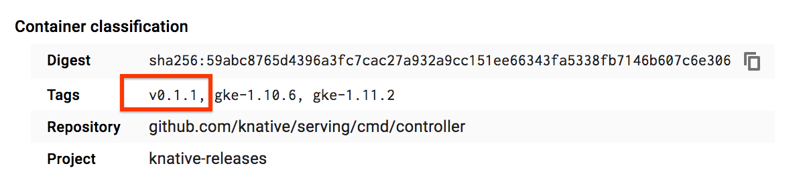

<!-- START doctoc generated TOC please keep comment here to allow auto update -->
<!-- DON'T EDIT THIS SECTION, INSTEAD RE-RUN doctoc TO UPDATE -->
**Table of Contents**  *generated with [DocToc](https://github.com/thlorenz/doctoc)*

- [Checking the Version of Your Knative Serving Installation](#checking-the-version-of-your-knative-serving-installation)

<!-- END doctoc generated TOC please keep comment here to allow auto update -->

# Checking the Version of Your Knative Serving Installation

If you want to check what version of Knative serving you have installed, enter
the following command:

```bash
kubectl describe deploy controller --namespace knative-serving
```

This will return the description for the `knative-serving` controller; this
information contains the link to the container that was used to install Knative:

```yaml
---
Pod Template:
  Labels: app=controller
  Annotations: sidecar.istio.io/inject=false
  Service Account: controller
  Containers:
    controller:
      # Link to container used for Knative install
      Image: gcr.io/knative-releases/github.com/knative/serving/cmd/controller@sha256:59abc8765d4396a3fc7cac27a932a9cc151ee66343fa5338fb7146b607c6e306
```

Copy the full `gcr.io` link to the container and paste it into your browser. If
you are already signed in to a Google account, you'll be taken to the Google
Container Registry page for that container in the Google Cloud Platform console.
If you aren't already signed in, you'll need to sign in a to a Google account
before you can view the container details.

On the container details page, you'll see a section titled "Container
classification," and in that section is a list of tags. The versions of Knative
you have installed will appear in the list as `v0.1.1`, or whatever verion you
have installed:


