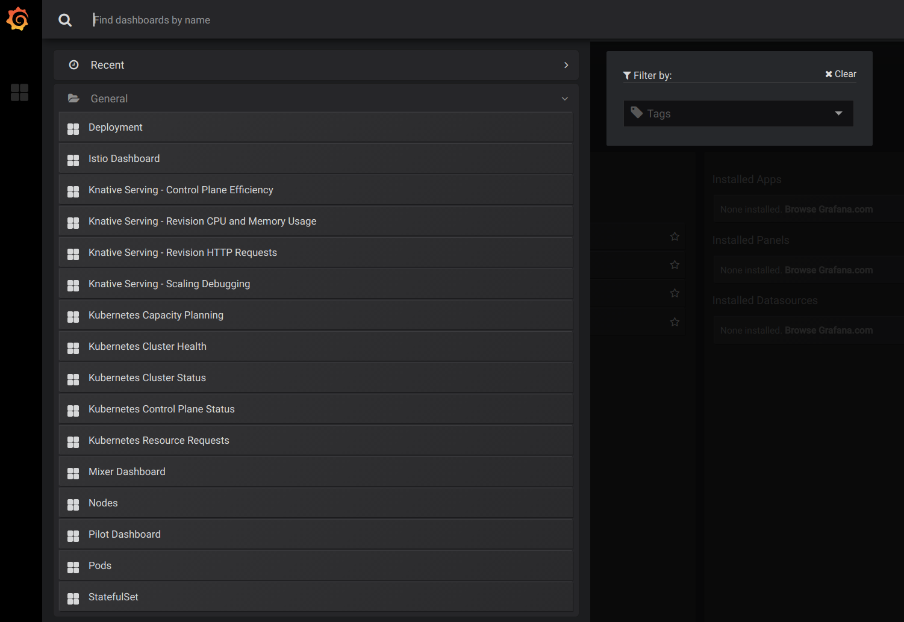

# Accessing metrics

To open the [Grafana](https://grafana.com/) UI (the visualization tool 
for [Prometheus](https://prometheus.io/), enter the following command:

```shell
kubectl port-forward -n monitoring $(kubectl get pods -n monitoring --selector=app=grafana --output=jsonpath="{.items..metadata.name}") 3000
```

This starts a local proxy of Grafana on port 3000. The Grafana UI is only exposed within
the cluster for security reasons.

Navigate to the Grafana UI at [http://localhost:3000](http://localhost:3000). 
Select `Home` button on the top of the page to see the list of pre-installed dashboards (screenshot below):


The following dashboards are pre-installed with Knative Serving:

* **Revision HTTP Requests:** HTTP request count, latency and size metrics per revision and per configuration
* **Nodes:** CPU, memory, network and disk metrics at node level
* **Pods:** CPU, memory and network metrics at pod level
* **Deployment:** CPU, memory and network metrics aggregated at deployment level
* **Istio, Mixer and Pilot:** Detailed Istio mesh, Mixer and Pilot metrics
* **Kubernetes:** Dashboards giving insights into cluster health, deployments and capacity usage

To login as an administrator and modify or add dashboards, sign in with username `admin` and password `admin`.
Make sure to change the password before exposing Grafana UI to outside the cluster.