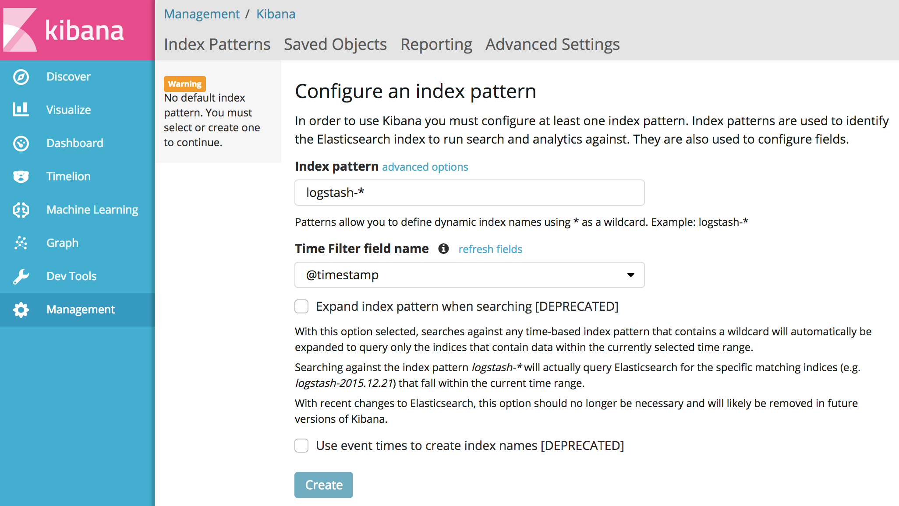

# Monitoring, Logging and Tracing Installation

Knative Serving offers two different monitoring setups:
[Elasticsearch, Kibana, Prometheus and Grafana](#elasticsearch-kibana-prometheus--grafana-setup)
or
[Stackdriver, Prometheus and Grafana](#stackdriver-prometheus--grafana-setup).
You can install only one of these two setups and side-by-side installation of
these two are not supported.

## Elasticsearch, Kibana, Prometheus & Grafana Setup

If you installed the
[full Knative release](../install/README.md#Installing-Knative),
skip this step and continue to
[Create Elasticsearch Indices](#create-elasticsearch-indices)

- Install Knative monitoring components from the root of the [Serving repository](https://github.com/knative/serving):

  ```shell
  kubectl apply -R -f config/monitoring/100-common \
      -f config/monitoring/150-elasticsearch \
      -f third_party/config/monitoring/common \
      -f third_party/config/monitoring/elasticsearch \
      -f config/monitoring/200-common \
      -f config/monitoring/200-common/100-istio.yaml
  ```

- The installation is complete when logging & monitoring components are all
  reported `Running` or `Completed`:

  ```shell
  kubectl get pods -n monitoring --watch
  ```

  ```
  NAME                                  READY     STATUS    RESTARTS   AGE
  elasticsearch-logging-0               1/1       Running   0          2d
  elasticsearch-logging-1               1/1       Running   0          2d
  fluentd-ds-5kc85                      1/1       Running   0          2d
  fluentd-ds-vhrcq                      1/1       Running   0          2d
  fluentd-ds-xghk9                      1/1       Running   0          2d
  grafana-798cf569ff-v4q74              1/1       Running   0          2d
  kibana-logging-7d474fbb45-6qb8x       1/1       Running   0          2d
  kube-state-metrics-75bd4f5b8b-8t2h2   4/4       Running   0          2d
  node-exporter-cr6bh                   2/2       Running   0          2d
  node-exporter-mf6k7                   2/2       Running   0          2d
  node-exporter-rhzr7                   2/2       Running   0          2d
  prometheus-system-0                   1/1       Running   0          2d
  prometheus-system-1                   1/1       Running   0          2d
  ```

  CTRL+C to exit watch.

### Create Elasticsearch Indices

To visualize logs with Kibana, you need to set which Elasticsearch indices to explore. We will create two indices in Elasticsearch using `Logstash` for application logs and `Zipkin`
for request traces.

- Ensure your Kubernetes node(s) are labeled with
  `beta.kubernetes.io/fluentd-ds-ready="true"` so that the Fluentd
  DaemonSet runs on each node:

  ```shell
  kubectl label nodes --all beta.kubernetes.io/fluentd-ds-ready="true"
  ```

  Some platforms come with this label set by default, so if you see an
  error like below you can safely ignore it:

  ```shell
  error: 'beta.kubernetes.io/fluentd-ds-ready' already has a value (true), and --overwrite is false
  ```

  Wait for the Fluentd DaemonSet to be ready on at least one Node
  before proceeding to create the Elasticsearch indices. You can check
  the status with:

  ```shell
  kubectl get daemonset fluentd-ds -n monitoring
  ```

- To open the Kibana UI (the visualization tool for
  [Elasticsearch](https://info.elastic.co)), start a local proxy with the
  following command:

  ```shell
  kubectl proxy
  ```

  This command starts a local proxy of Kibana on port 8001. For security
  reasons, the Kibana UI is exposed only within the cluster.

- Navigate to the
  [Kibana UI](http://localhost:8001/api/v1/namespaces/monitoring/services/kibana-logging/proxy/app/kibana).
  _It might take a couple of minutes for the proxy to work_.

- Within the "Configure an index pattern" page, enter `logstash-*` to
  `Index pattern` and select `@timestamp` from `Time Filter field name` and
  click on `Create` button.



- To create the second index, select `Create Index Pattern` button on top left
  of the page. Enter `zipkin*` to `Index pattern` and select `timestamp_millis`
  from `Time Filter field name` and click on `Create` button.


## Stackdriver, Prometheus & Grafana Setup

If your Knative Serving is not built on a Google Cloud Platform (GCP) based
cluster or you want to send logs to another GCP project, you need to build your
own Fluentd image and modify the configuration first. See

1. Install
   [Fluentd image on Knative Serving](https://github.com/knative/serving/blob/master/image/fluentd/README.md).
2. [Set up a logging plugin](setting-up-a-logging-plugin.md).
3. Install Knative monitoring components:

  ```shell
  kubectl apply -R -f config/monitoring/100-common \
      -f config/monitoring/150-stackdriver-prod \
      -f third_party/config/monitoring/common \
      -f config/monitoring/200-common \
      -f config/monitoring/200-common/100-istio.yaml
  ```

## Learn More

- Learn more about accessing logs, metrics, and traces:
  - [Accessing Logs](./accessing-logs.md)
  - [Accessing Metrics](./accessing-metrics.md)
  - [Accessing Traces](./accessing-traces.md)

---

Except as otherwise noted, the content of this page is licensed under the
[Creative Commons Attribution 4.0 License](https://creativecommons.org/licenses/by/4.0/),
and code samples are licensed under the
[Apache 2.0 License](https://www.apache.org/licenses/LICENSE-2.0).
