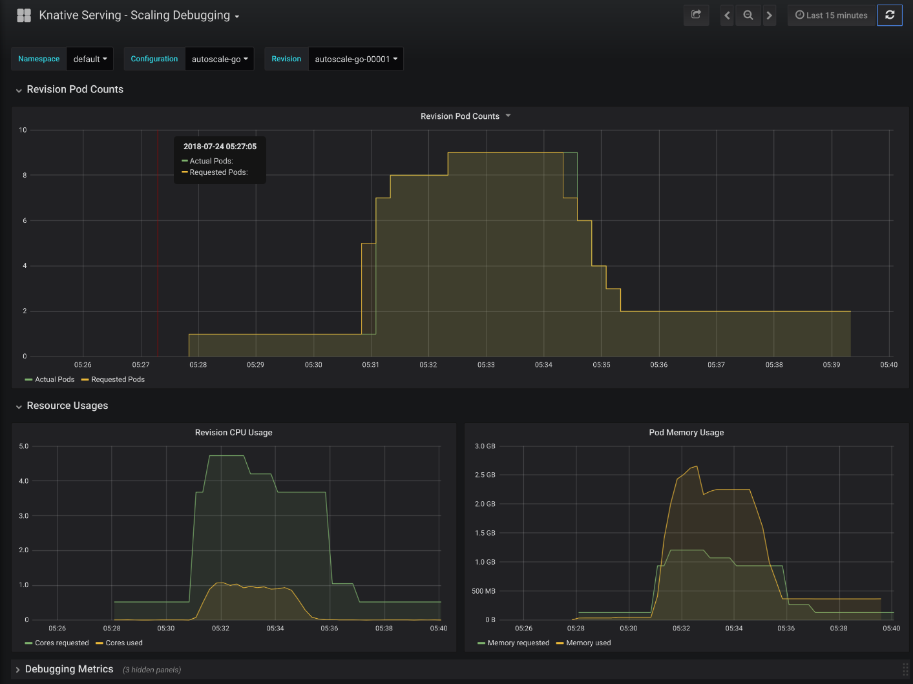
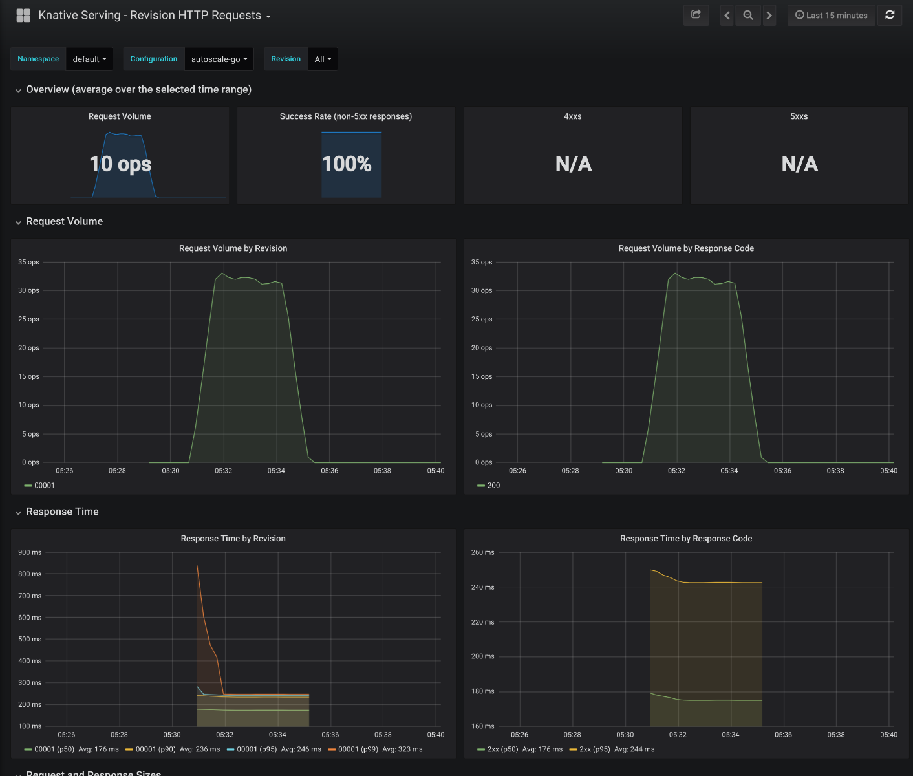

# Autoscale Sample

A demonstration of the autoscaling capabilities of a Knative Serving Revision.

## Prerequisites

1. A Kubernetes cluster with
   [Knative Serving](https://github.com/knative/docs/blob/master/install/README.md)
   installed.
1. A
   [metrics installation](https://github.com/knative/docs/blob/master/serving/installing-logging-metrics-traces.md)
   for viewing scaling graphs (optional).
1. Install
   [Docker](https://docs.docker.com/get-started/#prepare-your-docker-environment).
1. Check out the code:

```
go get -d github.com/knative/docs/serving/samples/autoscale-go
```

## Setup

Build the application container and publish it to a container registry:

1. Move into the sample directory:

   ```
   cd $GOPATH/src/github.com/knative/docs
   ```

1. Set your preferred container registry:

   ```
   export REPO="gcr.io/<YOUR_PROJECT_ID>"
   ```

   - This example shows how to use Google Container Registry (GCR). You will
     need a Google Cloud Project and to enable the
     [Google Container Registry API](https://console.cloud.google.com/apis/library/containerregistry.googleapis.com).

1. Use Docker to build your application container:

   ```
   docker build \
     --tag "${REPO}/serving/samples/autoscale-go" \
     --file=serving/samples/autoscale-go/Dockerfile .
   ```

1. Push your container to a container registry:

   ```
   docker push "${REPO}/serving/samples/autoscale-go"
   ```

1. Replace the image reference with our published image:
   ```
   perl -pi -e \
   "s@github.com/knative/docs/serving/samples/autoscale-go@${REPO}/serving/samples/autoscale-go@g" \
   serving/samples/autoscale-go/service.yaml
   ```

## Deploy the Service

1. Deploy the Knative Serving sample:

   ```
   kubectl apply --filename serving/samples/autoscale-go/service.yaml
   ```

1. Find the ingress hostname and IP and export as an environment variable:
   ```
   export IP_ADDRESS=`kubectl get svc knative-ingressgateway --namespace istio-system --output jsonpath="{.status.loadBalancer.ingress[*].ip}"`
   ```

## View the Autoscaling Capabilities

1. Make a request to the autoscale app to see it consume some resources.

   ```
   curl --header "Host: autoscale-go.default.example.com" "http://${IP_ADDRESS?}?sleep=100&prime=10000&bloat=5"
   ```

   ```
   Allocated 5 Mb of memory.
   The largest prime less than 10000 is 9973.
   Slept for 100.13 milliseconds.
   ```

1. Ramp up traffic to maintain 10 in-flight requests.

   ```
   go run serving/samples/autoscale-go/test/test.go -sleep 100 -prime 10000 -bloat 5 -qps 9999 -concurrency 300
   ```

   ```
   REQUEST STATS:
   Total: 439      Inflight: 299   Done: 439       Success Rate: 100.00%   Avg Latency: 0.4655 sec
   Total: 1151     Inflight: 245   Done: 712       Success Rate: 100.00%   Avg Latency: 0.4178 sec
   Total: 1706     Inflight: 300   Done: 555       Success Rate: 100.00%   Avg Latency: 0.4794 sec
   Total: 2334     Inflight: 264   Done: 628       Success Rate: 100.00%   Avg Latency: 0.5207 sec
   Total: 2911     Inflight: 300   Done: 577       Success Rate: 100.00%   Avg Latency: 0.4401 sec
   ...
   ```

   > Note: Use CTRL+C to exit the load test.

1. Watch the Knative Serving deployment pod count increase.
   ```
   kubectl get deploy --watch
   ```
   > Note: Use CTRL+C to exit watch mode.

## Analysis

### Algorithm

Knative Serving autoscaling is based on the average number of in-flight requests
per pod (concurrency). The system has a default
[target concurency of 100.0](https://github.com/knative/serving/blob/3f00c39e289ed4bfb84019131651c2e4ea660ab5/config/config-autoscaler.yaml#L35).

For example, if a Revision is receiving 350 requests per second, each of which
takes about about .5 seconds, Knative Serving will determine the Revision needs
about 2 pods

```
350 * .5 = 175
175 / 100 = 1.75
ceil(1.75) = 2 pods
```

#### Tuning

By default Knative Serving does not limit concurrency in Revision containers. A
limit can be set per-Configuration using the
[`ContainerConcurrency`](https://github.com/knative/serving/blob/3f00c39e289ed4bfb84019131651c2e4ea660ab5/pkg/apis/serving/v1alpha1/revision_types.go#L149)
field. The autoscaler will target a percentage of `ContainerConcurrency` instead
of the default `100.0`.

### Dashboards

View the Knative Serving Scaling and Request dashboards (if configured).

```
kubectl port-forward --namespace knative-monitoring $(kubectl get pods --namespace knative-monitoring --selector=app=grafana --output=jsonpath="{.items..metadata.name}") 3000
```





### Other Experiments

1. Maintain 1000 concurrent requests.

   ```
   go run serving/samples/autoscale-go/test/test.go -qps 9999 -concurrency 1000
   ```

1. Maintain 100 qps with fast requests.

   ```
   go run serving/samples/autoscale-go/test/test.go -qps 100 -concurrency 9999
   ```

1. Maintain 100 qps with slow requests.

   ```
   go run serving/samples/autoscale-go/test/test.go -qps 100 -concurrency 9999 -sleep 500
   ```

1. Heavy CPU usage.

   ```
   go run serving/samples/autoscale-go/test/test.go -qps 9999 -concurrency 10 -prime 40000000
   ```

1. Heavy memory usage.
   ```
   go run serving/samples/autoscale-go/test/test.go -qps 9999 -concurrency 5 -bloat 1000
   ```

## Cleanup

```
kubectl delete --filename serving/samples/autoscale-go/service.yaml
```

## Further reading

1. [Autoscaling Developer Documentation](https://github.com/knative/serving/blob/master/docs/scaling/DEVELOPMENT.md)
