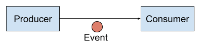
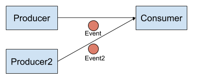

## Event Topologies
We will walk through the simplest to more complicated topologies

### 1:1 Event Delivery
The most straightforward use case is that whenever events are produced, you want some code to handle that event.


Looking at the diagram above, we’ll create the components in the reverse order.
Let's create a consumer that will display the events that are sent to it:

```
cat <<EOF | kubectl create -f -
apiVersion: serving.knative.dev/v1
kind: Service
metadata:
  name: event-display
spec:
  template:
    spec:
      containers:
        - image: gcr.io/knative-releases/knative.dev/eventing-contrib/cmd/event_display
EOF
```{{execute}}

For creating the producer, we will use the PingSource that will create events every minute.
The “sink” element describes where to send events. In this case, events are sent to a service with the name “event-display”
which means there's a tight coupling between the producer and consumer.

```
cat <<EOF | kubectl create -f -
apiVersion: sources.knative.dev/v1beta2
kind: PingSource
metadata:
  name: test-ping-source
spec:
  schedule: "*/1 * * * *"
  data: '{"message": "1 to 1 delivery!"}'
  sink:
    ref:
      apiVersion: serving.knative.dev/v1
      kind: Service
      name: event-display
EOF
```{{execute}}

To verify event delivery, you can check the logs of the consumer with the following command (You will not see an event there for a minute after creating the producer):

```
# it is likely that is pod is still being created after scaling down to zero
kubectl wait --for=condition=ready pod -l serving.knative.dev/service=event-display
# get the logs
kubectl logs -l serving.knative.dev/service=event-display -c user-container --since=10m --tail=50
```{{execute}}

### N:1 Event Delivery
With a standard format for events, like Cloud Events, your function already knows how to handle
receiving the event and you’ll only need to update your business logic to handle processing the
new data type. As an extension to the previous example, a second producer can send events to the
same consumer. In the diagram below, you can see an updated drawing where a new producer (Producer2) and event (Event2) have been added.


Let us create the second producer:

```
cat <<EOF | kubectl create -f -
apiVersion: sources.knative.dev/v1beta2
kind: PingSource
metadata:
  name: test-ping-source2
spec:
  schedule: "*/1 * * * *"
  data: '{"note": "multiple events to the same function works!"}'
  sink:
    ref:
      apiVersion: serving.knative.dev/v1
      kind: Service
      name: event-display
EOF
```{{execute}}

To verify event delivery, you can check the logs of the consumer with the following command (You will not see an event there for a minute after creating the producer):

```
# it is likely that is pod is still being created after scaling down to zero
kubectl wait --for=condition=ready pod -l serving.knative.dev/service=event-display
# see the logs
kubectl logs -l serving.knative.dev/service=event-display -c user-container --since=10m --tail=50
```{{execute}}

### Caveats
- There is a tight coupling between the producer and the consumer.
- Both retries and timeouts completely depend on the producer. Events might get dropped due to errors or timeouts and
cancellations may occur while handling the request.
