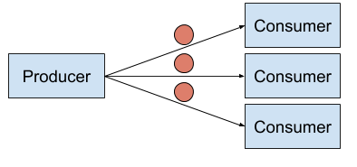
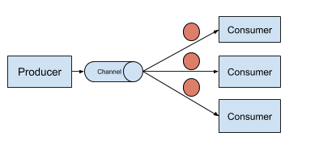

### 1:N Event Delivery

Similar to the first scenario, you can have multiple consumers that are all interested in the same event. You might want
to run multiple checks or update multiple systems with the new event. There are two ways you can handle this scenario.
The first way to handle this is an extension of the first diagram. Each consumer is directly tied to the producer.


This manner of handling multiple consumers for an event, also called the fanout pattern, introduces a bunch of complex
problems for our application architecture. Problems like what if the producer crashes after delivering an event to only a subset of consumers?
what if a client was temporarily un-available, how does it get the messages it missed? etc.

Rather than burdening the producers to handle these problems, Knative Eventing introduces the concept of a Channel.


### Channel

Channels help de-couple the Producers from Consumers. The Producer only publishes to the channel and the consumer registers a `Subscription` to get events from the channel.
There are several kinds of channels, but they all implement the capability to deliver events to all consumers and persist the events. This resolves both the problems (producer crashing, clients temporarily offline) mentioned above.
When you create the channel, you can choose which kind of channel is most appropriate for your use case.
For development, an “in memory” channel may be sufficient, but for production you may need persistence, retry, and replay capabilities for reliability and/or compliance.

### Subscription
Consumers of the events need to let the channel know they’re interested to receive events by creating a subscription.

Let's see this in action now. First we install and create an in-memory channel:
Install an in-memory channel. (Knative also supports Apache Kafka Channel, Google Cloud Pub/Sub Channel and NATS Channel as options)
```
kubectl apply --filename https://github.com/knative/eventing/releases/download/${latest_version}/in-memory-channel.yaml
```{{execute}}

Now, create an in-memory channel: InMemory channels are great for testing because they add very little overhead and require
almost no resources. The downside, though, is that you have no persistence and retries. For this example, an InMemory channel is well suited.

```
cat <<EOF | kubectl create -f -
apiVersion: messaging.knative.dev/v1
kind: InMemoryChannel
metadata:
  name: pingevents
EOF
```{{execute}}

We will now create 3 consumers:

```
for i in 1 2 3; do
cat <<EOF | kubectl create -f -
apiVersion: serving.knative.dev/v1
kind: Service
metadata:
  name: event-display${i}
spec:
  template:
    spec:
      containers:
        - image: gcr.io/knative-releases/knative.dev/eventing-contrib/cmd/event_display
EOF
done
```{{execute}}

Now that the channel and the consumers exist, we will need to create the subscriptions
to make sure the consumers can get the messages.

```
for i in 1 2 3; do
cat <<EOF | kubectl create -f -
apiVersion: messaging.knative.dev/v1
kind: Subscription
metadata:
    name: subscriber-${i}
spec:
    channel:
        apiVersion: messaging.knative.dev/v1
        kind: InMemoryChannel
        name: pingevents
    subscriber:
        ref:
            apiVersion: serving.knative.dev/v1
            kind: Service
            name: event-display${i}
EOF
done
```{{execute}}

Finally, we create the Producers. As before, we will create a PingSource producer. The “sink” element describes where to send
events. Rather than sending the events to a service, events are sent to a channel with the name “pingevents” which means
there’s no longer a tight coupling between the producer and consumer.

```
cat <<EOF | kubectl create -f -
apiVersion: sources.knative.dev/v1beta2
kind: PingSource
metadata:
  name: test-ping-source-channel
spec:
  schedule: "*/1 * * * *"
  data: '{"message": "Message from Channel!"}'
  sink:
    ref:
      apiVersion: messaging.knative.dev/v1
      kind: InMemoryChannel
      name: pingevents
EOF
```{{execute}}

To verify event delivery, you can check the logs of all three consumers: (You will not see an event there for a minute after creating the producer):
```
# it is likely that is pod is still being created after scaling down to zero
kubectl wait --for=condition=ready pod -l serving.knative.dev/service=event-display1 --timeout=90s
kubectl wait --for=condition=ready pod -l serving.knative.dev/service=event-display2 --timeout=90s
kubectl wait --for=condition=ready pod -l serving.knative.dev/service=event-display3 --timeout=90s
# see the logs
kubectl logs -l serving.knative.dev/service=event-display1 -c user-container --since=10m --tail=50
kubectl logs -l serving.knative.dev/service=event-display2 -c user-container --since=10m --tail=50
kubectl logs -l serving.knative.dev/service=event-display3 -c user-container --since=10m --tail=50
```{{execute}}
