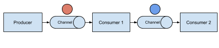

## Sequences
The unix philosophy states:
> Write programs that do one thing and do it well. Write programs to work together.

In an event driven architecture too, it is useful to split up functionality into smaller chunks. These chunks can then be implemented as either microservices
or functions. We then need to pass the events from the producer through a series of consumers. This time rather than creating several channels and subscriptions, we
will create a `Sequence` instead. A Sequence lets us define an in-order list of functions that will be invoked. Sequence creates `Channel`s and `Subscription`s under the hood.

Let's see this in action now. We will create the following topology where the event is passed from Producer to Consumer 1, who transforms the event, and then passes it
along to Consumer 2, which displays the event.



First, let's create the final consumer:

```
cat <<EOF | kubectl create -f -
apiVersion: serving.knative.dev/v1
kind: Service
metadata:
  name: event-display-chain
spec:
  template:
    spec:
      containers:
        - image: gcr.io/knative-releases/knative.dev/eventing-contrib/cmd/event_display
EOF
```{{execute}}

Then create the first consumer which will modify the message:

```
cat <<EOF | kubectl create -f -
apiVersion: serving.knative.dev/v1
kind: Service
metadata:
  name: first
spec:
  template:
    spec:
      containers:
        - image: gcr.io/knative-releases/knative.dev/eventing-contrib/cmd/appender
          env:
            - name: MESSAGE
              value: " - Updating this message a little..."
EOF
```{{execute}}

Now, let's create the Sequence to execute the service "first" and then pass its result to the service "event-display-chain"

```
cat <<EOF | kubectl create -f -
apiVersion: flows.knative.dev/v1
kind: Sequence
metadata:
  name: sequence
spec:
  channelTemplate:
    apiVersion: messaging.knative.dev/v1beta1
    kind: InMemoryChannel
  steps:
    - ref:
        apiVersion: serving.knative.dev/v1
        kind: Service
        name: first
  reply:
    ref:
      kind: Service
      apiVersion: serving.knative.dev/v1
      name: event-display-chain
EOF
```{{execute}}

Finally, create the producer to create the event:

```
cat <<EOF | kubectl create -f -
apiVersion: sources.knative.dev/v1beta2
kind: PingSource
metadata:
  name: ping-source-sequence
spec:
  schedule: "*/1 * * * *"
  data: '{"message": "Hello Sequence!"}'
  sink:
    ref:
      apiVersion: flows.knative.dev/v1beta1
      kind: Sequence
      name: sequence
EOF
```{{execute}}

Verify that the sequence was executed and the message was updated by running the below command
(You will not see an event there for a minute after creating the producer):

```
# it is likely that is pod is still being created after scaling down to zero
kubectl wait --for=condition=ready pod -l serving.knative.dev/service=event-display-chain --timeout=90s
# see the logs
kubectl -n default logs -l serving.knative.dev/service=event-display-chain -c user-container --since=10m --tail=50
```{{execute}}
