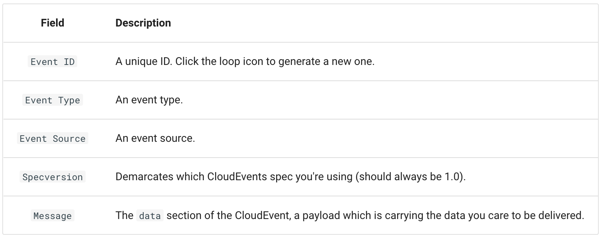

## Using a Knative Service as a source
In this tutorial, you will use the [CloudEvents](https://github.com/ruromero/cloudevents-player) Player app to showcase the core concepts of Knative Eventing. 
By the end of this tutorial, you should have an architecture that looks like this:

The above image is Figure 6.6 from [Knative in Action](https://www.manning.com/books/knative-in-action).

### Creating your first source
The CloudEvents Player acts as a Source for CloudEvents by intaking the URL of the Broker as an environment variable, 
`BROKER_URL`. You will send CloudEvents to the Broker through the CloudEvents Player application.

Create the CloudEvents Player Service:
```sh
kn service create cloudevents-player \
--image ruromero/cloudevents-player:latest \
--env BROKER_URL=http://broker-ingress.knative-eventing.svc.cluster.local/default/example-broker
```{{execute}}

✅ **Expected output:**
```sh
Service 'cloudevents-player' created to latest revision 'cloudevents-player-00001' is available at URL:
http://cloudevents-player.default.example.com
```

> ❓ **Why is my Revision named something different!**
> Because we didn't assign a revision-name, Knative Serving automatically created one for us. It's okay if your Revision is named something different.

### Examining the CloudEvents Player
**You can use the CloudEvents Player to send and receive CloudEvents**. If you open the Service URL in your browser, 
the Create Event form appears:


> ❓ **What do these fields mean?**

> For more information on the CloudEvents Specification, check out the [CloudEvents Spec](https://github.com/cloudevents/spec/blob/v1.0.1/spec.md).


